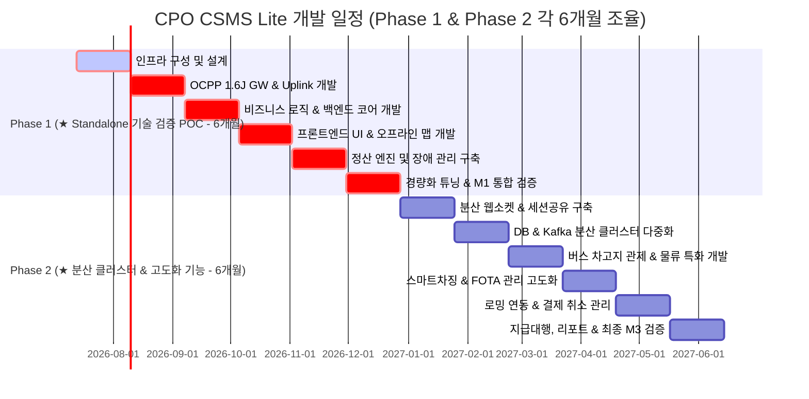

# [Timeline] CPO[^CPO] CSMS[^CSMS] Lite 예상 개발 일정 (Development Timeline)

본 문서는 CPO CSMS Lite 구축을 위한 단계별 개발 로드맵 및 상세 개발 일정을 기술합니다. 본 프로젝트는 **Phase 1 (단일 서버 기동 모드 - 필수 기능 / 기술 검증 POC)**의 안정성을 극대화하기 위해 **초기 6개월(24주)** 동안의 설계, 구현, 튜닝 및 통합 검증(POC)을 진행하며, 대규모 분산 스케일 아웃 및 대외 연동 요건이 포함된 **Phase 2 (분산 확장 클러스터 및 고도화 기능)**에 대해서도 **6개월(24주)의 넉넉한 안정화 개발 기간**을 부여하여 총 12개월(1년)의 장기 안정 로드맵으로 구성합니다.

※ **3D 디지털 트윈 관제 기능**은 본 프로젝트 구축 범위에서 제외되었으며, 필요 시 별도 계약 및 독립 프로젝트로 분리하여 관리합니다.

---

## 1. 프로젝트 마일스톤 (Project Milestones)

| 마일스톤 | 목표 작업 | 완료 기준 | 예상 일자 (개발 착수 대비) |
| :--- | :--- | :--- | :--- |
| **M1: Phase 1 (POC) 완료** | 단일 호스트 (POC) 기동 검증 | 통합 기능 정의서 상의 Phase 1 필수 기능(OCPP[^OCPP] 1.6J 연동, 일반 관제 대시보드, 정산 원장 저장 및 단독 튜닝)의 100% 완료 및 안정화 검증 | **24주차 말 (6개월차)** |
| **M2: Phase 2 개발 완료** | 분산 클러스터 및 스마트 차징 고도화 | Redis 세션 공유, 멀티 노드 라우팅, DB[^DB]/Kafka 분산 클러스터, OCPP 2.0.1 확장, 스마트 차징 프로파일 제어 및 전기 버스 차고지 배치도 완성 | **40주차 말 (10개월차)** |
| **M3: 최종 인수** | 대외 연동 및 안정성 검증 배포 | 로밍 중계 연동, 정산지급 대행, 청구 리포터 완성, 대용량 부하 테스트(2,000 TPS[^TPS]) 통과 및 폐쇄망(Air-Gapped) 패키지 최종 인도 | **48주차 말 (12개월차/1년)** |

> [!NOTE]
> Phase 1 기간(초기 6개월)은 단일 서버 구동 모드의 설계/개발과 병행하여 **기술 검증(POC) 수행 단계**로 기획되었습니다. POC 수행 로드맵의 월별 마일스톤([05.poc.md](file:///d:/project/lselink/ocpp-lite/git/h2y-ocpp/doc/05.poc.md#L8))과 개발 일정이 100% 동기화되어 진행됩니다.

---

## 2. 주차별 상세 계획 (Weekly Detailed Plan)

### 2.1. [Phase 1 - 1개월차] 개발 환경 & 인프라 및 상세 설계 (Week 1 - 4)
* **주요 목표:** 단일 VM 내 기본 인프라(DB, Kafka) 설치 및 150개 AS-IS 화면 기능 정의 기반 백엔드/프론트엔드 상세 아키텍처 설계.
* **상세 작업:**
  * 개발망 내 PostgreSQL(OLTP[^OLTP]) 및 ClickHouse(OLAP[^OLAP] 시계열) 인스턴스 단독 노드 설치 및 초기 스키마 셋업.
  * 단일 Kafka Broker(KRaft Mode) 설정 및 토픽 구조 설계 (`raw-events`, `control-commands`).
  * Spring Boot 3.x/4.x 기반 프로젝트 초기화 및 Java 25 Virtual Threads 기능 활성화 (`spring.threads.virtual.enabled=true`).
  * OCPP 1.6J 연동 프로토콜 명세 분석 및 AS-IS 기능 매트릭스 상세 유스케이스 정의서 작성.

### 2.2. [Phase 1 - 2개월차] OCPP 1.6J WebSocket Gateway & Uplink 구현 (Week 5 - 8)
* **주요 목표:** WebSocket Gateway 구축 및 실시간 미터링 시계열 데이터 파이프라인 개발.
* **상세 작업:**
  * Spring WebSocket 기반의 WS Gateway 설계 및 ConcurrentHashMap 구조 of `LocalSessionStore` 구현.
  * **Uplink 메시지 파이프라인:** CP -> GW[^GW] -> Kafka(`raw-events`) -> BizCore 컨슘 구조 구현.
  * OCPP 1.6J 핵심 프로파일(Core) 메시지 지원: `BootNotification`, `Heartbeat`, `StatusNotification`, `Authorize`, `StartTransaction`, `StopTransaction`, `MeterValues` 구현.
  * 15초 단위의 대용량 미터링 데이터를 ClickHouse 시계열 테이블에 벌크 인서트(Bulk Insert)하는 버퍼 엔진 구현.

### 2.3. [Phase 1 - 3개월차] 비즈니스 로직 & 백엔드 코어 개발 (Week 9 - 12)
* **주요 목표:** 충전소 자산 등록 및 기본 사용자/인증 마스터 백엔드 API[^API] 구현.
* **상세 작업:**
  * 법인관리, 사업장목록, 충전소목록, 한전계약단가 관리 API 개발.
  * 충전기관리(등록/상세), 충전기목록 및 충전기모델관리, 충전기 개소 관리 백엔드 로직 완성.
  * RFID[^RFID] 정보 마스터 등록 및 RFID 재발급/정지 등 요청 승인 프로세스 개발.
  * 휴일 관리 적용을 통한 요일별 요금 매핑 기본 로직 구축.

### 2.4. [Phase 1 - 4개월차] 프론트엔드 Vue 3 UI[^UI] 포털 및 오프라인 지도 개발 (Week 13 - 16)
* **주요 목표:** Vue 3 포털 레이아웃 구축, 충전기 상태 관제 화면 및 오프라인 지도 뷰 개발.
* **상세 작업:**
  * Vue 3 (Composition API) + Pinia 상태 관리를 적용한 기본 어드민 포털 레이아웃 및 컴포넌트 개발.
  * 실시간 충전기 커넥터 상태 모니터링 화면 및 상태 동적 필터링 그리드 구축.
  * Leaflet.js 및 GeoJSON 오프라인 타일 서빙을 활용한 폐쇄망 전용 지도 관제 화면 설계.
  * 웹소켓 연동 실시간 OCPP Raw 메시지 로그 뷰어(JSON 포맷팅 및 실시간 정지 기능) 프론트 연동.

### 2.5. [Phase 1 - 5개월차] 정산 엔진 및 장애 관리 구축 (Week 17 - 20)
* **주요 목표:** TOU[^TOU] 요금 계산 정산 엔진 개발 및 기기 장애 접수 처리 프로세스 구축.
* **상세 작업:**
  * 계절별/시간대별 TOU 요금 계산 로직 적용 및 트랜잭션 종료 시 최종 이용금액을 연산하는 정산 엔진 개발.
  * 트랜잭션 완료 즉시 실행되는 바로정산 API 및 PostgreSQL CDR(Charge Detail Record) 저장 로직 구현.
  * 제조사별 장애코드관리 및 StatusNotification 고장 수동 접수 처리 관리 시스템 구축.

### 2.6. [Phase 1 - 6개월차] 경량화 튜닝 및 1차 마일스톤(M1) 통합 검증 (Week 21 - 24)
* **주요 목표:** Standalone 단일 서버 환경 경량화 튜닝 및 M1 마일스톤 통합 부하 테스트 검증 완료.
* **상세 작업:**
  * 단일 VM 리소스 최적화를 위한 Kafka Heap Size 강제 제한(512MB) 및 ClickHouse 쿼리당 최대 메모리 사용 임계치 제한(4GB) 적용.
  * 가상 충전기 시뮬레이터를 활용한 동시 2,000대 연결 검증 및 통합 시나리오 테스트.
  * 완전 폐쇄망(Air-Gapped) 내 독립 실행 배포본 패키징 및 로컬 오프라인 실행 통합 검증 완료.

---

### 2.7. [Phase 2 - 7개월차] 분산 웹소켓 & 세션 공유 아키텍처 구축 (Week 25 - 28)
* **주요 목표:** L4/L7 로드밸런서 연동 및 Redis 기반 분산 서버 세션 공유 구축.
* **상세 작업:**
  * L4/L7 로드밸런서 연동을 위한 WebSocket Gateway 분산 아키텍처 구축.
  * 다중 기동 환경 분산 세션 조회를 위한 Redis Active Connection Map 연동.
  * Redis Pub/Sub 채널을 통한 제어 명령 특정 게이트웨이 노드 타겟팅 라우팅 채널 구축.

### 2.8. [Phase 2 - 8개월차] 데이터베이스 및 메시지 브로커 분산 다중화 (Week 29 - 32)
* **주요 목표:** Apache Kafka Multi-Broker 및 PostgreSQL Primary-Standby 복제, ClickHouse 분산 레플리카 설정.
* **상세 작업:**
  * 메시지 손실 없는 분산 구성을 위한 Apache Kafka Multi-Broker 배포 및 Partitioning 설정.
  * PostgreSQL 복제본 구성(Primary-Standby)을 통한 DB 장애 극복(Failover) 정책 적용.
  * ClickHouse 분산 클러스터 및 레플리카 세팅을 통한 시계열 데이터 가용성 확장.

### 2.9. [Phase 2 - 9개월차] 전기 버스 차고지 관제 및 물류 특화 시스템 개발 (Week 33 - 36)
* **주요 목표:** Canvas 기반 드래그 앤 드롭 차고지 배치도 편집기 및 버스 운수사 특화 물류 시스템 구축.
* **상세 작업:**
  * 차고지 평면도 드래그 앤 드롭 편집기(Canvas) 및 차량 배차 스케줄 연동 최적 SOC 충전 스케줄 현황판 구현.
  * 전기 버스 모델 관리, 차량 및 idTag 정보 매핑 및 배터리 SOH[^SOH](State of Health) 모니터링 팝업 구축.
  * 노선 버스 운수사 전용 충전 요율 및 요금 정산 리포트 모듈 개발.

### 2.10. [Phase 2 - 10개월차] 스마트 차징 및 원격 FOTA[^FOTA] 관리 고도화 (Week 37 - 40)
* **주요 목표:** 동적 충전 프로파일 제어 엔진 및 FOTA 배포 스케줄러 구현 (M2 달성).
* **상세 작업:**
  * OCPP 1.6J/2.0.1 규격 스마트 차징 적용 (`SetChargingProfile`) 및 전력 한도 분배 알고리즘 연동.
  * FOTA 자동화 배포 스케줄러 개발 및 충전기 펌웨어 업그레이드 진행 상태 트래킹 엔진 개발.
  * OCPP 보안 규격을 위한 TLS[^TLS] 암호화 키 관리 및 기기 개별 인증서 발급 프로세스 적용.

### 2.11. [Phase 2 - 11개월차] 대외 로밍 중계 연동 및 결제 취소 수동 관리 (Week 41 - 44)
* **주요 목표:** 환경부/한전 로밍 정보 연동 및 PG[^PG] 결제 취소 건 예외 복구 관리자 화면 구현.
* **상세 작업:**
  * 환경부/한전 로밍 API 중계 프로토콜 연동 및 로밍 정산 테이블 구축.
  * PG사 Merchant API 연동 및 바로정산 고도화.
  * PG 결제 승인 취소 오류 건 수동 조치 및 강제 부분 취소 처리 제어 어드민 화면 개발.

### 2.12. [Phase 2 - 12개월차] 정산지급 대행, 리포트 출력 및 최종 M3 검증 (Week 45 - 48)
* **주요 목표:** 위탁 지급대행 연동, 거래처 청구서 PDF 생성 및 2,000 TPS 부하 테스트 통과를 거친 최종 인도 (M3 달성).
* **상세 작업:**
  * 위탁 충전소 점주 정산 대금 자동 송금 요청 및 송금 결과 대조(Reconciliation) 시스템 구축.
  * 위탁 거래처별 거래명세표 및 용역 청구서 PDF 실시간 생성/발송 모듈 구현.
  * 가상 시뮬레이터 활용 동시 2,000 TPS 대용량 부하 테스트 검증 완료.
  * 쿠버네티스 Helm Chart 및 폐쇄망 배포용 통합 Docker 패키지 검증 및 인도.

---

## 3. 리소스 투입 및 역할 정의 (Resources & Roles)

* **Back-end Engineer (2명):**
  * WebSocket Gateway, Kafka 메시지 파이프라인 개발.
  * 가상 스레드 튜닝, PostgreSQL & ClickHouse 하이브리드 연동, 정산 계산 엔진 및 Redis 세션 클러스터 개발.
* **Front-end Engineer (1명):**
  * Vue 3 어드민 포털 개발, 실시간 관제 UI 구현, Canvas 차고지 배치 편집기 개발.
* **DevOps / DBA (1명):**
  * PostgreSQL 및 ClickHouse 파티셔닝, 복제 정책 셋업.
  * Kafka Cluster 구성, CI/CD 배포 패키지 구성 및 2,000 TPS 부하 테스트 인프라 제어.

---
[^API]: **API (Application Programming Interface):** 응용 프로그램 프로그래밍 인터페이스
[^CPO]: **CPO (Charge Point Operator):** 전기차 충전소 운영 사업자
[^CSMS]: **CSMS (Charging Station Management System):** 충전기 통합 관리 시스템
[^DB]: **DB (Database):** 데이터베이스
[^FOTA]: **FOTA (Firmware Over-The-Air):** 무선 펌웨어 업데이트
[^GW]: **GW (Gateway):** 게이트웨이 (서버/기기 간의 통신 접점)
[^OCPP]: **OCPP (Open Charge Point Protocol):** 개방형 충전 통신 규격
[^OLAP]: **OLAP (Online Analytical Processing):** 실시간 데이터 분석 처리
[^OLTP]: **OLTP (Online Transaction Processing):** 실시간 트랜잭션 처리
[^PG]: **PG (Payment Gateway):** 전자 결제 대행사
[^RFID]: **RFID (Radio Frequency Identification):** 무선 주파수 식별 (충전 회원 카드 등)
[^SOH]: **SOH (State of Health):** 배터리 수명 상태 비율
[^TLS]: **TLS (Transport Layer Security):** 전송 계층 보안 (보안 통신 표준)
[^TOU]: **TOU (Time of Use):** 계절별/시간대별 차등 요금제
[^TPS]: **TPS (Transactions Per Second):** 초당 트랜잭션 처리 수
[^UI]: **UI (User Interface):** 사용자 인터페이스
