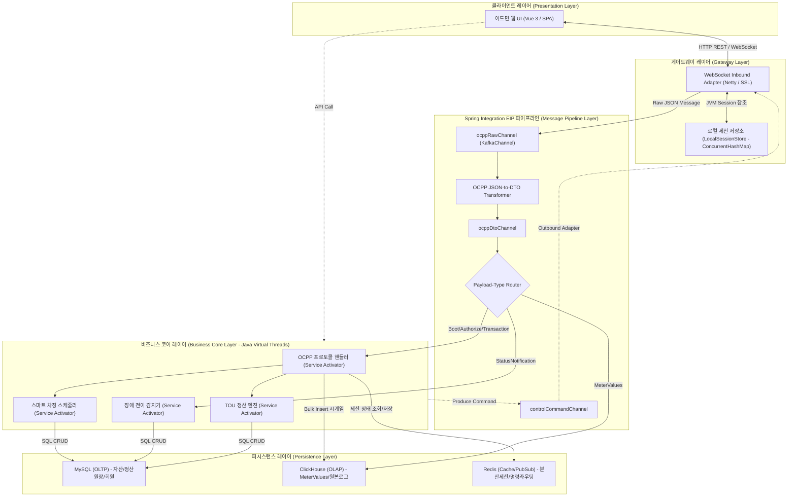
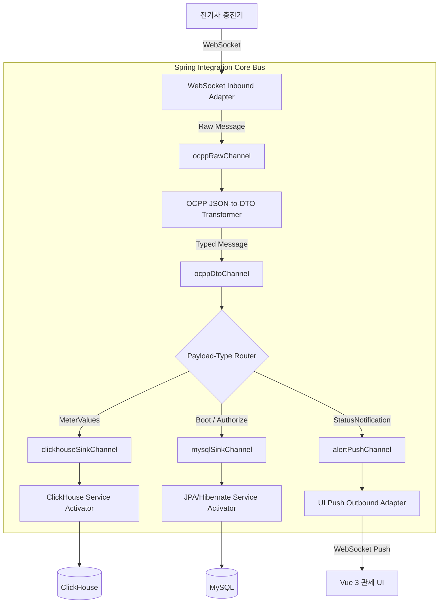
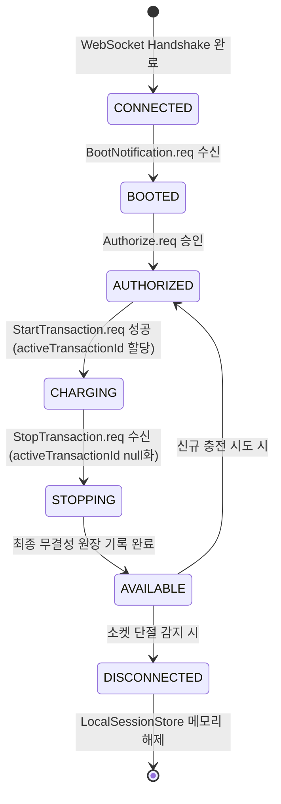
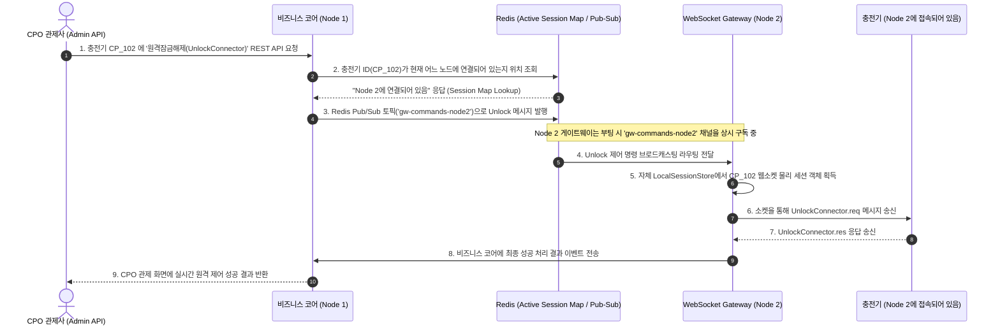
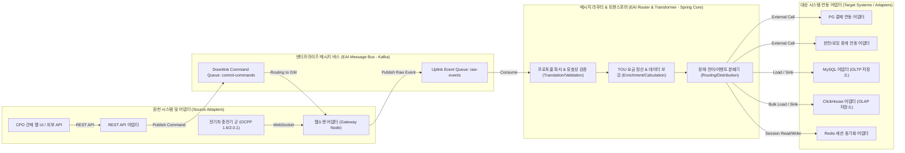

# [Architecture] CPO[^CPO] CSMS[^CSMS] Lite 소프트웨어 아키텍처 정의서

본 문서는 CPO CSMS Lite의 내적 소프트웨어 모듈 구성, 데이터 레이어 연동, 가상 스레드 분배 및 다중 노드 세션 라우팅을 정의하는 소프트웨어 아키텍처 정의서입니다. 

---

## 1. 아키텍처 핵심 설계 원칙 (Architectural Principles)

본 시스템은 수천 대의 충전기로부터 유입되는 대용량 실시간 트래픽을 처리하고, 폐쇄망(Air-Gapped) 내 하드웨어 자원을 극대화하기 위해 다음과 같은 3대 핵심 아키텍처 원칙을 준수합니다.

### 1.1. 비차단 비동기 파이프라인 (Loose Coupling & Async Pipeline)
* **구조:** WebSocket Gateway 레이어와 비즈니스 처리 코어(Business Core) 레이어를 물리적으로 격리하고, 그 사이에 **Apache Kafka**를 완충 지대로 배치합니다.
* **효과:** 충전기 연결 유지 및 패킷 수신 기능이 무거운 DB[^DB] 쓰기, 정산 연산, 외부 결제 연동(PG[^PG]) 지연 등의 백엔드 부하에 직접적으로 노출되지 않고 독립적으로 보장됩니다.

### 1.2. 하이브리드 세션 관리 (Stateful Agent & Stateless Service)
* **구조:** 웹소켓 세션별로 가벼운 상태값만을 갖는 **`OcppSessionAgent` (Stateful)** 인스턴스를 JVM[^JVM] 메모리에 띄워 관리하고, 무거운 트랜잭션 처리 및 조회 연산은 **Stateless Service** 싱글톤 객체들이 분할 처리합니다.
* **효과:** 세션별 기기의 동작 상태(Booted -> Charging -> Available)를 데이터베이스 액세스 없이 메모리 수준에서 직관적으로 검증할 수 있고, 세션 정보가 극도로 가벼워 메모리(Heap) 오버헤드가 최소화됩니다.

### 1.3. 데이터 CQRS[^CQRS] (Command Query Responsibility Segregation)
* **구조:** ACID 트랜잭션과 데이터의 정합성이 최우선인 정보는 **MySQL (OLTP[^OLTP])**에 격리 저장하고, 용량이 매우 크고 변경이 없는 계측 데이터(MeterValues) 및 원본 JSON 패킷 로그는 **ClickHouse (OLAP[^OLAP])** 시계열 테이블에 적재합니다.
* **효과:** OLTP 데이터베이스의 잠금(Lock) 경합 및 디스크 I/O 병목을 완화하고, 수억 건의 미터값 추이 시각화 쿼리를 100ms 이내에 처리합니다.

---

## 2. 소프트웨어 다층 레이어드 구조 (Software Layered Architecture)

솔루션 내부의 모듈 구조는 하부 인프라 및 통신 프로토콜의 변화에 유연하게 대응할 수 있도록 역할별로 명확히 레이어링되어 있습니다. 아키텍처 결정 사항에 맞춰 **[제 1안: Spring Integration 버전]**과 **[제 2안: Spring Boot 버전]**에 따른 세부 소프트웨어 구성의 차이를 기술합니다.

### 2.1. [제 1안: Spring Integration 버전] EIP[^EIP] 및 메시지 채널 기반 레이어드 아키텍처
Spring Integration의 엔터프라이즈 통합 패턴(EIP)을 적용하여, 통신 수신부(Gateway)와 처리 엔진(Core) 간의 물리적 및 논리적 격리를 완성하고, 데이터 흐름을 Channel 객체로 완벽히 추상화한 구조입니다.



### 2.2. [제 2안: Spring Boot 버전] Spring Kafka 직접 구현 기반 레이어드 아키텍처
EIP 프레임워크를 도입하지 않고, Spring Boot 내에 Spring-Kafka 모듈만 의존하여 개발자가 서비스(Service) 레이어 내부에서 직접 `KafkaTemplate`으로 발행하고 `@KafkaListener`로 구독하여 이벤트를 처리하는 아키텍처입니다.

```mermaid
flowchart TD
    subgraph Client ["클라이언트 레이어 (Presentation Layer)"]
        UI["어드민 웹 UI (Vue 3 / SPA)"]
    end

    subgraph GW ["게이트웨이 레이어 (Gateway Layer)"]
        WS["WebSocket Gateway Handler (Netty / SSL)"]
        SessionStore["로컬 세션 저장소 (LocalSessionStore - ConcurrentHashMap)"]
        WS <-->|JVM Session 참조| SessionStore
    end

    subgraph MQ ["메시지 브로커 레이어 (Message Broker Layer)"]
        RawEvents["Kafka raw-events (Uplink Topic)"]
        CtrlCmds["Kafka control-commands (Downlink Topic)"]
    end

    subgraph Core ["비즈니스 코어 레이어 (Business Core Layer - Java Virtual Threads)"]
        OCPPAgent["OCPP 프로토콜 핸들러 (@Service / 수동 파싱)"]
        SettEngine["TOU 정산 엔진 (@Service)"]
        FaultMgr["장애 전이 감지기 (@Service)"]
        SmartCharger["스마트 차징 스케줄러 (@Service)"]
        
        OCPPAgent -->|직접 호출/의존| SettEngine & FaultMgr & SmartCharger
    end

    subgraph DB ["퍼시스턴스 레이어 (Persistence Layer)"]
        MySQL["MySQL (OLTP) - 자산/정산원장/회원"]
        ClickHouse["ClickHouse (OLAP) - MeterValues/원본로그"]
        Redis["Redis (Cache/PubSub) - 분산세션/수동 명령 라우팅"]
    end
    %% 업링크 데이터 흐름
    UI <-->|HTTP REST / WebSocket| WS
    WS -->|KafkaTemplate.send()| RawEvents
    RawEvents -->|@KafkaListener 수동 처리| OCPPAgent
    
    OCPPAgent & SettEngine & FaultMgr & SmartCharger -->|SQL CRUD| MySQL
    OCPPAgent -->|Bulk Insert 시계열| ClickHouse
    OCPPAgent -->|세션 상태 조회/저장| Redis
    
    %% 다운링크 제어 흐름
    UI -.->|API Call| Core
    Core -.->|KafkaTemplate.send()| CtrlCmds
    CtrlCmds -.->|@KafkaListener 수신| WS
```

### 2.3. 레이어별 상세 역할 정의 및 1안/2안 비교

| 레이어 명칭 | 제 1안 (Spring Integration 버전) | 제 2안 (Spring Boot 버전) |
| :--- | :--- | :--- |
| **클라이언트 레이어** | 어드민 웹 UI[^UI] (Vue 3 / SPA) | 어드민 웹 UI (Vue 3 / SPA) |
| **게이트웨이 레이어** | `WebSocket Inbound Adapter`가 통신 세션을 감지하여 메시지를 EIP 채널로 포워딩. | `WebSocket Handler` 내에서 `KafkaTemplate`을 주입받아 수동으로 JSON 문자열을 발행. |
| **메시지 파이프라인** | **Spring Integration Core Bus (추상화 채널)**<br>- `ocppRawChannel` 등 EIP Channel 객체로 제어.<br>- Phase 1: Kafka 단일 브로커 기반 채널<br>- Phase 2: HA[^HA] 분산 Kafka 클러스터 채널로 확장. | **Apache Kafka 단일/분산 브로커**<br>- 인프라 메시지 백로그를 직접 사용.<br>- 단독 구동 시에도 처음부터 Kafka 브로커 필요 또는 Phase 2 전환 시 소스코드 직접 수정. |
| **비즈니스 코어 레이어** | `Service Activator` 패턴을 활용하여 비즈니스 서비스 클래스가 외부 메시지 큐와 직접 결합하지 않는 POJO 구조. | `@KafkaListener`가 비즈니스 서비스 클래스 메서드에 하드코딩되어 외부 카프카 구조와 직접 결합되는 구조. |
| **퍼시스턴스 레이어** | MySQL(OLTP), ClickHouse(OLAP), Redis(분산 세션 및 SI Outbound 라우팅) | MySQL(OLTP), ClickHouse(OLAP), Redis(분산 세션 및 개발자 수동 명령 라우팅) |

### 2.4. [제 1안] Spring Integration 기반 EIP 파이프라인 설계 (EIP Pipeline Detail)
솔루션 내부의 데이터 흐름은 Spring Integration 프레임워크를 기반으로 구성되어, 비즈니스 코드와 하부 인프라(메시지 큐, 프로토콜) 간의 완벽한 관심사 분리(Separation of Concerns)를 구현합니다.



* **EIP 주요 컴포넌트 명세:**
  * **Inbound WebSocket Adapter:** 충전기로부터 TCP 소켓을 통해 수신된 raw 문자열(JSON) 패킷을 Spring Integration의 표준 `Message<String>` 객체로 패키징하여 `ocppRawChannel`로 송신합니다.
  * **Transformers (데이터 변환기):** `ocppRawChannel`에서 수신된 JSON 메시지를 파싱 및 유효성 검증(Schema Validation)을 수행하고, 솔루션 내부 공통 규격인 `OcppMessage<DTO>` 자바 객체로 변환하여 `ocppDtoChannel`로 보냅니다.
  * **Payload-Type Router (콘텐츠 기반 라우터):** 메시지 페이로드의 OCPP[^OCPP] Action명(예: `MeterValues`, `BootNotification`, `StatusNotification`)에 따라 실시간으로 분기(Routing) 채널을 정합니다.
  * **Service Activators (서비스 연동 엔드포인트):** 분기된 채널들의 메시지를 받아 실제 데이터베이스 적재 서비스(`ClickHouseService`, `MySQLService`) 및 알림 발송 모듈 등의 POJO 싱글톤 빈으로 작업을 연계 호출합니다.
  * **Outbound WebSocket Adapter (UI 전송 게이트웨이):** 장애 전이나 관제 화면 갱신이 필요한 경우, `alertPushChannel`로 유입되는 최종 메시지를 구독하여 어드민 웹 UI(Vue 3)로 소켓 브로드캐스팅합니다.
* **프로세스 진화(Phase 1 ➡️ Phase 2) 전략:**
  * **Phase 1 (Standalone):** 게이트웨이와 비즈니스 코어 간의 주요 연동 채널(ocppRawChannel, controlCommandChannel)을 단일 Kafka 브로커 기반의 KafkaChannel로 구동하여 메시지 완충 및 장애 격리를 활성화합니다.
  * **Phase 2 (Scale-out):** 채널 설정을 XML/Java Config 단에서 `KafkaMessageDrivenChannelAdapter` 및 `KafkaProducerMessageHandler`를 다중 분산 브로커 클러스터 환경으로 세팅하여 수평 확장(Scale-out)을 구현합니다.

### 2.5. [제 2안] Spring Kafka 직접 구현 기반 파이프라인 설계
개발자가 인프라 컴포넌트와 비즈니스 핸들러 코드를 직접 하드코딩하여 연동하는 비동기 메시지 통신 구조입니다.

```mermaid
flowchart TD
    CP["전기차 충전기"] -->|WebSocket| WS_GW["WebSocket Handler"]
    
    subgraph Spring_Boot_Kafka ["Spring Boot Application context"]
        WS_GW -->|KafkaTemplate.send()| Kafka_Template["KafkaTemplate Client"]
        
        subgraph Core_Services ["비즈니스 코어 (@Service)"]
            Listener["@KafkaListener Message Handler"]
            Biz_Logic["OCPP 프로토콜 서비스"]
            Settlement["TOU 정산 서비스"]
            Alert_Handler["장애 전이 감지기"]
            
            Listener -->|수동 파싱 & 메서드 분기| Biz_Logic
            Biz_Logic --> Settlement & Alert_Handler
        end
    end
    
    subgraph Kafka_Broker ["Apache Kafka (인프라 토픽)"]
        Uplink_Topic["raw-events topic"]
    end
    
    Kafka_Template -->|Publish JSON| Uplink_Topic
    Uplink_Topic -->|Subscribe Events| Listener
    
    Settlement --> DB_MySQL[(MySQL)]
    Biz_Logic --> DB_CH[(ClickHouse)]
    Alert_Handler -->|SimpMessagingTemplate| UI["Vue 3 관제 UI"]
```

* **수동 연동 컴포넌트 명세:**
  * **WebSocket Handler & KafkaTemplate:** 게이트웨이 레벨에서 물리 소켓으로부터 문자열이 유입되면 `KafkaTemplate.send("raw-events", jsonStr)` 코드를 호출하여 Kafka 브로커로 이벤트를 수동 발행합니다.
  * **@KafkaListener & Payload Parser:** 비즈니스 서비스 내에서 `@KafkaListener(topics = "raw-events")` 어노테이션이 지정된 리스너 메소드가 동작합니다. 리스너 내부에서는 들어온 JSON 문자열을 ObjectMapper를 사용해 DTO[^DTO] 객체로 직접 파싱하고, `switch-case` 분기를 돌려 적절한 비즈니스 서비스(`OcppService`, `SettlementService` 등)로 명시적 의존을 맺어 동기 호출합니다.
  * **SimpMessagingTemplate (UI 알림 푸시):** 알림 관리자 모듈에서 Spring WebFlux 또는 WebSocket Message Broker 모듈의 `SimpMessagingTemplate.convertAndSend()`를 수동으로 직접 구현하여 관제 포털로 패킷을 발행합니다.
* **프로세스 진화(Phase 1 ➡️ Phase 2) 전략:**
  * **Phase 1 (Standalone):** 초기 단독 기동 시에도 로컬 Kafka 브로커와 토픽이 완전히 활성화되어 기동되어야 합니다.
  * **Phase 2 (Scale-out):** 분산 세션 상태 동기화를 위해 비즈니스 서비스 코드 내에 Redis를 활용한 세션 조회 및 수동 Redis Pub/Sub 메시지 발행/수신 코드를 추가로 직접 코딩해야 하므로 대대적인 코드 수정이 불가피합니다.

---

## 3. 웹소켓 세션 관리 및 세션 객체 상세 설계

### 3.1. `OcppSessionAgent` 데이터 명세
충전기당 1개씩 생성되며, JVM 메모리 공간의 점유율을 줄이기 위해 부가 기능을 배제하고 핵심 속성만을 갖는 초경량 상태 변수 구조체로 구성됩니다.

```java
public class OcppSessionAgent {
    private final String chargePointId;       // 충전기 고유 아이덴티티 (예: CP_1001)
    private final WebSocketSession session;    // JVM 실제 물리 웹소켓 소켓 객체 참조
    private String ocppVersion = "1.6J";       // 현재 연결 프로토콜 버전 (1.6J / 2.0.1)
    private SessionState state = SessionState.CONNECTED; // 세션 수명 주기 상태
    private String activeTransactionId = null; // 현재 충전이 개시된 활성 트랜잭션 ID (미충전 시 null)
    private Instant lastHeartbeatTime;        // 최종 하트비트 수신 시각 (커넥션 타임아웃 판단용)
    
    // Getters & Setters
}
```

### 3.2. 세션 수명 주기 상태 전이도 (State Transition Model)
세션 객체는 OCPP 프로토콜 규격 및 물리 소켓 감지에 따라 다음과 같이 엄격하게 변환됩니다.



---

## 4. [Phase 2] 다중 노드 분산 환경에서의 원격 명령 라우팅 흐름

Phase 2(Scale-out) 환경에서는 부하 분산기에 의해 충전기가 각기 다른 게이트웨이 노드(Node 1, Node 2)에 접속하게 됩니다. 관리자 어드민 API가 특정 노드에 들어왔을 때, 다른 노드에 속한 충전기의 소켓 세션 인스턴스를 찾아서 명령을 안전하게 배달하기 위해 **Redis Pub/Sub** 및 **세션 상태 동기화 맵**을 라우터로 활용합니다.



* **핵심 라우팅 규칙:**
  * **위치 정보 저장:** 충전기가 특정 노드에 접속하거나 해제될 때, 해당 게이트웨이 노드는 Redis `Hash` 구조인 `active_session_map`에 `[충전기ID] : [노드ID]` 형태로 상태를 기록합니다.
  * **메시지 전송 이중화:** 특정 노드가 갑작스럽게 다운되는 현상에 대비해, Redis Pub/Sub 채널 전송 실패 시 3회 이내로 Kafka `control-commands-retry` 토픽으로 우회 발행하여 메시지 유실을 방지합니다.

---

## 5. EAI[^EAI] 관점의 통합 아키텍처 매핑 (EAI Integration Architecture Map)

솔루션의 통합 구성 요소를 고전적 EAI(Enterprise Application Integration) 엔터프라이즈 통합 유형과 비교 매핑하여 시스템 결합도를 도식화한 내용입니다.

```mermaid
flowchart LR
    %% Source systems & Adapters
    subgraph Sources ["원천 시스템 및 어댑터 (Source Adapters)"]
        CP["전기차 충전기 군 (OCPP 1.6/2.0.1)"] -->|WebSocket| WS_Adapt["웹소켓 어댑터 (Gateway Node)"]
        AdminUI["CPO 관제 웹 UI / 외부 API"] -->|REST API| REST_Adapt["REST API 어댑터"]
    end

    %% Enterprise Message Bus
    subgraph MessageBus ["엔터프라이즈 메시지 버스 (EAI Message Bus - Kafka)"]
        direction TB
        RawTopic["Uplink Event Queue: raw-events"]
        CmdTopic["Downlink Command Queue: control-commands"]
    end

    %% Routing & Transforming Engine
    subgraph EAI_Engine ["메시지 라우터 & 트랜스포머 (EAI Router & Transformer - Spring Core)"]
        direction TB
        Parser["프로토콜 파서 & 유효성 검증 (Translation/Validation)"]
        Enricher["TOU 요금 정산 & 데이터 보강 (Enrichment/Calculation)"]
        Distributor["장애 전이/이벤트 분배기 (Routing/Distribution)"]
        
        Parser --> Enricher --> Distributor
    end

    %% Target Adapters & Systems
    subgraph Targets ["대상 시스템 연동 어댑터 (Target Systems / Adapters)"]
        PG_Adapt["PG 결제 연동 어댑터"]
        Roam_Adapt["한전/로밍 중계 연동 어댑터"]
        
        DB_OLTP["MySQL 어댑터 (OLTP 저장소)"]
        DB_OLAP["ClickHouse 어댑터 (OLAP 저장소)"]
        Cache_Session["Redis 세션 동기화 어댑터"]
    end

    %% EAI Flow Connections
    WS_Adapt -->|Publish Raw Event| RawTopic
    REST_Adapt -->|Publish Command| CmdTopic
    
    RawTopic -->|Consume| Parser
    Distributor -->|Load / Sink| DB_OLTP
    Distributor -->|Bulk Load / Sink| DB_OLAP
    Distributor -->|Session Read/Write| Cache_Session
    Distributor -->|External Call| PG_Adapt
    Distributor -->|External Call| Roam_Adapt
    
    CmdTopic -->|Routing to GW| WS_Adapt
```ic class OcppSessionAgent {
    private final String chargePointId;       // 충전기 고유 아이덴티티 (예: CP_1001)
    private final WebSocketSession session;    // JVM 실제 물리 웹소켓 소켓 객체 참조
    private String ocppVersion = "1.6J";       // 현재 연결 프로토콜 버전 (1.6J / 2.0.1)
    private SessionState state = SessionState.CONNECTED; // 세션 수명 주기 상태
    private String activeTransactionId = null; // 현재 충전이 개시된 활성 트랜잭션 ID (미충전 시 null)
    private Instant lastHeartbeatTime;        // 최종 하트비트 수신 시각 (커넥션 타임아웃 판단용)
    
    // Getters & Setters
}
```

### 3.2. 세션 수명 주기 상태 전이도 (State Transition Model)
세션 객체는 OCPP 프로토콜 규격 및 물리 소켓 감지에 따라 다음과 같이 엄격하게 변환됩니다.


---

## 4. [Phase 2] 다중 노드 분산 환경에서의 원격 명령 라우팅 흐름

Phase 2(Scale-out) 환경에서는 부하 분산기에 의해 충전기가 각기 다른 게이트웨이 노드(Node 1, Node 2)에 접속하게 됩니다. 관리자 어드민 API가 특정 노드에 들어왔을 때, 다른 노드에 속한 충전기의 소켓 세션 인스턴스를 찾아서 명령을 안전하게 배달하기 위해 **Redis Pub/Sub** 및 **세션 상태 동기화 맵**을 라우터로 활용합니다.


* **핵심 라우팅 규칙:**
  * **위치 정보 저장:** 충전기가 특정 노드에 접속하거나 해제될 때, 해당 게이트웨이 노드는 Redis `Hash` 구조인 `active_session_map`에 `[충전기ID] : [노드ID]` 형태로 상태를 기록합니다.
  * **메시지 전송 이중화:** 특정 노드가 갑작스럽게 다운되는 현상에 대비해, Redis Pub/Sub 채널 전송 실패 시 3회 이내로 Kafka `control-commands-retry` 토픽으로 우회 발행하여 메시지 유실을 방지합니다.

---

## 5. EAI[^EAI] 관점의 통합 아키텍처 매핑 (EAI Integration Architecture Map)

솔루션의 통합 구성 요소를 고전적 EAI(Enterprise Application Integration) 엔터프라이즈 통합 유형과 비교 매핑하여 시스템 결합도를 도식화한 내용입니다.



* **EAI 설계 구성 요소 분석:**
  * **Source Adapters (송신 어댑터):** 
    * `WebSocket Gateway`: OCPP 프로토콜을 전송 매체(TCP/IP[^IP] 소켓)로부터 발췌하는 입력 어댑터.
    * `REST API Adapter`: 내부 어드민 및 외부 파트너 시스템의 HTTP 트랜잭션 수신 어댑터.
  * **EAI Message Bus (메시지 통신 채널 - Kafka):**
    * 중앙 메시지 백본으로서 비동기 큐잉(Queueing)과 브로드캐스트 분배를 도맡으며 메시지 순서 및 백로그 자가 제어 담당.
  * **EAI Router & Transformer (통합 변환 엔진 - Spring Core):**
    * `Translation & Validation (파싱 & 검증)`: 다양한 버전(OCPP 1.6 / 2.0.1)의 이기종 프로토콜 JSON을 플랫폼 내부 표준 자바 DTO(Canonical Data Model)로 공통 변환 및 유효성 검증.
    * `Enrichment & Calculation (정산 & 보강)`: 충전기 원천 데이터에 한전 요율 정보 및 충전소 자산 메타 정보를 결합하여 충전 금액 연산 및 프로파일 추가.
    * `Routing & Distribution (분배)`: 가공된 데이터를 목적에 맞게 실시간 트래픽, 정산 원장, 외부 통신 어댑터 등으로 분류하여 실시간 유도.
  * **Target Adapters (수신/적재 어댑터):**
    * DB 라이터 모듈(JPA/ClickHouse Bulk Writer)과 외부 시스템 프록시 클라이언트(Payment Gateway, Roaming API[^API] Client)들이 해당 데이터 구조를 최종 적재 또는 대외 전송하는 수신 어댑터(Target Adapters) 역할을 성실히 대행합니다.

---
[^API]: **API (Application Programming Interface):** 응용 프로그램 프로그래밍 인터페이스
[^CPO]: **CPO (Charge Point Operator):** 전기차 충전소 운영 사업자
[^CQRS]: **CQRS (Command Query Responsibility Segregation):** 명령 및 조회 책임 분리 패턴
[^CSMS]: **CSMS (Charging Station Management System):** 충전기 통합 관리 시스템
[^DB]: **DB (Database):** 데이터베이스
[^DTO]: **DTO (Data Transfer Object):** 데이터 전송 객체
[^EAI]: **EAI (Enterprise Application Integration):** 기업 애플리케이션 통합
[^EIP]: **EIP (Enterprise Integration Patterns):** 기업 통합 패턴 (소프트웨어 아키텍처 디자인 패턴)
[^HA]: **HA (High Availability):** 고가용성 (서버 다중화 등을 통한 서비스 중단 최소화 설계)
[^IP]: **IP (Internet Protocol):** 인터넷 프로토콜 (네트워크 주소 규격)
[^JVM]: **JVM (Java Virtual Machine):** 자바 가상 머신
[^OCPP]: **OCPP (Open Charge Point Protocol):** 개방형 충전 통신 규격
[^OLAP]: **OLAP (Online Analytical Processing):** 실시간 데이터 분석 처리
[^OLTP]: **OLTP (Online Transaction Processing):** 실시간 트랜잭션 처리
[^PG]: **PG (Payment Gateway):** 전자 결제 대행사
[^UI]: **UI (User Interface):** 사용자 인터페이스
