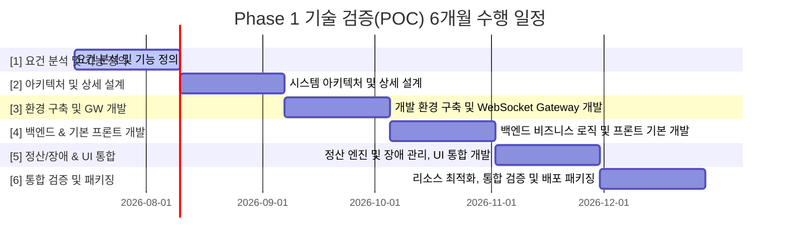
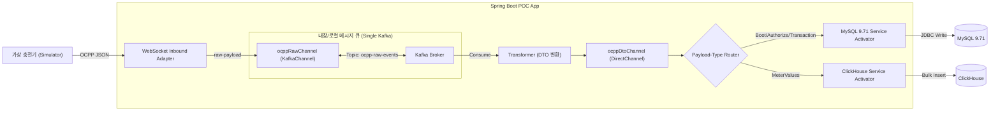

# [POC] CPO[^CPO] CSMS[^CSMS] Lite Phase 1 기술 검증 정의서 (Proof of Concept)

본 문서는 CPO CSMS Lite의 Phase 1 (Standalone 단독 운영 모드) 핵심 설계 요건을 검증하기 위한 기술 검증(POC) 정의서입니다. 
가상 스레드(Java 25), 단일 Kafka 브로커를 백엔드로 하는 Spring Integration EIP[^EIP] 파이프라인, 그리고 MySQL 9.71(OLTP[^OLTP]) 및 ClickHouse(OLAP[^OLAP]) 이원화 적재(CQRS[^CQRS])의 실동작 방식을 코드로 구현하고 검증하는 것을 목적으로 합니다.

---

## 1. POC 6개월 수행 로드맵 (6-Month POC Roadmap)

본 기술 검증(POC)은 Phase 1 Standalone 모드 구축 일정과 싱크를 맞추어 총 6개월(24주)의 일정으로 세분화하여 진행하되, 첫 1개월은 요건 분석 및 기능 정의, 두 번째 1개월은 시스템 아키텍처 및 상세 설계 기간으로 배정하고 이후 개발 및 검증 일정을 압축하여 전체 기간 내에 수행되도록 설계했습니다.



### 1.1. 주차별 세부 마일스톤 및 수행 작업

#### 1개월차: 요건 분석 및 기능 정의 (Week 1 - 4)
* **1주차 (Week 1):**
  * **[요건 분석]** AS-IS CSMS 시스템 토폴로지, 레거시 시스템 간 데이터 연동 방식 및 실하중 트래픽 패턴 분석.
  * **[데이터 분석]** AS-IS 충전 원장, 결제 데이터, 충전기 마스터 DB[^DB] 스키마(약 100여 개 테이블) 분석 및 정규화/반정규화 상태 검토.
* **2주차 (Week 2):**
  * **[요건 분석]** 150개 AS-IS 관리자 UI[^UI] 화면에 대한 기능 카탈로그 분류 및 Standalone 운영에 필요한 화면 60개 선별 작업 수행.
  * **[요구사항 도출]** 운영 기능(충전소, 회원, 결제, 정산)과 통신/장애 모니터링 기능의 요구사항 상세 정의서(SRS) 작성.
* **3주차 (Week 3):**
  * **[프로토콜 분석]** OCPP[^OCPP] 1.6J JSON 명세서(Core, Firmware, Local Auth, Smart Charging 등) 분석 및 Java Object 매핑 모델 정의.
  * **[요구사항 매핑]** AS-IS 충전기 제어 시나리오(원격 부팅, 승인, 미터링)와 OCPP 메시지(BootNotification, StatusNotification 등) 간 1:1 매핑 정의서 작성.
* **4주차 (Week 4):**
  * **[범위 구체화]** Phase 1 Standalone 검증을 위한 필수 기능 범위(Scope Matrix) 도출 및 유관 부서 조정.
  * **[기능 정의]** 필수 30개 기능에 대한 'Phase 1 핵심 기능정의서(FDS)' 최종 작성 및 아키텍처 설계를 위한 검토 승인 완료.

#### 2개월차: 시스템 아키텍처 및 상세 설계 (Week 5 - 8)
* **5주차 (Week 5):**
  * **[아키텍처]** Java 25 가상 스레드 동시성 모델 적용 방안 설계, Single Kafka 브로커 토폴로지 및 파티셔닝 전략 수립.
  * **[CQRS 패턴]** MySQL 9.71(쓰기/트랜잭션)과 ClickHouse(읽기/시계열 로그) 간 CQRS 데이터 분할 및 동기화 아키텍처 수립.
* **6주차 (Week 6):**
  * **[소켓 GW[^GW] 설계]** Spring WebSocket 기반 WebSocket 연결 유지 관리, Connection Heartbeat 감지 및 세션 강제 축출(Eviction) 알고리즘 설계.
  * **[파이프라인 설계]** Spring Integration EIP 구성 요소(Channel, Message, Router, Transformer, Service Activator) 간 메시지 라우팅 토폴로지 설계.
* **7주차 (Week 7):**
  * **[데이터 설계]** MySQL 9.71 OLTP 스키마(충전소 마스터, 트랜잭션 CDR, RFID[^RFID] 정보 등) 및 ClickHouse OLAP 테이블(MeterValues 수집용 시계열 로그 테이블) DDL 설계.
  * **[인덱스 모델링]** ClickHouse 파티션 키 및 소팅 키(Sorting Key) 설계, MySQL 9.71 쿼리 최적화를 위한 인덱스 전략 수립.
* **8주차 (Week 8):**
  * **[인터페이스 설계]** 백엔드 API[^API] 명세(Spring MVC Controller REST API) 및 프론트엔드 연동용 실시간 이벤트 WebSocket 푸시 프로토콜 설계.
  * **[설계서 확정]** 'Phase 1 Standalone 아키텍처 상세설계서(ADD)' 및 '인터페이스 정의서(IDD)' 최종 승인 및 개발 준비 완료.

#### 3개월차: 개발 환경 구축 및 WebSocket Gateway 개발 (Week 9 - 12)
* **9주차 (Week 9):**
  * **[개발 환경]** JDK 25(OpenJDK) 설치 및 IntelliJ IDE 프로젝트 세팅, Maven 빌드 구성 및 패키지 구조 수립.
  * **[인프라 구성]** Docker Compose를 활용하여 Local Docker 환경에 MySQL 9.71, Kafka(KRaft 모드), ClickHouse 단일 노드 구동 환경 구축.
* **10주차 (Week 10):**
  * **[DB 초기화]** MySQL 9.71 마스터 스키마 DDL 실행, 초기 더미 데이터 적재 및 스프링 데이터 JPA 연동 설정.
  * **[스키마 검증]** ClickHouse 시계열 로그 저장용 MergeTree 엔진 테이블 생성 및 로컬 커넥션(HikariCP/JDBC) 연동 검증.
* **11주차 (Week 11):**
  * **[웹소켓 구현]** Spring WebSocket Endpoint 핸들러 구현 및 `ConcurrentHashMap` 기반의 메모리 세션 관리 클래스 `LocalSessionStore` 개발.
  * **[메시지 채널]** Spring Integration `KafkaChannel` 정의 및 웹소켓 유입 Raw JSON 패킷을 Kafka `ocpp-raw-events` 토픽으로 유실 없이 퍼블리싱하는 파이프라인 연동 검증.
* **12주차 (Week 12):**
  * **[OCPP 연동]** OCPP 1.6J Core 프로파일의 필수 메시지 4종(`BootNotification`, `Heartbeat`, `StatusNotification`, `Authorize`) 수신 핸들러 및 응답 메시지 빌더 구현.
  * **[세션 처리]** 하트비트 타임아웃(Heartbeat Timeout) 감지 시 물리 소켓을 강제 차단하고 DB 상 충전기 상태를 `Offline`으로 변경하는 세션 감시 백그라운드 스레드 구현.

#### 4개월차: 백엔드 비즈니스 로직 및 프론트 기본 개발 (Week 13 - 16)
* **13주차 (Week 13):**
  * **[트랜잭션 개발]** `StartTransaction` / `StopTransaction` 메시지 파싱 및 MySQL 9.71 `charging_transaction` 테이블 상태 변경 연동.
  * **[미터값 적재]** 15초 주기 `MeterValues` ClickHouse 벌크 인서트 버퍼링(Queue) 엔진 및 백그라운드 Flush 스케줄러 구현.
* **14주차 (Week 14):**
  * **[비즈니스 API]** 법인/사업장 마스터, 충전소 목록, 충전기 자산 조회, 한전 요금 테이블 연동 API 개발.
  * **[인증/인프라]** 충전기 웹소켓 접속 시 Basic Auth HTTP 헤더 인증 처리 필터 및 스프링 시큐리티 기본 적용.
* **15주차 (Week 15):**
  * **[FE 기본 레이아웃]** Vue 3 (Vite, TypeScript) 개발 환경 세팅, Pinia 상태 관리 아키텍처 수립 및 어드민 기본 포털 레이아웃(Sidebar, Header, Main) 구성.
  * **[FE 대시보드]** 메인 관제 대시보드 컴포넌트(실시간 기동률, 충전소 상태 카드 그리드) 구현.
* **16주차 (Week 16):**
  * **[FE 관제 화면]** 충전기 커넥터 상태 모니터링 그리드 화면 개발, Axios 통신 모듈 연동 및 실시간 상태 동적 변경용 웹소켓 이벤트 바인딩.

#### 5개월차: 정산 엔진 및 장애 관리, UI 통합 개발 (Week 17 - 20)
* **17주차 (Week 17):**
  * **[정산 엔진]** 계절별/시간대별 TOU[^TOU] 요금 체계 및 한전 기본 요금 가중치 연산 엔진 구현.
  * **[CDR 영속화]** 충전 종료 시 누적 사용 Wh 전력량과 단가를 연산해 최종 CDR(Charge Detail Record)을 발급하고 MySQL 9.71 원장에 영속화하는 로직 개발.
* **18주차 (Week 18):**
  * **[FE 자산 관리]** 충전소 및 충전기 자산 등록/상세 조회 화면 및 요금 정책 설정 매핑 컴포넌트 개발.
  * **[조회 API]** MySQL 9.71 트랜잭션 테이블 조회를 통한 충전 이력 및 과금 원장 조회 API/화면 연동.
* **19주차 (Week 19):**
  * **[장애 감지]** OCPP `StatusNotification` Faulted 수신 시 MySQL 9.71 장애 이력 테이블 생성 및 `alertPushChannel`을 통한 브로드캐스팅 알림 발송 백엔드 구현.
  * **[원격 제어]** 어드민 API of 원격 제어 명령(`Reset`, `UnlockConnector`) 수신 시 active WebSocket 세션으로 OCPP Call 패킷 즉시 라우팅 처리.
* **20주차 (Week 20):**
  * **[FE UI 통합]** 실시간 장애 팝업 알림창 및 장애 이력 그리드 연계, 실시간 OCPP 통신 로그 뷰어 화면 개발.
  * **[FE 동적 제어]** 특정 기기 트래픽 격리(Sandbox) 및 실시간 패킷 디버깅(WireTap) 스위칭 관리자 콘솔 UI 개발 및 백엔드 연동 통합 검증.
  * **[백엔드/FE]** UI-백엔드 WebSocket 통합 연동 및 실시간 이벤트 채널 매핑 완료.

#### 6개월차: 리소스 최적화, 통합 검증 및 배포 패키징 (Week 21 - 24)
* **21주차 (Week 21):**
  * **[리소스 최적화]** 단일 VM의 리소스 가용성 극대화를 위해 가상 스레드 덤프 분석, Kafka JVM[^JVM] Heap(512MB) 튜닝, ClickHouse 쿼리 메모리 한도 설정.
  * **[DB 튜닝]** MySQL 9.71 DB Connection Pool(HikariCP 50개) 최적화 및 슬로우 쿼리 인덱스 튜닝.
* **22주차 (Week 22):**
  * **[부하 테스트]** Node.js 기반 가상 충전기 시뮬레이터 2,000대 연결 구동 및 대량의 `MeterValues` 송신 하에서 메모리 누수 및 CPU[^CPU] 점유율 모니터링.
  * **[스트레스 테스트]** 네트워크 지연(Latency) 및 단선 시 재연결(Reconnect)에 따른 세션 복구 안정성 검증.
* **23주차 (Week 23):**
  * **[시나리오 검증]** 부팅 -> 승인 -> 충전 시작 -> 미터값 수집 -> 장애 발생 -> 원격 리셋 -> 충전 종료 -> 정산 및 CDR 영속화 -> UI 반영에 이르는 Phase 1 통합 시나리오 테스트.
  * **[병목 개선]** 통합 테스트 시 발견된 병목 구간(ClickHouse JDBC 드라이버 병목 등) 튜닝 및 패키징 준비.
  * **[인프라/배포]** Makeself를 이용한 리눅스용 단일 무인 설치 파일(`install.run`) 및 Inno Setup을 이용한 윈도우용 `setup.exe` 컴파일 스크립트 개발.
* **24주차 (Week 24):**
  * **[인프라/배포]** 완전 폐쇄망 환경의 가상 머신에 인스톨러 배포 후 1-Click 설치 기동 완료 및 M1 마일스톤(Phase 1 POC 통과) 최종 확인 및 종료.

---

## 2. POC 검증 핵심 기능 명세 (POC Functional Requirements)

Phase 1 POC에서 구현 및 검증하는 필수 기능 범위 및 상세 명세입니다.

### 2.1. 웹소켓 게이트웨이 및 세션 제어 기능
* **충전기 커넥션 핸들셰이크 & 인증:**
  * 충전기 웹소켓 접속 시 HTTP Basic Authentication 식별자 검증 및 세션 개설.
  * 동일 기기의 중복 접속 시 기존 세션 강제 끊김 처리(Session Eviction) 및 신규 세션 유지.
* **커넥션 하트비트 감지 및 타임아웃 감지:**
  * 설정된 Heartbeat Interval(예: 60초)의 1.5배 이상 데이터 수신이 없을 시, 고장으로 판단하고 게이트웨이 레벨에서 물리 웹소켓 강제 Close 처리.
  * 메모리 내 `LocalSessionStore`에서 즉시 세션 객체 제거 및 MySQL 9.71 상 충전기 상태를 `Offline`으로 변경.

### 2.2. OCPP 1.6J 표준 메시지 수신 처리 기능
* **기기 부팅 및 인증 (`BootNotification`, `Authorize`):**
  * 부팅 메시지 수신 시 MySQL 9.71의 `charge_point` 테이블을 조회하여 해당 기기가 Registered 상태이면 accepted 응답을 전송하고 Online 상태로 변경.
  * RFID 태그 접촉에 따른 `Authorize` 요청 시, 데이터베이스 내 회원 상태 및 정기권 유효 여부를 체크하여 accepted/invalid 여부 반환.
* **충전 개시 및 종료 (`StartTransaction`, `StopTransaction`):**
  * 충전 시작 시 충전 트랜잭션 식별 ID를 고유하게 발급하고, MySQL 9.71 내 `charging_transaction` 테이블에 상태(status: Charging) 기록.
  * 충전 종료 시 누적 Wh 충전량과 요금 단가를 곱하여 최종 금액을 연산하고, **최종 정산 원장(CDR)**을 영속화하여 트랜잭션 완료(status: Finished).
* **실시간 계측값 수집 (`MeterValues`):**
  * 15초 주기로 전송되는 충전기의 전류(A), 전압(V), 누적 전력량(Wh), 배터리 충전율(SOC) 정보를 추출하여 메모리 버퍼(Queue)로 인입.

### 2.3. 비동기 적재 및 관제 알림 기능
* **ClickHouse 시계열 로그 적재:**
  * 버퍼에 대기 중인 MeterValues 패킷 및 OCPP 원본 로그 문자열을 ClickHouse JDBC 드라이버의 Batch 실행을 통해 1초/1,000건 단위로 고속 병렬 적재.
* **실시간 알림 및 장애 감지 (`StatusNotification`):**
  * 충전기가 `Faulted` 상태 메시지를 보낼 경우, 즉시 MySQL 9.71에 장애 이력을 생성하고, `alertPushChannel`을 통해 어드민 UI 웹 화면으로 Web소켓 브로드캐스팅 알림 발송.

### 2.4. Phase 1 필수 관리자 화면 연계 검증
본 POC의 백엔드 처리기는 [통합 기능 분류 정의서 (02.feature_specification)](file:///d:/project/lselink/ocpp-lite/git/h2y-ocpp/doc/02.feature_specification.md)에서 정의한 Phase 1 필수 어드민 화면의 데이터 원천을 완벽하게 제공하도록 검증 설계를 포함합니다.

1. **대시보드 및 관제 현황 모니터링:**
   * `LocalSessionStore`에 보존된 활성 웹소켓 세션 수를 실시간 집계하여 대시보드의 '충전기 기동률' 데이터를 제공합니다.
   * 충전소별 상태 집계 현황 및 실시간 충전기 기동률 상태를 요약 대시보드 그리드 형태로 시각화하여 연동합니다.
2. **충전기 상태 조회, 통신로그 조회 및 동적 채널 제어:**
   * 충전기로부터 수신된 `StatusNotification` 메시지를 처리하여 커넥터별 상태(Available, Charging, Faulted)를 실시간 반영합니다.
   * ClickHouse에 벌크 적재된 원본 JSON 패킷을 조회하는 API를 통해 관리자가 디버깅용 통신 로그를 탐색할 수 있도록 합니다.
   * 관리자 콘솔 UI에서 특정 충전기 선택 시 즉시 '동적 격리(Sandbox)' 명령을 하달해 트래픽을 차단/우회하고, 정밀 모니터링을 위해 '동적 디버깅(WireTap)'을 활성화하여 실시간 패킷 흐름 스트림 뷰와 연계합니다.
3. **충전이력 상세조회 & 결제 정보 현황:**
   * `StopTransaction` 수신 시 연산 완료된 최종 과금 정보(CDR)가 MySQL 9.71의 `charging_transaction` 테이블에 완벽하게 Commit되는지 조회하여, 일반/법인차량 충전 이력 및 매출 통계 화면의 데이터 무결성을 검증합니다.
4. **원격 제어 및 인증 설정:**
   * 어드민 API로부터 전달받은 원격 명령(`Reset`, `UnlockConnector` 등)을 `controlCommandChannel`을 경유해 해당 충전기의 실시간 WebSocket 세션으로 즉시 라우팅하여 제어 반응 속도를 측정합니다.
   * 충전기 등록 마스터 설정에 정의된 Basic Auth 보안 인증 키값을 기준으로 웹소켓 커넥트 시점의 Handshake 검증을 통과하는지 검증합니다.

### 2.5. 동적 채널 및 라우팅 제어 기능 (Dynamic Channel & Routing Management)
* **특정 충전기 트래픽 격리 (Traffic Sandbox):**
  * 특정 충전기 단말의 펌웨어 오작동 등으로 인해 비정상적인 미터값(`MeterValues`) 및 상태 알림(`StatusNotification`) 패킷이 폭증할 때, 시스템 전체 공유 파이프라인의 메시지 처리 지연이 발생하는 것을 방지합니다.
  * 런타임에 Dynamic Router를 통해 해당 충전기 ID(예: `CP_1001`) 전용의 격리 채널(Sandbox Channel)을 실시간 등록/바인딩하여, 타 정상 충전기들의 메시지 파이프라인과 트래픽 흐름을 완벽히 격리(Isolation)합니다.
* **실시간 디버깅 감시 (Dynamic WireTap):**
  * 특정 충전기에 기기 통신 장애가 발생하여 관제사가 정밀 디버깅을 원할 경우, 시스템 재기동 없이 해당 충전기 ID에 대해서만 동적으로 `WireTap` 패턴을 활성화합니다.
  * 실시간 수신되는 OCPP 메시지의 복사본을 디버깅용 웹소켓 채널(`debugConsoleChannel`)로 분기 유도하여 관리자 화면의 실시간 로그 뷰어에 통신 디버깅 스트림을 노출합니다.
### 2.6. 폐쇄망 원클릭 단일 인스톨러 패키징 (Single-File Offline Installer)
인프라(Docker/DB/Kafka)가 미설치된 완전 폐쇄망 환경에서도 복잡한 네이티브 수동 설정 없이, 원클릭으로 모든 인프라와 애플리케이션을 설치하고 구동할 수 있도록 단일 실행 파일 형태의 오프라인 인스톨러를 구성하고 검증합니다.
* **리눅스(Linux) 환경 패키징 (Makeself):**
  * Makeself 자가 추출형 아카이브 도구를 활용하여 오프라인 Docker 설치 패키지(RPM/DEB), 통합 컨테이너 DTO[^DTO] 이미지 백업본(`ocpp-lite-images.tar`), `docker-compose.yml` 및 기동 쉘 스크립트(`install.sh`)를 단 하나의 `install.run` 실행 파일로 패키징합니다.
  * 실행 시 호스트의 Docker 설치 유무를 식별하여 미설치 시 내장된 패키지로 무인 설치(Silent Install)를 수행한 후, 컨테이너 이미지를 일괄 로드하여 서비스를 최종 기동합니다.
* **윈도우(Windows) 환경 패키징 (Inno Setup):**
  * Inno Setup 컴파일러를 활용하여 모든 설치 파일을 하나의 `setup.exe` 파일로 압축 패키징합니다.
  * 설치 마법사 동작 과정에서 백그라운드로 Docker Desktop 설치 프로세스를 자동 대행하고, 이미지를 로드하여 `docker-compose` 구동까지 일괄 처리하는 배치 스크립트(`install.bat`)를 구동합니다.

---

## 3. 아키텍처 및 검증 범위 (Architecture & Verification Scope)

* **WebSocket & Kafka 연동 검증:** 실시간 충전기 연결용 웹소켓 인터페이스와 Spring Integration의 `KafkaChannel`을 연동하여 메시지를 유실 없이 Kafka 브로커로 인입시키고 비동기로 컨슘하는가?
* **Spring Integration EIP 파이프라인 검증:** `Inbound Adapter ➡️ KafkaChannel ➡️ Transformer ➡️ Payload Router ➡️ Service Activator` 흐름이 POJO 수준에서 정상 동작하는가?
* **가상 스레드(Virtual Threads) 및 DB 적재 검증:** 가상 스레드 환경에서 MySQL 9.71(JPA) 정산 원장 적재 및 ClickHouse(벌크 인서트) 미터값 시계열 저장이 논블로킹으로 동시 수행되는가?



---

## 4. 개발 및 테스트 환경 구성 (Poc Environment)

POC 구동을 위한 로컬 호스트 직접 설치형(Native Binary) 인프라 정의서입니다. 단일 VM 혹은 개발자 PC의 OS(Linux/Windows) 내에 MySQL 9.71, ClickHouse, Apache Kafka(KRaft)를 직접 구동합니다.

### 4.1. 미들웨어별 구동 및 설정 가이드

#### 4.1.1. MySQL 9.71 (OLTP DB)
- **필수 설정 (`/etc/mysql/my.cnf` 또는 `C:\ProgramData\MySQL\MySQL Server 9.0\my.ini`)**:
  ```ini
  [mysqld]
  port=3306
  bind-address=0.0.0.0
  max_connections=500
  default-time-zone='+00:00'
  character-set-server=utf8mb4
  collation-server=utf8mb4_unicode_ci
  ```
- **기동 명령어**:
  - **Linux**: `sudo systemctl start mysql`
  - **Windows**: `net start MySQL90` (설정된 서비스명 기준)
- **데이터베이스 및 사용자 생성**:
  ```sql
  CREATE DATABASE ocpp_db;
  CREATE USER 'ocpp_user'@'%' IDENTIFIED BY 'ocpp_password';
  GRANT ALL PRIVILEGES ON ocpp_db.* TO 'ocpp_user'@'%';
  FLUSH PRIVILEGES;
  ```

#### 4.1.2. Apache Kafka (KRaft Mode)
- **필수 설정 (`config/kraft/server.properties`)**:
  ```properties
  node.id=1
  process.roles=broker,controller
  listeners=PLAINTEXT://0.0.0.0:9092,CONTROLLER://0.0.0.0:9093
  advertised.listeners=PLAINTEXT://localhost:9092
  controller.listener.names=CONTROLLER
  controller.quorum.voters=1@localhost:9093
  log.dirs=/tmp/kraft-combined-logs
  log.retention.hours=24
  ```
- **기동 명령어 (Linux/macOS)**:
  ```bash
  # 1. 고유 클러스터 ID 생성
  KAFKA_CLUSTER_ID=$(bin/kafka-storage.sh random-uuid)
  
  # 2. 로그 디렉토리 포맷 설정
  bin/kafka-storage.sh format -t $KAFKA_CLUSTER_ID -c config/kraft/server.properties
  
  # 3. Kafka 브로커 백그라운드 구동
  bin/kafka-server-start.sh -daemon config/kraft/server.properties
  ```

#### 4.1.3. ClickHouse (OLAP DB)
- **필수 설정 (`/etc/clickhouse-server/config.xml` 및 `users.xml`)**:
  - 외부 연동을 위해 호스트 바인딩 해제 (`config.xml` 내 `<listen_host>::</listen_host>` 활성화)
  - HTTP 포트(`8123`) 및 TCP 포트(`9000`) 확인
- **기동 명령어**:
  - **Linux**: `sudo systemctl start clickhouse-server`
- **데이터베이스 및 사용자 생성 (`clickhouse-client` 접속 후)**:
  ```sql
  CREATE DATABASE ocpp_log_db;
  CREATE USER ocpp_user IDENTIFIED WITH sha256_password BY 'ocpp_password';
  GRANT ALL ON ocpp_log_db.* TO ocpp_user;
  ```

---

## 5. 핵심 백엔드 POC 구현 코드 (Sample Implementation)

Phase 1 요건을 충족하기 위한 Java 25 & Spring Boot 3.x/4.x 기반 핵심 설정 및 클래스 구현 표준 예시입니다.

### 5.1. application.yml 설정
```yaml
spring:
  threads:
    virtual:
      enabled: true # 1. Java 25 가상 스레드 전역 활성화

  datasource: # 2. MySQL 9.71 OLTP 설정
    url: jdbc:mysql://localhost:3306/ocpp_db?useSSL=false&serverTimezone=UTC
    username: ocpp_user
    password: ocpp_password
    driver-class-name: com.mysql.cj.jdbc.Driver
    hikari:
      maximum-pool-size: 50 # 가상 스레드 증가에 대비한 충분한 커넥션 풀 확보

  kafka: # 3. Kafka 브로커 연동 설정
    bootstrap-servers: localhost:9092
    consumer:
      group-id: ocpp-core-group
      auto-offset-reset: earliest
      key-deserializer: org.apache.kafka.common.serialization.StringDeserializer
      value-deserializer: org.apache.kafka.common.serialization.StringDeserializer
    producer:
      key-serializer: org.apache.kafka.common.serialization.StringSerializer
      value-serializer: org.apache.kafka.common.serialization.StringSerializer

clickhouse: # 4. ClickHouse OLAP 설정
  url: jdbc:ch://localhost:8123/ocpp_log_db
  username: ocpp_user
  password: ocpp_password
```

### 5.2. WebSocket Gateway & Spring Integration 설정
수신된 메시지를 동기 채널이 아닌 KafkaChannel을 통해 Kafka 브로커에 큐잉하고 컨슘하도록 어댑터와 채널을 연동합니다.

```java
package com.h2y.ocpp.poc.config;

import org.apache.kafka.clients.admin.NewTopic;
import org.springframework.context.annotation.Bean;
import org.springframework.context.annotation.Configuration;
import org.springframework.integration.channel.DirectChannel;
import org.springframework.integration.config.EnableIntegration;
import org.springframework.integration.dsl.IntegrationFlow;
import org.springframework.integration.dsl.MessageChannels;
import org.springframework.integration.kafka.dsl.Kafka;
import org.springframework.kafka.core.ConsumerFactory;
import org.springframework.kafka.core.KafkaTemplate;
import org.springframework.messaging.MessageChannel;

@Configuration
@EnableIntegration
public class IntegrationConfig {

    private static final String RAW_TOPIC = "ocpp-raw-events";

    // 1. Kafka 토픽 등록 Bean
    @Bean
    public NewTopic ocppRawTopic() {
        return new NewTopic(RAW_TOPIC, 1, (short) 1);
    }

    // 2. ocppRawChannel을 Kafka 메시지 채널로 정의 (Spring Integration)
    // WS Gateway가 이 채널로 메세지를 전송하면 내부적으로 Kafka Topic으로 자동 퍼블리싱됩니다.
    @Bean
    public MessageChannel ocppRawChannel(KafkaTemplate<String, String> kafkaTemplate) {
        return Kafka.channel(kafkaTemplate, RAW_TOPIC)
                .autoStartup(true)
                .get();
    }

    // 3. 내부 비즈니스 DTO 채널
    @Bean
    public MessageChannel ocppDtoChannel() {
        return MessageChannels.direct().get();
    }

    // 4. Kafka 토픽으로부터 메시지를 수신하여 비즈니스 DTO 파이프라인으로 태우는 Flow
    @Bean
    public IntegrationFlow ocppRawMessageConsumerFlow(
            ConsumerFactory<String, String> consumerFactory,
            MessageChannel ocppDtoChannel,
            OcppMessageTransformer transformer) {
        
        return IntegrationFlow.from(Kafka.messageDrivenChannelAdapter(consumerFactory, RAW_TOPIC))
                .transform(transformer)  // JSON ➡️ Java DTO 객체 변환
                .channel(ocppDtoChannel) // DTO 채널로 바이패스
                .get();
    }
}
```

### 5.3. OCPP JSON-to-DTO Transformer & Router 구현
메시지를 구조화하여 처리 엔진 및 데이터 저장소로 조건 분기 분배합니다.

```java
package com.h2y.ocpp.poc.config;

import com.fasterxml.jackson.databind.JsonNode;
import com.fasterxml.jackson.databind.ObjectMapper;
import org.springframework.integration.annotation.MessageEndpoint;
import org.springframework.integration.annotation.Transformer;
import org.springframework.messaging.Message;
import org.springframework.messaging.support.MessageBuilder;

import java.time.Instant;

@MessageEndpoint
public class OcppMessageTransformer {

    private final ObjectMapper objectMapper = new ObjectMapper();

    @Transformer(inputChannel = "ocppRawChannel", outputChannel = "ocppDtoChannel")
    public Message<OcppDto> transform(Message<String> rawMessage) throws Exception {
        String payload = rawMessage.getPayload();
        JsonNode root = objectMapper.readTree(payload);

        // OCPP 1.6J 표준 패킷 포맷 파싱: [MessageType, UniqueId, Action, Payload]
        int messageType = root.get(0).asInt();
        String messageId = root.get(1).asText();
        String action = root.get(2).asText();
        JsonNode body = root.get(3);

        OcppDto dto = new OcppDto(messageId, action, body.toString(), Instant.now());
        
        return MessageBuilder.withPayload(dto)
                .setHeader("ocppAction", action)
                .build();
    }
}
```

```java
package com.h2y.ocpp.poc.config;

import org.springframework.context.annotation.Bean;
import org.springframework.context.annotation.Configuration;
import org.springframework.integration.annotation.Router;
import org.springframework.integration.dsl.IntegrationFlow;
import org.springframework.messaging.MessageChannel;

@Configuration
public class OcppRouterConfig {

    // ocppDtoChannel로 들어온 DTO를 ocppAction 헤더값을 기준으로 세부 비즈니스 서비스로 분기 라우팅
    @Bean
    public IntegrationFlow ocppRoutingFlow(MessageChannel ocppDtoChannel) {
        return IntegrationFlow.from(ocppDtoChannel)
                .route(OcppDto.class, dto -> dto.getAction(), mapping -> mapping
                        .subFlowMapping("BootNotification", sf -> sf.handle("ocppCoreService", "handleBoot"))
                        .subFlowMapping("Authorize", sf -> sf.handle("ocppCoreService", "handleAuthorize"))
                        .subFlowMapping("StartTransaction", sf -> sf.handle("ocppCoreService", "handleStartTx"))
                        .subFlowMapping("StopTransaction", sf -> sf.handle("ocppCoreService", "handleStopTx"))
                        .subFlowMapping("MeterValues", sf -> sf.handle("clickHouseService", "handleMeterValues"))
                )
                .get();
    }
}
```

### 5.4. 비즈니스 서비스 및 ClickHouse 벌크 저장 엔진
가상 스레드 컨텍스트 하에서 MySQL 9.71 트랜잭션 및 ClickHouse 벌크 라이터가 동작합니다.

```java
package com.h2y.ocpp.poc.service;

import com.h2y.ocpp.poc.config.OcppDto;
import org.slf4j.Logger;
import org.slf4j.LoggerFactory;
import org.springframework.stereotype.Service;
import org.springframework.transaction.annotation.Transactional;

@Service("ocppCoreService")
public class OcppCoreService {

    private static final Logger log = LoggerFactory.getLogger(OcppCoreService.class);

    @Transactional
    public void handleBoot(OcppDto dto) {
        log.info("[MySQL 9.71 적재] BootNotification 처리 - Thread: {}", Thread.currentThread());
        // JPA/Hibernate를 활용한 MySQL CP 마스터 온라인 갱신 로직 실행
    }

    @Transactional
    public void handleStartTx(OcppDto dto) {
        log.info("[MySQL 9.71 적재] StartTransaction 생성 - Thread: {}", Thread.currentThread());
        // charging_transaction 테이블에 Insert 처리
    }
}
```

```java
package com.h2y.ocpp.poc.service;

import com.h2y.ocpp.poc.config.OcppDto;
import org.slf4j.Logger;
import org.slf4j.LoggerFactory;
import org.springframework.beans.factory.annotation.Autowired;
import org.springframework.stereotype.Service;

import javax.sql.DataSource;
import java.sql.Connection;
import java.sql.PreparedStatement;
import java.util.ArrayList;
import java.util.List;
import java.util.concurrent.BlockingQueue;
import java.util.concurrent.LinkedBlockingQueue;
import java.util.concurrent.ScheduledExecutorService;
import java.util.concurrent.ScheduledThreadPoolExecutor;
import java.util.concurrent.TimeUnit;

@Service("clickHouseService")
public class ClickHouseService {

    private static final Logger log = LoggerFactory.getLogger(ClickHouseService.class);
    private final BlockingQueue<OcppDto> buffer = new LinkedBlockingQueue<>(10000);
    
    @Autowired
    private DataSource clickHouseDataSource; // ClickHouse 전용 JDBC 데이터소스 주입

    public ClickHouseService() {
        // 백그라운드에서 1초 또는 1000건 단위로 ClickHouse 벌크 적재 수행하는 가상 스레드 스케줄러 기동
        ScheduledExecutorService scheduler = new ScheduledThreadPoolExecutor(1, 
                r -> Thread.ofVirtual().name("ch-bulk-writer").unstarted(r));
        
        scheduler.scheduleWithFixedDelay(this::flushBuffer, 1, 1, TimeUnit.SECONDS);
    }

    public void handleMeterValues(OcppDto dto) {
        buffer.offer(dto); // 버퍼에 임시 적재 (논블로킹)
    }

    private void flushBuffer() {
        if (buffer.isEmpty()) return;

        List<OcppDto> batch = new ArrayList<>();
        buffer.drainTo(batch, 1000); // 최대 1,000건 인출

        log.info("[ClickHouse Bulk Insert] {} 건 적재 개시 - Thread: {}", batch.size(), Thread.currentThread());

        String sql = "INSERT INTO default.meter_value_history (cp_id, transaction_id, event_time, payload) VALUES (?, ?, ?, ?)";
        try (Connection conn = clickHouseDataSource.getConnection();
             PreparedStatement ps = conn.prepareStatement(sql)) {
            
            conn.setAutoCommit(false);
            for (OcppDto dto : batch) {
                ps.setString(1, "CP_1001");
                ps.setString(2, dto.getMessageId());
                ps.setObject(3, java.sql.Timestamp.from(dto.getReceivedAt()));
                ps.setString(4, dto.getPayload());
                ps.addBatch();
            }
            ps.executeBatch();
            conn.commit();
            log.info("[ClickHouse Bulk Insert] 적재 완료");
        } catch (Exception e) {
            log.error("ClickHouse Bulk Insert 중 오류 발생", e);
        }
    }
}
```

### 5.5. 동적 채널 등록 및 Dynamic Router 구현 예시
Spring Integration의 `IntegrationFlowContext` 및 `@Router` 패턴을 활용하여 런타임에 기기별 채널을 동적으로 바인딩하고 라우팅 경로를 변경하는 구현 예시입니다.

```java
package com.h2y.ocpp.poc.config;

import org.springframework.integration.annotation.Router;
import org.springframework.messaging.MessageChannel;
import org.springframework.stereotype.Component;

import java.util.Collection;
import java.util.Collections;
import java.util.Map;
import java.util.concurrent.ConcurrentHashMap;

@Component("dynamicRouter")
public class OcppDynamicRouter {

    private final Map<String, MessageChannel> customRoutes = new ConcurrentHashMap<>();
    private final MessageChannel defaultChannel;

    public OcppDynamicRouter(MessageChannel ocppDtoChannel) {
        this.defaultChannel = ocppDtoChannel;
    }

    // 1. DTO 유입 시 충전기 ID를 기반으로 동적 분기 채널 매핑
    @Router
    public Collection<MessageChannel> route(OcppDto dto) {
        String cpId = "CP_1001"; // 예시: dto에서 실제 충전기 ID 획득
        MessageChannel targetChannel = customRoutes.get(cpId);
        
        if (targetChannel != null) {
            return Collections.singletonList(targetChannel);
        }
        return Collections.singletonList(defaultChannel); // 매핑이 없으면 기본 DirectChannel 배달
    }

    // 2. 특정 충전기 전용 채널 동적 등록 (Sandbox/격리 또는 실시간 WireTap 목적)
    public void registerCustomRoute(String cpId, MessageChannel channel) {
        customRoutes.put(cpId, channel);
    }

    // 3. 동적 채널 해제 및 기본 채널 원복
    public void removeCustomRoute(String cpId) {
        customRoutes.remove(cpId);
    }
}
```

```java
package com.h2y.ocpp.poc.service;

import com.h2y.ocpp.poc.config.OcppDynamicRouter;
import org.springframework.beans.factory.annotation.Autowired;
import org.springframework.integration.dsl.IntegrationFlow;
import org.springframework.integration.dsl.MessageChannels;
import org.springframework.integration.dsl.context.IntegrationFlowContext;
import org.springframework.messaging.MessageChannel;
import org.springframework.stereotype.Service;

@Service
public class DynamicChannelService {

    @Autowired
    private IntegrationFlowContext flowContext;

    @Autowired
    private OcppDynamicRouter dynamicRouter;

    // 특정 오동작 충전기(CP)에 대해 트래픽 Sandbox(격리 및 Drop/제한) 동적 적용
    public void isolateChargePoint(String cpId) {
        // 1. 격리용 전용 DirectChannel 동적 생성
        String channelName = "sandbox-" + cpId + "-channel";
        MessageChannel sandboxChannel = MessageChannels.direct(channelName).get();

        // 2. 격리 채널에 대한 처리 Flow 동적 등록 (예: 로깅 및 폐기/속도 제한)
        IntegrationFlow sandboxFlow = IntegrationFlow.from(sandboxChannel)
                .handle(message -> {
                    System.out.println("[Traffic Sandbox] 격리 채널 유입 및 폐기: " + message.getPayload());
                })
                .get();

        flowContext.registration(sandboxFlow)
                .id(cpId + ".sandbox.flow")
                .register();

        // 3. Dynamic Router에 해당 CP와 격리 채널 매핑 등록
        dynamicRouter.registerCustomRoute(cpId, sandboxChannel);
    }

    // 격리 해제 및 기본 채널 복구
    public void releaseChargePoint(String cpId) {
        dynamicRouter.removeCustomRoute(cpId);
        flowContext.remove(cpId + ".sandbox.flow");
    }
}
```

---

## 6. 검증 시나리오 및 방법 (Verification Scenario)

작성된 코드를 빌드하고 시뮬레이터를 이용하여 전체 흐름을 테스트합니다.

### 6.1. Step 1: 인프라 기동 및 테이블 생성
1. 로컬 환경에서 도커 데몬을 기동한 후 `docker-compose -f docker-compose-poc.yml up -d` 명령어를 통해 환경을 기동합니다.
2. MySQL 9.71 및 ClickHouse 콘솔에 접속하여 [01.prd.md의 핵심 데이터베이스 스키마 스크립트](file:///d:/project/h2y/h2y-ocpp/doc/01.standard_solution/01.prd.md#L745-L801)를 실행하여 테스트용 테이블을 초기화합니다.

### 6.2. Step 2: Spring Boot POC 어질리티 빌드 및 기동
1. Java 25 SDK 환경에서 프로젝트 루트 경로로 진입하여 Maven 또는 Gradle 빌드를 완료합니다.
2. `OcppPocApplication`을 실행하여 웹소켓 게이트웨이 포트(예: 8080)와 Kafka 브로커 커넥션이 오차 없이 맺어지는지 확인합니다.

### 6.3. Step 3: 가상 시뮬레이터 송신 및 연동 확인
아래의 Mocking용 Node.js 클라이언트 스크립트를 사용하여 가상 메시지 패킷을 웹소켓 게이트웨이로 발송합니다.

```javascript
// simulator.js
const WebSocket = require('ws');
const ws = new WebSocket('ws://localhost:8080/ocpp/CP_1001');

ws.on('open', function open() {
  console.log('WS 연결 완료');
  
  // 1. BootNotification 전송
  const bootMsg = [2, "msg-0001", "BootNotification", {
    chargePointVendor: "H2Y-Vendor",
    chargePointModel: "H2Y-Fast-200"
  }];
  ws.send(JSON.stringify(bootMsg));

  // 2. 15초 단위 실시간 계측값(MeterValues) 루프 전송
  let count = 1;
  setInterval(() => {
    const meterMsg = [2, `msg-meter-${count++}`, "MeterValues", {
      transactionId: "TX_9999",
      meterValue: [{
        timestamp: new Date().toISOString(),
        sampledValue: [{ value: (30 + count * 0.1).toString(), context: "Sample.Periodic" }]
      }]
    }];
    ws.send(JSON.stringify(meterMsg));
    console.log('MeterValues 패킷 송신 완료');
  }, 1000); // POC 검증을 위해 1초 주기로 고속 송신 테스트
});
```

### 6.4. Step 4: 데이터 적재 여부 최종 검증 (Checklist)

| 검증 단계 | 검증 항목 | 확인 방법 및 명령어 | 성공 여부 |
| :--- | :--- | :--- | :---: |
| **소켓 접속** | 가상 시뮬레이터와 Gateway 간의 WS 접속 성립 여부 | 런타임 로그 내 `Session Open / Connected` 기록 확인 | [ ] |
| **Kafka 인입** | `ocpp-raw-events` 토픽에 Raw JSON 패킷 적재 여부 | `kafka-console-consumer.sh --bootstrap-server localhost:9092 --topic ocpp-raw-events --from-beginning` 실행 시 패킷 출력 확인 | [ ] |
| **EIP 라우팅** | Transformer를 거쳐 Action(Boot/Meter)별 비즈니스 서비스 라우팅 여부 | 어플리케이션 로그에 `[MySQL 9.71 적재]`, `[ClickHouse Bulk Insert]` 분기 지점 정상 도달 메시지 확인 | [ ] |
| **MySQL 9.71 확인**| `charge_point` 테이블의 상태가 Registered -> Online 변경 여부 | `SELECT cp_id, status FROM charge_point WHERE cp_id = 'CP_1001';` 수행 시 `Online` 확인 | [ ] |
| **ClickHouse 확인**| 1초 버퍼 기동 후 `meter_value_history` 벌크 적재 완료 여부 | `SELECT count(), max(event_time) FROM meter_value_history;` 수행 시 레코드 수가 1초마다 대량 증가 확인 | [ ] |
| **동적 채널 격리** | 특정 기기(CP) 트래픽에 대한 격리(Sandbox) 런타임 적용 여부 | `DynamicChannelService.isolateChargePoint("CP_1001")` 호출 후, 어플리케이션 로그에 `[Traffic Sandbox] 격리 채널 유입` 출력 확인 | [ ] |
| **단일 인스톨러** | Makeself 또는 Inno Setup 기반 패키지 구동 검증 | `install.run` (리눅스) 또는 `setup.exe` (윈도우) 기동 후 Docker 자동 설치 및 서비스 기동 확인 | [ ] |

---
[^API]: **API (Application Programming Interface):** 응용 프로그램 프로그래밍 인터페이스
[^CPO]: **CPO (Charge Point Operator):** 전기차 충전소 운영 사업자
[^CPU]: **CPU (Central Processing Unit):** 중앙 처리 장치
[^CQRS]: **CQRS (Command Query Responsibility Segregation):** 명령 및 조회 책임 분리 패턴
[^CSMS]: **CSMS (Charging Station Management System):** 충전기 통합 관리 시스템
[^DB]: **DB (Database):** 데이터베이스
[^DTO]: **DTO (Data Transfer Object):** 데이터 전송 객체
[^EIP]: **EIP (Enterprise Integration Patterns):** 기업 통합 패턴 (소프트웨어 아키텍처 디자인 패턴)
[^GW]: **GW (Gateway):** 게이트웨이 (서버/기기 간의 통신 접점)
[^JVM]: **JVM (Java Virtual Machine):** 자바 가상 머신
[^OCPP]: **OCPP (Open Charge Point Protocol):** 개방형 충전 통신 규격
[^OLAP]: **OLAP (Online Analytical Processing):** 실시간 데이터 분석 처리
[^OLTP]: **OLTP (Online Transaction Processing):** 실시간 트랜잭션 처리
[^RFID]: **RFID (Radio Frequency Identification):** 무선 주파수 식별 (충전 회원 카드 등)
[^TOU]: **TOU (Time of Use):** 계절별/시간대별 차등 요금제
[^UI]: **UI (User Interface):** 사용자 인터페이스
