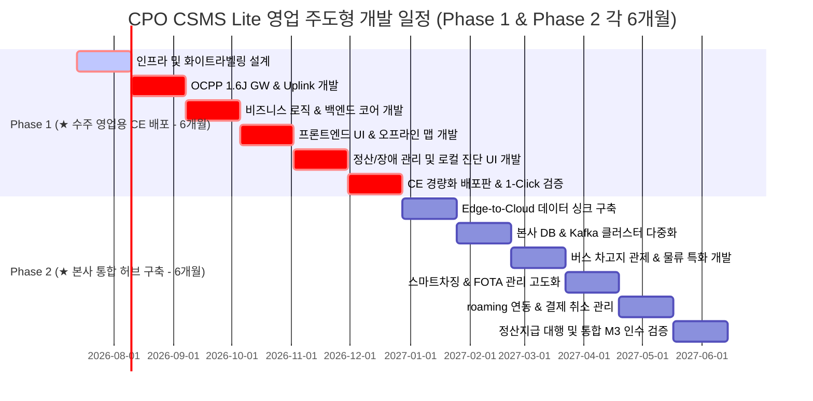
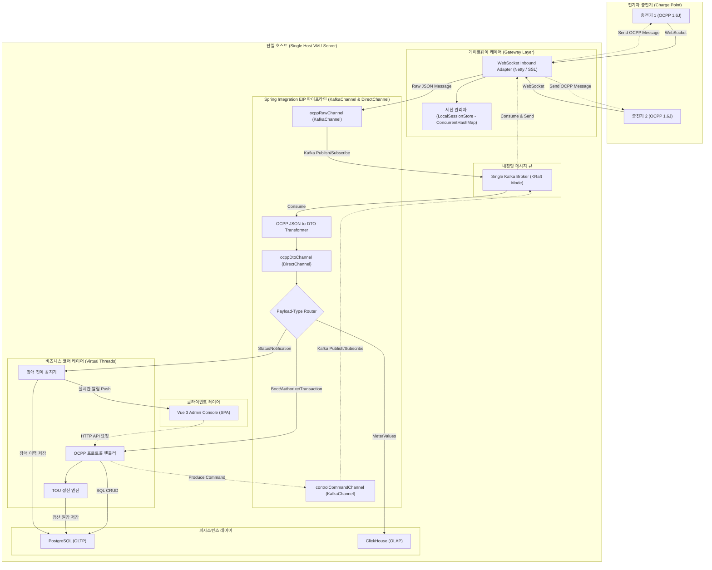
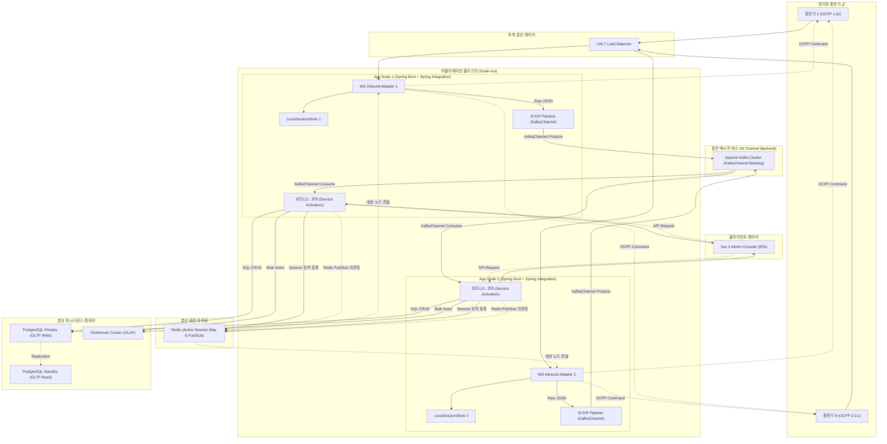
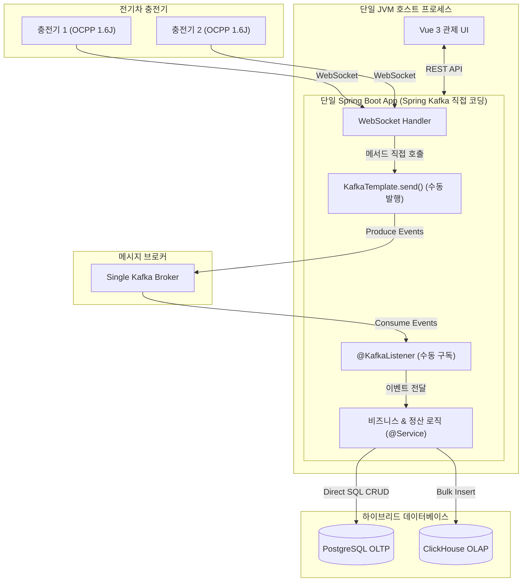
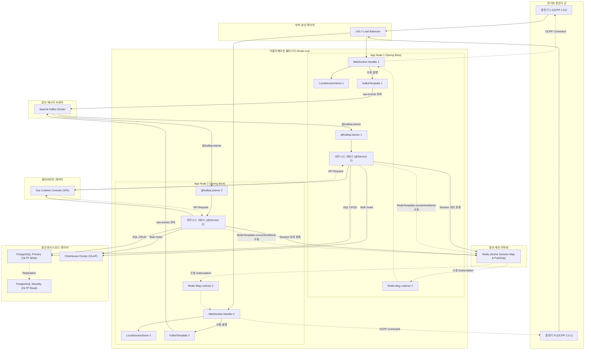
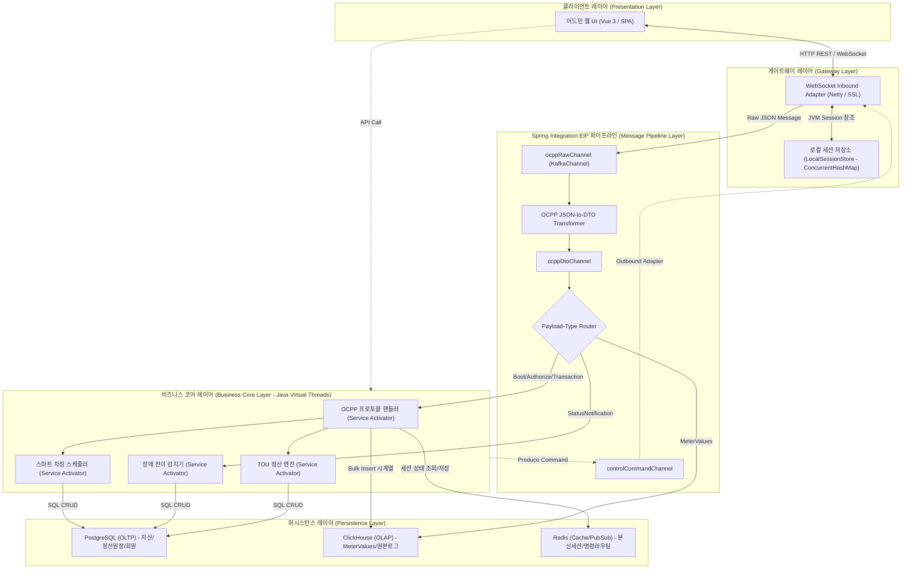
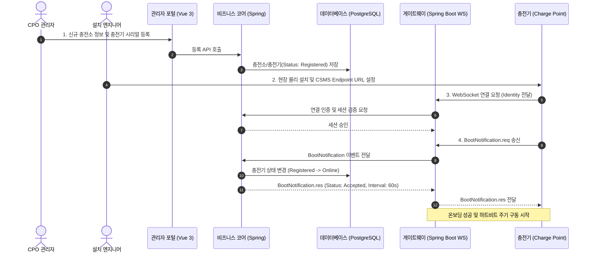
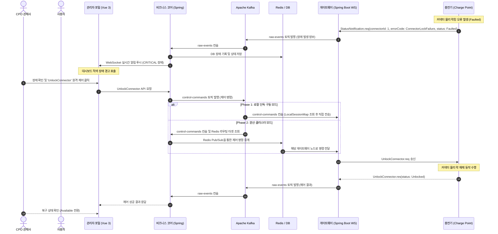
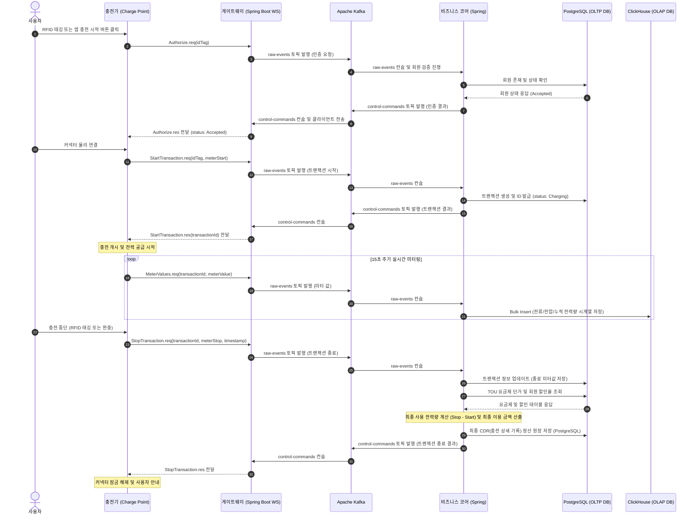

# [PRD] CPO CSMS Lite (Integrated CSMS Platform)

## 1. 프로젝트 개요 (Project Overview)

### 1.1. 목적
전기차 충전 인프라의 효율적 운영 및 관리를 위해 CPO(Charge Point Operator) 전용 고성능 통합 관리 시스템(CSMS: Charging Station Management System)을 구축합니다. 충전기 상태 모니터링, 원격 제어, 매출 정산, 고객 및 멤버십 관리를 일원화하여 운영 효율성을 극대화합니다.

### 1.2. 핵심 가치
- **실시간성 확보 (Real-time Processing):** 초 단위의 충전 상태 변경 및 미터값 처리를 위한 고성능 비동기 아키텍처 확보.
- **대용량 트래픽 처리 (Scalability):** 수천 대 이상의 충전기가 동시에 발생시키는 OCPP 메시지를 병목 없이 수집하고 분석할 수 있는 확장성 제공.
- **폐쇄망 유연 배포 (Air-gapped Readiness):** 군부대, 정부기관, 대기업 사옥 등 외부 인터넷이 단절된 폐쇄망 환경에서도 로컬 리소스만으로 완벽 구동.
- **직관적 시각화 (Interactive Visualization):** 2D 기반 충전소 배치도 및 상태 관제를 직관적으로 구현합니다. (※ 3D 입체 디지털 트윈 기술은 본 핵심 구축 프로젝트 범위에서 완전히 제외하고 별도 추가 트랙으로 진행)
- **표준 규격 준수 (Standard Compliance):** OCPP 1.6J 표준 프로토콜 완벽 지원 (Phase 2에서 OCPP 2.0.1 규격 추가 지원).

### 1.3. 개발 로드맵 및 마일스톤 (Timeline & Milestones)

본 프로젝트는 수주 영업(Loss Leader) 및 조기 시장 선점을 목적으로 하여, Phase 1 (Community Edition 영업 릴리스) 6개월, Phase 2 (본사 통합 허브 및 HA 클러스터 고도화) 6개월을 배정하여 총 12개월(1년)의 일정으로 진행됩니다.



| 마일스톤 | 목표 작업 | 완료 기준 | 예상 일자 (개발 착수 대비) |
| :--- | :--- | :--- | :--- |
| **M1: Phase 1 완료** | 영업 수주용 1-Click 패키지 및 화이트라벨링 릴리스 | 영업부서 제안용 Community Edition(Docker-Compose) 배포 패키지 완성, 위탁 파트너사 로고/테마 맞춤화(White-labeling) 엔진 최우선 구현, 현장 엔지니어 자가 진단 UI 및 PostgreSQL 싱글 DB 기반 초경량 구동 검증 완료 | **24주차 말 (6개월차)** |
| **M2: Phase 2 개발 완료** | 본사 통합 허브 및 데이터 동기화 파이프라인 개발 | 각 영업지(CE Edge)로부터 충전 원장(CDR) 및 시계열 미터링 요약을 본사 서버로 이관/수집하는 Edge-to-Cloud 동기화 API 파이프라인 완성, Redis 분산 세션 및 다중 노드 제어 명령 라우팅 연동 완료 | **40주차 말 (10개월차)** |
| **M3: 최종 인수** | 전국 영업망 통합 관제 안정성 검증 및 최종 인도 | 본사 통합 허브 서버의 Kafka/ClickHouse 대용량 부하 테스트(가상 충전기 10,000대 이상) 통과, 로밍 중계 연동, 폐쇄망 패키징 및 최종 인도 | **48주차 말 (12개월차/1년)** |

### 1.4. 시스템 아키텍처 후보안 비교 (System Architecture Options)

솔루션 구축 및 미래 서비스 확장을 고려하여 두 가지 아키텍처 후보군을 비교 검토했습니다. 본 프로젝트는 **수평 확장(Scale-out) 대응 및 코드 안정성이 우수한 [제 1안: Spring Integration 버전]을 권장안으로 채택**하여 진행합니다.

#### 1.4.1. [제 1안: Spring Integration 버전 - 권장] EIP 기반 분산 진화형 아키텍처
* **개요:** 웹소켓 통신 게이트웨이와 비즈니스 코어 엔진을 물리적/논리적으로 분리하고, Spring Integration(EIP) 및 Kafka 메시지 버스를 도입하여 비동기 처리 파이프라인을 구축합니다.
* **장점:** 
  * **무혈 분산 스위칭:** 개발 코드의 변경 없이 설정 전환만으로 Phase 1(단일 브로커 KafkaChannel)에서 Phase 2(HA 클러스터 분산 KafkaChannel)로 즉시 수평 확장 가능.
  * **장애 격리:** DB 병목 및 API 지연이 실시간 충전기 웹소켓 세션 유지에 영향을 주지 않음.
  * **보일러플레이트 제거:** 라우터, 트랜스포머 등 EIP 패키지 활용으로 코드 표준화 및 통신 결합도 제거.
* **단점:** 구조적 추상화 수준이 높아 초반 진입 장벽 및 설정 공수가 다소 필요함.

##### [제 1안] Phase 1: 1대 운영 모드 (초기 및 Standalone 배포)
단일 가상 머신(VM) 또는 하드웨어 내에서 Kafka 단일 브로커(KRaft 모드)와 PostgreSQL 단독 인스턴스만을 결합하여 구동합니다. 웹소켓 게이트웨이와 비즈니스 코어 간의 주요 채널(ocppRawChannel, controlCommandChannel)에 Kafka 단일 브로커를 메시지 버스로 연동하여 실시간 완충 및 장애 격리를 활성화하며, 별도의 분산 세션 공유 미들웨어(Redis) 없이 JVM 로컬 메모리로 세션을 관리합니다.



> **Phase 1 핵심:** 웹소켓 게이트웨이와 코어 간의 연동 채널(ocppRawChannel, controlCommandChannel)이 단일 Kafka 브로커를 메시지 버스로 하는 KafkaChannel로 구동되어, 단일 서버 환경에서도 메시지 완충 및 장애 격리가 상시 활성화됩니다.

##### [제 1안] Phase 2: 스케일 아웃 모드 (대형 서비스 확장 및 HA 클러스터)
운영 노드가 2대 이상으로 확장되면 L4/L7 로드밸런서를 배치하여 트래픽을 분산합니다. 이때 다중 노드 간의 웹소켓 세션 맵 동기화 및 제어 명령 라우팅을 위해 Redis 캐시 및 Pub/Sub 기능을 활성화합니다.



> **Phase 2 핵심:** Phase 1에서 이미 구현된 KafkaChannel 기반 메시지 파이프라인 코드를 100% 재사용하며, 설정 변경을 통해 단일 Kafka 브로커에서 HA 분산 Kafka 클러스터로 확장하고 다중 노드 제어 명령 라우팅을 위한 Redis Pub/Sub을 연동합니다.

#### 1.4.2. [제 2안: Spring Boot 버전 - 대안] Spring Kafka 직접 구현 기반 비동기 아키텍처
* **개요:** Spring Integration(EIP)과 같은 통합 프레임워크를 사용하지 않고, Spring Boot 내에 Spring-Kafka 의존성을 직접 추가하여 개발자가 `@KafkaListener` 어노테이션 및 `KafkaTemplate`을 활용해 수동으로 비동기 메시지 파이프라인을 구축합니다.
* **장점:**
  * **직관적인 구현:** 별도의 EIP 추상화 개념(Channel, Router, Transformer 등)을 학습할 필요 없이 익숙한 `@KafkaListener` 선언만으로 카프카 컨슈머를 빠르게 구성 가능.
  * **완충 작용:** 중간 브로커(Kafka)가 존재하므로 DB 병목이나 무거운 정산 작업 시에도 게이트웨이 웹소켓 세션이 직접 블로킹되는 연쇄 장애는 부분 방어 가능.
* **단점:**
  * **Phase 2 전환 비용 발생:** 로컬 단독 구동 시(Phase 1)에는 메모리 호출로 가볍게 기동하다가 분산(Phase 2)으로 전환하려 할 때, EIP처럼 설정 교체만으로 불가능하고 서비스 내부 송수신 코드를 `KafkaTemplate` 및 리스너 구조로 일일이 변경해주어야 함.
  * **스파게티 코드 위험:** 비즈니스 로직(Service) 내에 Kafka 메시지 발행/수신 코드가 직접 포함되므로 인프라 의존성이 비즈니스 도메인 코드에 침투하며, 라우팅이나 분기 조건이 늘어날수록 코드가 복잡해짐.
##### [제 2안] Phase 1: 1대 운영 모드 (초기 및 Standalone 배포)
단일 가상 머신(VM) 또는 하드웨어 내에서 Spring Integration EIP 추상화 없이, 단일 JVM 호스트 내에 Spring-Kafka 모듈을 직접 연동하여 단일 Kafka 브로커와 데이터베이스(PostgreSQL/ClickHouse)를 통해 구동하는 단독 배포 구성입니다.



##### [제 2안] Phase 2: 스케일 아웃 모드 (대형 서비스 확장 및 HA 클러스터)
어플리케이션 노드가 2대 이상으로 확장되면 L4/L7 로드밸런서를 배치하여 트래픽을 분산합니다. 이 모드에서는 개발자가 직접 구현한 Redis Pub/Sub 메시지 리스너 컨테이너와 Redis `active_session_map`을 조회하는 제어 명령 라우팅 코드를 서비스 및 게이트웨이 레이어에 직접 작성하여 다중 노드 간의 통신을 중계 처리합니다.



> **제 2안 특징:** Kafka 메시지 브로커를 도입하여 수집과 처리를 비동기 분리하지만, Spring Integration EIP 채널 추상화가 적용되지 않아 인프라(Kafka)에 대한 의존성이 비즈니스 로직 코드에 강하게 결합됩니다. 이로 인해 Phase 2(분산 스케일 아웃) 및 다중 노드 라우팅 적용 시 대대적인 코드 수정 및 수동 Redis Pub/Sub 연동 코딩(RedisTemplate, MessageListenerContainer 직접 설정)이 수반됩니다.

#### 1.4.3. 후보안 정량 비교 매트릭스 (Architecture Comparison Matrix)

두 아키텍처 후보안을 핵심 평가 기준에 따라 정량적으로 비교합니다. 평가 점수는 5점 만점(★) 기준이며, 높을수록 해당 기준에 유리합니다.

| 평가 기준 | 제 1안 (Spring Integration) | 제 2안 (Spring Boot) | 비고 |
| :--- | :---: | :---: | :--- |
| **수평 확장성 (Scale-out)** | ★★★★★ | ★★☆☆☆ | SI 버전은 채널 설정 교체만으로 분산 전환 가능. SB 버전은 코드 전면 재작성 필요. |
| **장애 격리 (Fault Isolation)** | ★★★★★ | ★★★★☆ | 두 안 모두 Kafka를 도입하여 DB 병목 완충 가능. 다만 SI 버전이 채널 레벨 장애 차단이 더 우수함. |
| **단일 노드 지연 시간 (Latency)** | ★★★★☆ | ★★★★☆ | 두 안 모두 중간 브로커(Kafka)를 경유하므로 비동기 지연(~2ms)이 발생하여 동일함. |
| **초기 배포 단순성** | ★★★☆☆ | ★★★★☆ | SB 버전이 EIP 설정이 빠져 소폭 단순하나, 두 안 모두 Kafka 브로커 기동이 필요함. |
| **초기 리소스 점유** | ★★★☆☆ | ★★★☆☆ | 두 안 모두 단일 JVM 내에서 Kafka 브로커 및 Heap 메모리를 공유하므로 유사함. |
| **코드 표준화 및 유지보수** | ★★★★★ | ★★★☆☆ | SI 버전은 EIP 패턴(Router, Transformer 등)으로 메시지 처리 코드 일관성 확보. |
| **운영 모니터링 가시성** | ★★★★★ | ★★★★☆ | Kafka 모니터링은 공통 적용되나 SI 버전의 Channel Interceptor를 통한 가시성 확보가 추가됨. |
| **폐쇄망 호환성 (Air-gap)** | ★★★★☆ | ★★★★☆ | 두 안 모두 가능하나, SB 버전이 프레임워크 의존성이 하나 더 적어 패키징에 미세하게 유리함. |
| **Phase 2 전환 비용** | ★★★★★ | ★★☆☆☆ | SI 버전은 설정 변경으로 전환. SB 버전은 수동 리스너 및 라우팅 코드 직접 작성 필요. |
| **총점** | **40/45** | **31/45** | — |

##### 기술 스택 비교

| 구성 요소 | 제 1안 (Spring Integration) | 제 2안 (Spring Boot) |
| :--- | :--- | :--- |
| **런타임** | Java 25, Spring Boot 3.x/4.x + Spring Integration 6.x | Java 25, Spring Boot 3.x/4.x |
| **메시지 처리** | Spring Integration EIP (Channel, Router, Transformer) | 수동 `@KafkaListener` / `KafkaTemplate` 직접 코딩 |
| **메시지 브로커** | Apache Kafka (KRaft, Phase 1 단일 브로커) | Apache Kafka (KRaft, Phase 1 단일 브로커) |
| **세션 관리 (Phase 1)** | JVM ConcurrentHashMap | JVM ConcurrentHashMap |
| **세션 관리 (Phase 2)** | Redis Active Connection Map + Pub/Sub | Redis Active Connection Map + 수동 Pub-Sub 개발 필요 |
| **OLTP DB** | PostgreSQL | PostgreSQL |
| **OLAP DB** | ClickHouse | ClickHouse |
| **프론트엔드** | Vue 3 SPA | Vue 3 SPA |
| **로드밸런서 (Phase 2)** | L4/L7 Load Balancer | L4/L7 Load Balancer |

##### 최종 의사결정 근거 요약

> [!IMPORTANT]
> 본 프로젝트는 **제 1안: Spring Integration 버전 (EIP 기반 분산 진화형 아키텍처)**을 최종 권장안으로 채택합니다.

**채택 사유:**

1. **제로 코드 변경 분산 전환:** Phase 1과 Phase 2 모두 동일한 KafkaChannel 기반의 코드를 사용하므로 개발 코드의 변경이 전혀 필요 없으며, 단독 구동(단일 브로커)에서 대형 서비스 확장(분산 클러스터) 시 설정 조절만으로 분산 전환됩니다. 제 2안(Spring Boot 버전)은 Phase 2 전환 시 인프라 연동 및 라우팅 코드를 대거 새로 코딩해야 하여 리팩토링 비용이 수반됩니다.

2. **도메인과 인프라의 결합도 제거:** 제 1안은 EIP 프레임워크가 Kafka 메시지 통신을 완벽히 추상화하여 비즈니스 서비스 클래스가 외부 메시지 큐 인터페이스에 오염되지 않습니다. 반면 제 2안은 `@KafkaListener`와 `KafkaTemplate`이 비즈니스 도메인 서비스 클래스에 침투하여 향후 유지보수 복잡도를 증대시킵니다.

3. **가시성 및 장애 격리 수준 향상:** Spring Integration의 Channel Interceptor 기능을 활용해 메시지 유입부터 DB 적재까지의 처리 지연과 에러 흐름을 전역 모니터링할 수 있어, 2,000 TPS 대용량 환경 관제에 최적화되어 있습니다.

**제 2안(Spring Boot 버전) 유보 사유:**
- EIP 프레임워크 학습 비용은 없으나 수평 확장(Scale-out) 시점에서 분산 라우팅 및 세션 동기화 로직을 수동으로 전부 복잡하게 코딩해야 합니다. 결과적으로 Phase 2 일정 내에 고가용성 클러스터를 완수하기 위한 개발 코스트가 제 1안에 비해 월등히 증가합니다.

---

#### 1.4.4. 소프트웨어 아키텍처 (Software Layered Architecture)
솔루션 내부의 소프트웨어 레이어는 결합도를 낮추고 처리 성능을 극대화하기 위해 다층 레이어드 구조(Layered Architecture) 및 메시지 기반 이벤트 주도 아키텍처(Event-Driven Architecture)로 설계되었습니다.

##### [제 1안: Spring Integration 버전] EIP 및 메시지 채널 기반 레이어드 아키텍처
Spring Integration의 엔터프라이즈 통합 패턴(EIP)을 적용하여, 통신 수신부(Gateway)와 처리 엔진(Core) 간의 물리적 및 논리적 격리를 완성하고, 데이터 흐름을 Channel 객체로 완벽히 추상화한 구조입니다.



##### [제 2안: Spring Boot 버전] Spring Kafka 직접 구현 기반 레이어드 아키텍처
EIP 프레임워크를 도입하지 않고, Spring Boot 내에 Spring-Kafka 모듈만 의존하여 개발자가 서비스(Service) 레이어 내부에서 직접 `KafkaTemplate`으로 발행하고 `@KafkaListener`로 구독하여 이벤트를 처리하는 아키텍처입니다.

```mermaid
flowchart TD
    subgraph Client ["클라이언트 레이어 (Presentation Layer)"]
        UI["어드민 웹 UI (Vue 3 / SPA)"]
    end

    subgraph GW ["게이트웨이 레이어 (Gateway Layer)"]
        WS["WebSocket Gateway Handler (Netty / SSL)"]
        SessionStore["로컬 세션 저장소 (LocalSessionStore - ConcurrentHashMap)"]
        WS <-->|JVM Session 참조| SessionStore
    end

    subgraph MQ ["메시지 브로커 레이어 (Message Broker Layer)"]
        RawEvents["Kafka raw-events (Uplink Topic)"]
        CtrlCmds["Kafka control-commands (Downlink Topic)"]
    end

    subgraph Core ["비즈니스 코어 레이어 (Business Core Layer - Java Virtual Threads)"]
        OCPPAgent["OCPP 프로토콜 핸들러 (@Service / 수동 파싱)"]
        SettEngine["TOU 정산 엔진 (@Service)"]
        FaultMgr["장애 전이 감지기 (@Service)"]
        SmartCharger["스마트 차징 스케줄러 (@Service)"]
        
        OCPPAgent -->|직접 호출/의존| SettEngine & FaultMgr & SmartCharger
    end

    subgraph DB ["퍼시스턴스 레이어 (Persistence Layer)"]
        Postgres["PostgreSQL (OLTP) - 자산/정산원장/회원"]
        ClickHouse["ClickHouse (OLAP) - MeterValues/원본로그"]
        Redis["Redis (Cache/PubSub) - 분산세션/수동 명령 라우팅"]
    end

    %% 업링크 데이터 흐름 (충전기 → 시스템)
    UI <-->|HTTP REST / WebSocket| WS
    WS -->|KafkaTemplate.send()| RawEvents
    RawEvents -->|@KafkaListener 수동 처리| OCPPAgent
    
    OCPPAgent & SettEngine & FaultMgr & SmartCharger -->|SQL CRUD| Postgres
    OCPPAgent -->|Bulk Insert 시계열| ClickHouse
    OCPPAgent -->|세션 상태 조회/저장| Redis
    
    %% 다운링크 제어 흐름
    UI -.->|API Call| Core
    Core -.->|KafkaTemplate.send()| CtrlCmds
    CtrlCmds -.->|@KafkaListener 수신| WS
```

* **핵심 구조 및 설계 원칙:**
  * **비차단 이벤트 루프 게이트웨이:** 충전기와의 웹소켓 접점(Gateway)과 무거운 비즈니스 연산 코어가 Kafka를 매개로 비동기 분리되어, 통신 연결 보장과 비즈니스 처리의 부하가 상호 영향을 미치지 않도록 설계되었습니다.
  * **가상 스레드(Virtual Threads) 기반 작업 분배:** Spring Boot의 기본 동기식 처리 흐름을 가상 스레드 풀로 위임하여, 스레드 블로킹 오버헤드 없이 수천 건의 동시 DB 트랜잭션 및 파일 배포 IO를 대기 시간 없이 안정적으로 수행합니다.
  * **CQRS 데이터 이원화 저장:** 정적 데이터 변경 및 금융/정산 정합성을 보장하는 정보는 PostgreSQL(OLTP)이 처리하고, 수천 대의 충전기로부터 쏟아지는 변경 불가능한 실시간 패킷 및 미터값 로그는 ClickHouse(OLAP) 시계열 테이블에 고속으로 벌크 인서트 처리합니다.

※ 보다 상세한 클래스 설계 및 웹소켓 세션 분산 라우팅 스펙은 [소프트웨어 아키텍처 정의서](file:///d:/project/lselink/ocpp-lite/git/h2y-ocpp/doc/04.software_architecture.md) ([HTML 뷰어](file:///d:/project/lselink/ocpp-lite/git/h2y-ocpp/doc/04.software_architecture.html)) 문서를 참고하십시오.

### 1.5. 핵심 성능 지표 (Key Performance Indicators)
- **동시 연결 대수 (Concurrent Connections):**
  - **Phase 1:** 단일 노드 기준 최소 2,000대 상시 접속 유지.
  - **Phase 2:** HA Cluster 구성 시 최대 10,000대 이상.
- **메시지 처리 성능 (Throughput):** Peak 시 최소 2,000 TPS(Transactions Per Second) 이상의 OCPP 메시지 처리.
- **응답 지연 시간 (Latency):** 게이트웨이 유입부터 비즈니스 처리 완료까지 평균 100ms 이하.
- **원격 제어 지연 시간 (Command Latency):** 관리자 명령 하달 후 충전기 도달까지 500ms 이내.

---

## 2. 사용자 시나리오 및 Flow (User Scenarios & Detail Flows)

### 2.1. Onboarding (신규 충전소 및 기기 등록 시나리오)



### 2.2. Monitoring & Control (원격 제어 및 장애 관리 시나리오)
- **상황:** 충전기 커넥터에 물리적 락킹 오류(Lock Failure) 발생으로 기기가 `Faulted` 상태로 전이됨.
- **흐름 및 시퀀스 다이어그램:**



### 2.3. Billing & Settlement (충전 트랜잭션 및 정산 시나리오)
- **흐름 및 시퀀스 다이어그램:**



---

## 3. 핵심 기능 목록 (Core Features Detail)

### 3.1. 자산 및 인프라 관리 (Asset Management)
충전 인프라의 모든 자산을 트리 구조로 관리하고 세부 라이프사이클을 추적합니다.
- **도메인 모델 구조:**
  - `CPO` (최상위 운영사) ── (1:N) ── `Partner/Tenant` (위탁사/파트너사) ── (1:N) ── `Charging Station` (충전소) ── (1:N) ── `Charge Point` (충전기) ── (1:N) ── `Connector` (커넥터)
- **자산 메타데이터 정의:**
  - **충전소:** 충전소 ID, 충전소명, 지번/도로명 주소, GPS 위도/경도, 동시 충전 한계 전력(kW), 운영 시간 정보, 파트너 ID.
  - **충전기:** 기기 고유 ID (Identity), 제조사, 모델명, 펌웨어 버전, 최대 정격 출력(kW), 입력 전압, 설치일자, OCPP 지원 버전(Phase 1: 1.6J, Phase 2: 1.6J / 2.0.1), 게이트웨이 할당 노드 ID, 현재 통신 상태(Online / Offline / Faulted).
  - **커넥터:** 커넥터 ID, 커넥터 규격 (급속 CCS1/CCS2, 완속 Type1 5Pin 등), 최대 허용 전류(A), 현재 상태값, 최종 미터값(Meter Value).

### 3.2. OCPP 제어 및 프로파일별 지원 명세 (OCPP Spec Matrix)

| 기능 분류 (Profile) | OCPP 1.6J 메시지 (Phase 1/2) | OCPP 2.0.1 메시지 (Phase 2) | 설명 및 필수 처리 조건 |
| :--- | :--- | :--- | :--- |
| **Core (기본 제어)** | `BootNotification`<br>`Heartbeat`<br>`StatusNotification`<br>`Authorize`<br>`StartTransaction`<br>`StopTransaction`<br>`MeterValues` | `BootNotification`<br>`Heartbeat`<br>`StatusNotification`<br>`Authorize`<br>`TransactionEvent` | 기기 부팅, 상태 전이 관리, 충전 시작/종료 트랜잭션 수명 주기 및 주기적 미터 데이터 실시간 적재. |
| **Firmware Mgmt** | `UpdateFirmware`<br>`FirmwareStatusNotification`<br>`GetDiagnostics`<br>`DiagnosticsStatusNotification` | `UpdateFirmware`<br>`FirmwareStatusNotification`<br>`GetLog`<br>`LogStatusNotification` | 폐쇄망 내부 FOTA 서버 경로로 펌웨어 파일 다운로드 명령 전달 및 업데이트 진행 상태 모니터링. |
| **Remote Control** | `RemoteStartTransaction`<br>`RemoteStopTransaction`<br>`Reset`<br>`UnlockConnector`<br>`TriggerMessage` | `RequestStartTransaction`<br>`RequestStopTransaction`<br>`Reset`<br>`UnlockConnector`<br>`TriggerMessage` | 관리자 웹 화면에서의 원격 충전 제어, 강제 리셋(Soft/Hard), 커넥터 락킹 해제. |
| **Smart Charging** | `SetChargingProfile`<br>`ClearChargingProfile`<br>`GetCompositeSchedule` | `SetChargingProfiles`<br>`ClearChargingProfiles`<br>`GetCompositeSchedule` | 충전기별 또는 시간대별 최대 허용 전력(kW/A) 스케줄을 할당하여 변압기 과부하 방지 및 에너지 효율화 구현. |
| **Device Model / Mgmt**| `GetConfiguration`<br>`ChangeConfiguration` | `GetVariables`<br>`SetVariables` | 충전기 내부 파라미터(인증 주기, 하트비트 주기, 최대 전류 등) 상세 조회 및 설정 변경. |

### 3.3. 실시간 관제 및 장애 관리 (Alarms)
- **실시간 메시지 뷰어:**
  - 충전기와 게이트웨이가 주고받는 OCPP 메시지(Raw JSON 형식)를 실시간으로 웹소켓 브로드캐스팅을 통해 관제 화면에 송출.
  - JSON 포맷팅 기능, 특정 메시지 타입 필터링, 검색 및 로깅 일시중지(Pause) 기능 탑재.
- **장애 분류 정책 (Alarm Severity Class):**
  - **CRITICAL (적색):** 화재 감지, 지락 장애, 비상 정지 버튼 눌림, 하드웨어 오작동 등 즉시 현장 출동이 필요한 상태.
  - **MAJOR (오렌지색):** 커넥터 잠금 장치 오류, 통신 모듈 오류 등 해당 커넥터 또는 기기 전체의 충전 서비스가 불가능한 상태.
  - **MINOR (황색):** 입력 전압 미세 변동, 내부 온도 상승 경고 등 서비스는 가능하나 예방 정비가 필요한 상태.
  - **INFO (청색/회색):** 기기의 Available/Charging 상태 전이, 펌웨어 다운로드 완료 등 일반적인 이벤트 이력.

### 3.4. 요금제 설계 및 정산 계산 엔진 (Tariff & Settlement)
- **TOU (Time-of-Use) 요금제 설정:**
  - 동절기(12~2월), 하절기(6~8월), 춘추절기(3~5월, 9~11월) 계절 분류 지원.
  - 시간별(24슬롯)로 세분화하여 각 슬롯당 kWh 단가(₩) 테이블 설정 가능.
- **CDR (Charge Detail Record) 데이터 구조 및 무결성 검증:**
  - CDR ID, 충전기 ID, 커넥터 ID, Transaction ID, 시작/종료 시각, 시작/종료 미터값(Wh), 총 충전 전력량(kWh), 최종 정산 금액, 결제 승인 번호, 회원/카드 식별 ID.

### 3.5. 권한 관리 (Role-Based Access Control)
- **사용자 역할별 권한 매트릭스:**

| 역할 명칭 | 대시보드 관제 | 인프라 추가/수정 | 원격 제어 명령 발송 | 정산 데이터 조회 | 시스템 설정 변경 |
| :--- | :---: | :---: | :---: | :---: | :---: |
| **SystemAdmin** | O | O | O | O | O |
| **CPO-Operator** | O | O | O | X | X |
| **Finance-User** | O | X | X | O | X |
| **Maintenance-Staff**| O | X | O (원격리셋만) | X | X |

---

## 4. 상세 기술 명세 (Technical Specifications)

### 4.1. Runtime 및 백엔드 스택
- **Java 25 가상 스레드 (Virtual Threads) 도입:**
  - 무거운 물리 스레드 대신 경량화된 가상 스레드를 활용하여, 1대 서버 런타임에서도 동시 2,000개 이상의 블로킹 I/O 작업(DB 쓰기, 원격 소켓 통신)을 효율적으로 수행.
- **Spring Boot 3.x/4.x Core Engine:**
  - 가상 스레드 기본 스레드 풀 할당(`spring.threads.virtual.enabled=true`).
  - Spring-Kafka 인메모리 바인딩 및 프로파일 기반 미들웨어 연동 제어.

### 4.2. 하이브리드 세션 관리 설계 (Session Store Abstraction)
- 노드 수에 구동 환경이 유연하게 반응하도록 `SessionRepository` 인터페이스를 추상화합니다.
  - **Local Session Store (Phase 1):** JVM 메모리의 `ConcurrentHashMap`을 통해 커넥션 저장. 외부 Redis 의존성을 완전히 배제하여 리소스 절약.
  - **Distributed Session Store (Phase 2):** Redis `Active Connection Map` 및 Pub/Sub 채널을 활용하여 다른 노드에 속한 세션으로 제어 명령을 안전하게 브로드캐스팅 라우팅.

### 4.3. 하이브리드 데이터베이스 분리 아키텍처
대용량 트래픽 수용 및 초고속 조회를 위해 OLTP 데이터베이스(PostgreSQL)와 OLAP 데이터베이스(ClickHouse)를 이원화하여 연동합니다.
- **PostgreSQL (OLTP 담당):** 충전소/기기 정보, 회원/카드 마스터 데이터, 최종 CDR 정산 원장 저장.
- **ClickHouse (OLAP 담당):** 실시간 MeterValues 상세 기록, OCPP 원본 JSON 로그, 상태 전이 이력 등 시계열 데이터 저장.

### 4.4. 데이터베이스 스키마 가이드라인

#### 4.4.1. PostgreSQL 핵심 테이블 설계 (OLTP)
```sql
-- 1. 충전소 (Charging Station) 테이블
CREATE TABLE charging_station (
    station_id VARCHAR(50) PRIMARY KEY,
    station_name VARCHAR(100) NOT NULL,
    address VARCHAR(255),
    latitude NUMERIC(10, 8),
    longitude NUMERIC(11, 8),
    max_limit_kw NUMERIC(6, 2) NOT NULL,
    partner_id VARCHAR(50) NOT NULL,
    created_at TIMESTAMP WITH TIME ZONE DEFAULT CURRENT_TIMESTAMP
);

-- 2. 충전기 (Charge Point) 테이블
CREATE TABLE charge_point (
    cp_id VARCHAR(50) PRIMARY KEY,
    station_id VARCHAR(50) REFERENCES charging_station(station_id),
    vendor VARCHAR(100),
    model_name VARCHAR(100),
    firmware_version VARCHAR(50),
    max_output_kw NUMERIC(6, 2),
    ocpp_version VARCHAR(20) NOT NULL DEFAULT '1.6J', -- '1.6J' (Phase 2에서 '2.0.1' 추가 지원)
    status VARCHAR(30) DEFAULT 'Offline',
    node_id VARCHAR(50), -- 현재 접속되어 있는 Gateway Node ID
    last_heartbeat TIMESTAMP WITH TIME ZONE,
    updated_at TIMESTAMP WITH TIME ZONE DEFAULT CURRENT_TIMESTAMP
);

-- 3. 커넥터 (Connector) 테이블
CREATE TABLE connector (
    cp_id VARCHAR(50) REFERENCES charge_point(cp_id),
    connector_id INT NOT NULL,
    connector_type VARCHAR(50) NOT NULL, -- 'CCS1', 'Type1' 등
    max_current_a INT NOT NULL,
    current_status VARCHAR(30) NOT NULL DEFAULT 'Available',
    last_meter_wh NUMERIC(12, 3),
    PRIMARY KEY (cp_id, connector_id)
);

-- 4. 충전 상세 기록 (CDR) 테이블 - Daily 파티셔닝 대상
CREATE TABLE charging_transaction (
    transaction_id VARCHAR(50) NOT NULL,
    cp_id VARCHAR(50) NOT NULL,
    connector_id INT NOT NULL,
    id_tag VARCHAR(50) NOT NULL,
    start_time TIMESTAMP WITH TIME ZONE NOT NULL,
    end_time TIMESTAMP WITH TIME ZONE,
    start_meter NUMERIC(12, 3) NOT NULL,
    end_meter NUMERIC(12, 3),
    total_energy_kwh NUMERIC(8, 3),
    total_amount NUMERIC(10, 2),
    settlement_status VARCHAR(20) DEFAULT 'Pending',
    created_at TIMESTAMP WITH TIME ZONE DEFAULT CURRENT_TIMESTAMP,
    PRIMARY KEY (transaction_id, start_time)
) PARTITION BY RANGE (start_time);
```

#### 4.4.2. ClickHouse 이력 테이블 설계 (OLAP - MergeTree 엔진)
```sql
-- 실시간 미터 이력 로그 테이블
CREATE TABLE default.meter_value_history (
    cp_id String,
    connector_id UInt8,
    transaction_id String,
    event_time DateTime,
    current_l1 Float32,
    voltage_l1 Float32,
    active_power Float32,
    energy_active_wh Float32,
    created_date Date DEFAULT toDate(event_time)
) ENGINE = MergeTree()
PARTITION BY toYYYYMM(created_date)
ORDER BY (cp_id, transaction_id, event_time)
SETTINGS index_granularity = 8192;

-- OCPP 통신 패킷 수집 원본 로그 테이블
CREATE TABLE default.ocpp_raw_log (
    cp_id String,
    direction Enum8('IN' = 1, 'OUT' = 2),
    message_type Enum8('Call' = 1, 'CallResult' = 2, 'CallError' = 3),
    message_id String,
    action String,
    payload String,
    event_time DateTime64(3),
    created_date Date DEFAULT toDate(event_time)
) ENGINE = MergeTree()
PARTITION BY toYYYYMM(created_date)
ORDER BY (cp_id, event_time)
SETTINGS index_granularity = 8192;
```

---

## 5. UI/UX 디자인 및 화면 구성 요구사항 (UI/UX Guide)

### 5.1. 디자인 스타일 및 토큰
- **스타일 컨셉:** 어두운 테마(Dark Mode)를 디폴트로 하는 고성능 기업용(Enterprise Web) 대시보드 스타일 채택.
- **색상 팔레트:**
  - **배경 (Background):** Slate 900 (`#0f172a`), Card/Panel: Slate 800 (`#1e293b`).
  - **포인트 컬러 (Primary/Accent):** Indigo 500 (`#6366f1`) 및 Cyan 400 (`#22d3ee`).
  - **상태 정의 색상:**
    - `Available` / `Online`: Emerald 500 (`#10b981`)
    - `Charging`: Sky 400 (`#38bdf8`)
    - `Faulted`: Rose 500 (`#f43f5e`)
    - `Offline`: Slate 500 (`#64748b`)
- **타이포그래피:** `Inter` (숫자 및 영문), `Pretendard` (국문 가독성 최적화).

### 5.2. 3D 관제 대시보드 (별도 추가 트랙 - Out of Scope)
- **본 프로젝트 구축 범위에서 제외되었으며, 향후 별도 도입 시 설계/구현 범위:**
  - Three.js WebGL 화면은 전체 화면 영역의 60%를 차지하며, 충전기가 설치된 현장 부지나 건물 내부 평면도를 2.5D/3D 형식으로 렌더링.
  - 각 충전기는 3D 실린더 또는 실제 기기 형태의 경량 Mesh로 표현되며, 현재 상태 색상의 아우라(Glow Effect) 및 실시간 전력 흐름을 보여주는 애니메이션 라인 연결.

---

## 6. 제약 사항 및 폐쇄망 대처 전략 (Constraints & Air-Gapped Solutions)

### 6.1. Air-Gapped 환경 완전 격리 대응
- **로컬 패키징 및 Zero-Dependency 배포:**
  - 외부 레포지토리 차단 환경에 대비해 프론트엔드 Vue 3 정적 빌드를 Spring Boot의 `/resources/static` 경로에 통합 포장 배포. 단일 JAR 파일과 로컬 DB만으로 전체 솔루션 실행 지원.
- **지도 데이터 로컬 서빙 (Offline Map):**
  - OpenStreetMap(OSM) 기반의 GeoJSON 벡터 맵을 서버 내장 스토리지에 탑재하여 오프라인에서 지도 타일을 Leaflet.js로 구동.
- **로컬 FOTA (Firmware Over-The-Air) 스토리지:**
  - 내장망 IP 기반의 자체 다운로드 링크(`http://[Internal-IP]:8080/api/fota/download/[File-ID]`)로 펌웨어 갱신을 수행하도록 내장 미니 다운로드 컨트롤러 설계.

### 6.2. 하드웨어 권장 스펙 (Hardware Specifications)

#### 6.2.1. Phase 1 (단일 서버 기동 시 - Standalone)
| 구분 | 최소 하드웨어 요구사항 | 권장 하드웨어 요구사항 | 비고 / 내부 자원 할당 |
| :--- | :--- | :--- | :--- |
| **CPU** | 8 Cores (x86_64 or ARM64) | 16 Cores 이상 | Java Virtual Threads 및 ClickHouse 분석 병렬 처리용. |
| **Memory (RAM)** | 32 GB RAM | 64 GB RAM 이상 | Spring Boot (4GB), Kafka (2GB), PostgreSQL (4GB), ClickHouse (8GB), 여유 OS 페이지 캐시 영역 필수. |
| **Storage** | OS(256GB SSD x1) + Data(1TB SSD x1) <br>**[총 2개]** | OS(256GB SSD x1) + PG(1TB SSD x1) + Kafka(500GB SSD x1) + CH(2TB NVMe SSD x1) <br>**[총 4개]** | OS 구동, Kafka 순차 쓰기, PG 트랜잭션, ClickHouse 벌크 적재 간 I/O 경합(Contention) 방지를 위해 물리 디스크를 완전히 분리하여 마운트 필수. |
| **Network** | 1 Gbps NIC x2 <br>**[총 2개]** | 10 Gbps NIC x2 <br>**[총 2개]** | 충전기 접속용 외부 서비스망(NIC #1)과 DB 및 시스템 관리 전용 내부망(NIC #2)을 물리적으로 분리하여 대역폭 간섭 배제 및 보안성 강화. |
| **예상 도입 비용** | **On-Premise:** 약 4,000,000 KRW (1회성)<br>**Cloud (AWS):** 월 약 370,000 KRW (약 $280) | **On-Premise:** 약 6,000,000 KRW (1회성)<br>**Cloud (AWS):** 월 약 740,000 KRW (약 $560) | 물리 장비 일시불 구매(워크스테이션/엔트리 서버, 부가세 별도) 또는 AWS 클라우드 월별 임대료 환산. |

#### 6.2.2. Phase 2 (분산 확장 클러스터 구성 시 - 노드별 사양)
| 노드 분류 | 최소 하드웨어 요구사항 (노드별) | 권장 하드웨어 요구사항 (노드별) | 필수 탑재 소프트웨어 / 런타임 |
| :--- | :--- | :--- | :--- |
| **Application Node (x2대)** | 2 Cores CPU / 4 GB RAM / 50 GB SSD / 1 Gbps NIC | 4 Cores CPU / 8 GB RAM / 100 GB SSD / 1 Gbps NIC | JDK 25, Spring Boot 3.x (Web소켓 세션 맵 탑재) |
| **Kafka Broker Node (x3대)** | 2 Cores CPU / 4 GB RAM / 200 GB SSD / 1 Gbps NIC | 4 Cores CPU / 8 GB RAM / 500 GB 이상 SSD / 10 Gbps NIC | Apache Kafka (KRaft Mode 실행, JVM 메모리 4G 할당, 백로그 누적 대비) |
| **PostgreSQL DB Node (x1대)** | 4 Cores CPU / 8 GB RAM / 300 GB SSD / 1 Gbps NIC | 8 Cores CPU / 16 GB RAM / 1 TB 이상 SSD / 10 Gbps NIC | PostgreSQL 15/16 (OLTP 튜닝 및 WAL 로그 버퍼 조정, 복제 지연 최소화, 트랜잭션/CDR 이력용) |
| **ClickHouse DB Node (x1대)** | 8 Cores CPU / 16 GB RAM / 500 GB SSD / 1 Gbps NIC | 16 Cores CPU / 32 GB RAM / 2 TB 이상 NVMe SSD / 10 Gbps NIC | ClickHouse DB (벡터화 병렬 처리 극대화를 위한 다중 코어 권장, 클러스터 동기화용, 대용량 원본 로그 적재) |
| **예상 도입 비용 (전체 합산)** | **On-Premise:** 약 20,000,000 KRW (1회성)<br>**Cloud (AWS):** 월 약 1,900,000 KRW (약 $1,450) | **On-Premise:** 약 35,000,000 KRW (1회성)<br>**Cloud (AWS):** 월 약 3,500,000 KRW (약 $2,630) | 전체 클러스터 인프라 구성 비용 (On-Premise는 L4/L7 스위칭 허브 및 NAS 백업 장비 포함). |

### 6.3. 1대 기동 모드(Phase 1)를 위한 경량화 튜닝 설정
- **Kafka Heap Size 제약:**
  ```bash
  export KAFKA_HEAP_OPTS="-Xms512M -Xmx512M"
  ```
  기본 1G 할당을 512MB로 강제 제한하여 1대 구동 환경의 오버헤드를 낮춤.
- **Kafka 데이터 Retension 최적화:** 1대 환경의 디스크 고갈 방지를 위해 `log.retention.hours=24`로 설정하여 하루가 지나면 큐 데이터를 자동 파기.
- **ClickHouse 메모리 제한 설정:** `users.xml` 설정 내에서 단일 쿼리당 최대 메모리 사용 임계치를 제한(`max_memory_usage = 4000000000` - 4GB)하여 OOM을 원천 차단.

---
