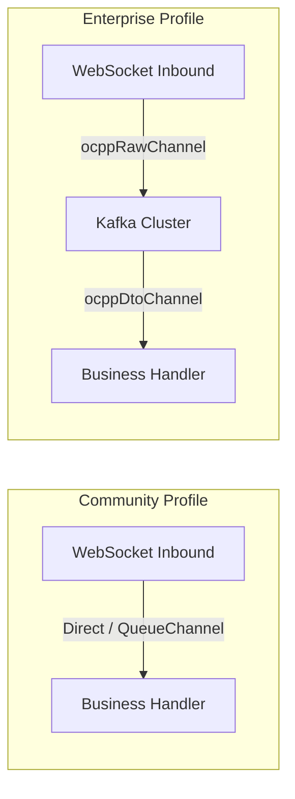
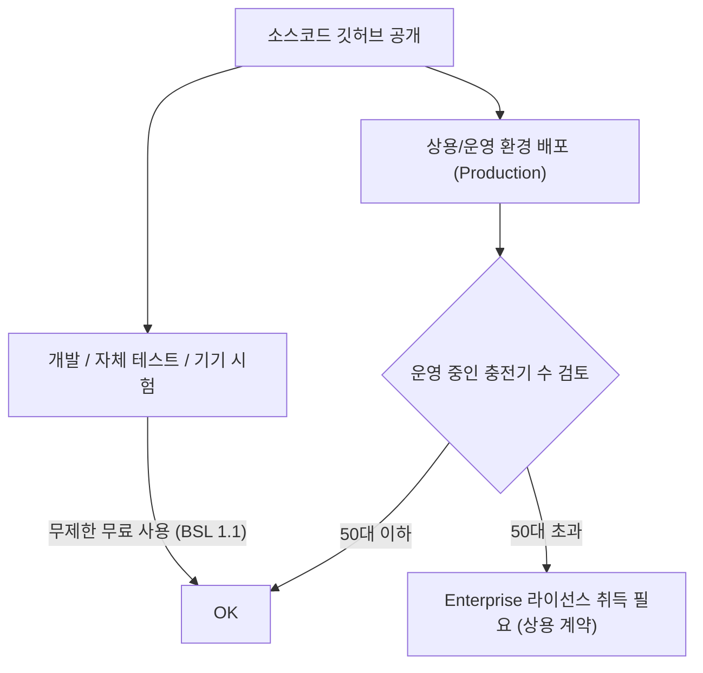

# [전략서] CPO[^CPO] CSMS[^CSMS] Lite 오픈소스 및 에디션 분할 전략서

본 문서는 CPO CSMS Lite 프로젝트의 **소스 공개 버전(Community Edition)** 요구사항 도입에 따른 비즈니스적 혜택, 에디션 간 기능 경계(Open-Core 전략), 구동을 위한 기술적 아키텍처 및 라이선스 정책을 정의합니다.

---

## 1. 개요 및 목적 (Introduction)

전기차 충전 솔루션 시장에서 OCPP[^OCPP] 표준 기반의 CSMS(Charging Station Management System)는 복잡한 웹소켓 통신 및 대용량 시계열 패킷 관리로 인해 진입 장벽이 높습니다. 본 프로젝트는 핵심 프로콜 처리 게이트웨이 및 기본 충전 제어 기능을 오픈소스로 개방하는 **오픈코어(Open-Core) 전략**을 채택하여 다음 목적을 달성하고자 합니다.

* **글로벌 개발자 및 제조사 생태계 포섭:** 충전기 제조업체 및 중소 CPO가 개발과 자가 테스트 환경에 무상 활용할 수 있도록 개방하여 플랫폼 장악력을 높입니다.
* **비즈니스 전환 파이프라인(SaaS/EE[^EE]) 확보:** Community Edition을 로컬 환경에서 기동해본 소형 사업자가, 충전기 운영 수량 증가 및 고도화된 정산/AI 스마트 차징 기능이 필요해지는 시점에 상용 **Enterprise Edition(EE)**으로 전환되도록 유도합니다.

---

## 2. 에디션별 기능 경계 (Open-Core Matrix)

Community Edition(CE[^CE])은 단일 노드 테스트 및 필수 제어가 가능한 수준의 스펙으로 제공되며, Enterprise Edition(EE)은 다중 분산 환경에서의 상용 운영 및 대규모 부하 제어를 위한 기능 스펙을 보장합니다.

| 기능 영역 | Community Edition (소스 공개) | Enterprise Edition (상용 비공개) |
| :--- | :--- | :--- |
| **OCPP 버전 및 통신**| OCPP 1.6J 완벽 지원 (단일 노드 기동) | OCPP 1.6J & OCPP 2.0.1 하이브리드 지원, 다중 게이트웨이 세션 분산 라우팅 |
| **메시지 파이프라인** | Spring Integration 인메모리 Direct/QueueChannel | Apache Kafka 분산 클러스터링 기반 완충 작용 및 장애 격리 |
| **데이터베이스** | PostgreSQL 단일 인스턴스 (OLTP[^OLTP] & OLAP[^OLAP] 데이터 통합 적재) | PostgreSQL(OLTP) & ClickHouse(OLAP) 이원화 저장 구조 |
| **세션 관리** | JVM[^JVM] 로컬 메모리 (`ConcurrentHashMap`) | Redis Active Session Map 및 Pub/Sub 기반 분산 세션 관리 |
| **요금제 및 정산** | 수동 정산 및 충전 상세 기록(CDR) 원장 조회 | 실시간 계절/시간대별(TOU[^TOU]) 단가 요금 계산 엔진, PG사 연동 자동 결제 및 정산 |
| **스마트 차징** | 미지원 (기본 프로파일 전송만 수동 지원) | AI 기반 대역폭 예측 및 변압기 과부하 방지 분산 스마트 차징 스케줄러 |
| **라이선스** | BSL 1.1 (개발/테스트 무료, 상용 50대 초과 시 유료 전환) | 상용 엔터프라이즈 라이선스 (Commercial) |

---

## 3. 기술적 설계 및 인프라 완화 요건 (Loose Infrastructure Coupling)

오픈소스 배포판의 성공 여부는 **"설치 및 1회성 구동이 얼마나 쉬운가"**에 달려 있습니다. 따라서 EE의 무거운 분산 미들웨어(Kafka, ClickHouse, Redis) 인프라 없이도 구동될 수 있는 추상화 레이어를 제공해야 합니다.

### 3.1. Spring Integration EIP[^EIP] 인메모리 스위칭
Spring Integration의 EIP(Enterprise Integration Patterns) 메시지 채널 추상화를 사용하여, 환경 설정(`spring.profiles.active=community`) 변경만으로 물리적인 미들웨어 연결 코드를 교체합니다.

* **Community 모드:** 외부 Kafka 브로커 없이 단일 JVM 프로세스 내에서 가상 스레드 기반 인메모리 `DirectChannel`을 통해 비즈니스 핸들러로 메시지를 다이렉트 중계합니다.
* **Enterprise 모드:** 대용량 트래픽의 완충 작용이 필요한 시점에 `KafkaChannel` 설정을 활성화하여 분산 큐 메시지 버스를 탑재합니다.

### 3.2. PostgreSQL Single-DB[^DB] 통합 데이터 액세스
ClickHouse(OLAP)가 부재하더라도, 데이터 액세스 레이어를 추상화하여 시계열 데이터인 `MeterValues` 및 `ocpp_raw_log`를 PostgreSQL의 파티션 테이블에 단일 적재하도록 돕습니다.
* **Spring Boot Multi-Datasource 구성:** DB 라우팅 인터페이스를 두어 `olap-datasource`를 ClickHouse 드라이버 또는 PostgreSQL 드라이버로 로컬 프로파일 설정에 따라 동적 스위칭합니다.
* **PostgreSQL 전용 DDL 제공:** 오픈소스 기동 시 PostgreSQL 스키마 내에 `meter_value_history` 테이블이 ClickHouse의 MergeTree 대체용 파티션 테이블로 생성될 수 있도록 마이그레이션 스크립트를 분리 보관합니다.

### 3.3. 비밀 키(Credentials) 관리 철저화
* `application.yml` 소스코드가 퍼블릭 Git 리포지토리에 완전 노출되므로, DB 비밀번호, JWT 암호화 Key 등 민감 비밀 데이터는 환경 변수(`${DB_PASSWORD}`, `${JWT_SECRET}`)로 처리하도록 설정합니다.
* 로컬 개발을 돕기 위해 `.env.example` 파일을 동봉하여, 개발자가 개발용 환경 변수를 빠르게 기입하고 로컬 실행 환경을 구축할 수 있도록 지원합니다.

### 3.4. Docker-Compose 1-Click 실행 환경 구성
오픈소스 사용자 경험 극대화를 위해, `docker-compose.yml` 템플릿 파일 하나로 전체 시스템을 가동할 수 있는 설정을 제공합니다.
* **CE Compose 구성 요소:** 
  1. **h2y-ocpp-community-app:** 백엔드(Spring Boot) + 프론트엔드 정적 빌드 파일(Vue 3)이 통합된 패키지 컨테이너.
  2. **postgresql-db:** 자산, 트랜잭션, 미터링 로그를 통합 수용하는 PostgreSQL 인스턴스.
* 이 단 2개의 컨테이너 구성만으로, 개발자는 `docker compose up -d` 명령어 1회 수행으로 즉시 CSMS 및 어드민 대시보드 검증 환경을 기동할 수 있습니다.

---

## 4. 라이선스 전략 (License Policy)

공개된 코드 기반으로 경쟁사가 무단으로 SaaS 형태의 서비스를 출시하거나 복제하는 것을 막기 위해 상용 경계선이 융합된 **BSL 1.1(Business Source License)**을 권장합니다.

* **BSL 1.1 라이선스 내용 요약:**
  * 개발, 자체 제조 테스트, 비상업용 및 특정 규모(예: 충전기 50대) 이하의 소규모 운영에서는 완전한 소스 공개와 무료 사용 권한을 부여합니다.
  * 다만, 상용 서비스를 구동하면서 운영 중인 충전기가 50대를 초과하는 시점부터는 당사로부터 유료 라이선스 계약을 체결하도록 명시하여 권리를 보존합니다.
  * 라이선스 만료 기간(예: 버전 출시 3년 후)이 경과하면 해당 버전은 일반 Apache 2.0 또는 MIT 라이선스로 자동 전환되는 오픈소스 공생 방식을 채택합니다.

---

## 5. 로드맵 및 마일스톤 연계

* **마일스톤 M1 (Phase 1 완료):**
  * Standalone 단일 기동 아키텍처 및 OCPP 1.6J 연동 비즈니스 엔진 완료와 동시에, **Community Edition 패키징(Docker-Compose 1-Click 스크립트 포함)이 퍼블릭 Git 레포지토리에 최초 릴리스**됩니다.
* **마일스톤 M2, M3 (Phase 2 및 최종 인수):**
  * 대용량 다중화 노드 연동, ClickHouse 벌크 적재, Redis 분산 세션 공유 및 AI 스마트 차징 모듈은 엔터프라이즈 모듈로 결합되어 상용 패키지로 납품됩니다.

---

## 6. 영업 및 비즈니스 관점의 세일즈 전략 (Sales & Business Value)

기술적 아키텍처 다이어그램과 더불어, 영업적(Sales) 관점에서 본 소스 공개 에디션 분할 전략은 솔루션 시장 장악과 매출 확대를 위한 핵심 병기 역할을 수행합니다.

### 6.1. 제품 주도 성장 (Product-Led Growth, PLG) 모델 확립
* **영업 비용 절감:** 기존의 대면 영업이나 복잡한 데모 시연 및 장기 PoC(Proof of Concept) 절차 없이, 잠재 고객사가 Docker 스크립트만으로 로컬 환경에서 직접 기능을 체험할 수 있습니다. 
* **자가 세일즈 퍼널:** 솔루션을 무료로 사용하여 운영하던 CPO(Charge Point Operator)들은 충전기 대수가 점진적으로 확대되는 시점(50대 임계치 초과)에 추가적인 인프라 리팩토링이나 플랫폼 교체 비용을 치르기보다, 마이그레이션 없이 사용하던 데이터와 UI[^UI] 그대로 엔터프라이즈 모듈 라이선스를 구매하는 자연스러운 세일즈 퍼널을 형성하게 됩니다.

### 6.2. 높은 고객 전환 비용 기반의 락인(Lock-in)
* **익숙함과 마이그레이션 장벽:** 엔지니어와 관제사들이 무료 버전(CE)의 UI, API[^API] 인터페이스, OCPP 통신 구조에 락인되면 다른 솔루션으로의 시스템 마이그레이션 비용이 급증합니다.
* **상용 전환 확률 극대화:** 50대 초과 시의 라이선스 제한은 기술적 차단이 아닌 법적 권리(BSL 1.1)로 작동하므로, 기업 규모가 커진 고객사는 시스템 안정성과 대외 이미지(감사 및 컴플라이언스 대응)를 위해 100% 상용 라이선스로 유도됩니다.

### 6.3. BSL 1.1을 통한 경쟁사 무단 도용 방지 (IP[^IP] 보호)
* 일반 오픈소스 라이선스(Apache 2.0, MIT)의 한계점은 대기업이나 대형 플랫폼사가 우리 소스코드를 그대로 가져가 자체 브랜드로 상용 서비스를 론칭하고 시장을 지배하는 리스크를 방어할 수 없다는 점입니다.
* **상업적 침해 원천 차단:** BSL 1.1 라이선스는 소스 공개의 투명성과 홍보 효과를 극대화하면서도, "50대 초과 상용 배포 금지" 조항을 강제함으로써 당사의 주요 수익 모델(대규모 솔루션 영업 매출)을 법적 테두리 안에서 완벽하게 보호합니다.

### 6.4. 충전기 제조업체(EVSE) 연계 채널 세일즈 (Channel Sales)
* **자가 테스트 도구 제공:** 국내외 충전기 제조업체들은 자사 기기의 OCPP 1.6J/2.0.1 규격 호환성 검증을 위해 자체적인 테스트 CSMS가 필요합니다.
* **간접 홍보 및 신규 유치:** 제조업체들에 CE 버전을 무상 제공하여 표준 테스트 CSMS로 정착시키면, 해당 제조사의 충전기를 구입하는 신생 CPO사들에게 우리 솔루션이 첫 번째로 권장되는 강력한 영업 네트워크(간접 세일즈 파이프라인)를 확보할 수 있습니다.

### 6.5. 운영 유지보수(O&M) 리소스 전가 및 기술 자립 유도
* **유지보수 책임 전가 및 자체 관리 유도 (Self-O&M Enablement):** 소스코드가 공개되어 있으므로 기술 내재화 역량을 갖춘 대형 고객사 및 파트너사가 스스로 시스템을 보수하도록 유도합니다. 이를 위해 **"기기 자가 진단 대시보드(OCPP 통신 상태 판별)", "오류 케이스별 조치 가이드라인(Runbook)", "커스텀 로직 추가 개발자 가이드(Tutorial)"**를 표준으로 제공하여, 고객사 엔지니어가 공급사 기술 지원 없이도 장애나 요건 변경에 자체 대처할 수 있도록 자생적 운영 환경을 적극 유도하고 조성합니다.
* **개방형 커뮤니티 창구 단일화:** 1:1 방식의 무상 밀착 기술지원을 제공하는 대신, 공식 GitHub Issues 및 Q&A 커뮤니티로 소통 창구가 일원화합니다. 다른 사용자나 기기 제조사들이 답변에 참여하는 집단지성 구조를 유도하여 개발사 엔지니어의 일상적 Q&A 대응 부담을 해소합니다.
* **SLA[^SLA] 차등을 통한 수익화:** 무료 배포판(CE)에는 "무보증(No Warranty) 및 자체 운영"을 기본 조항으로 적용하고, 당사 전문가의 상시 O&M 지원 및 긴급 장애 패치가 필요한 경우에만 고가의 "엔터프라이즈 O&M 서브스크립션" 유료 기술지원 계약을 맺도록 하여 유지보수 서비스 자체를 고부가가치 비즈니스로 변환시킵니다.

### 6.6. 충전사업(CPO) 수주 영업을 위한 전략적 도구(Loss Leader) 활용
소프트웨어를 독립 상품으로 판매하여 라이선스 수익을 올리는 기존 프레임에서 벗어나, **"실제 충전소 운영권 및 전력 판매 매출(충전 과금 수익)"**을 획득하기 위한 **영업용 핵심 무기(Loss Leader)**로 플랫폼을 정의할 때 세일즈 가치는 한 단계 더 진화합니다.

* **압도적인 수주 경쟁력 확보 (Loss Leader 전략):**
  * 아파트 단지, 마트, 지자체 공공 부지 등의 충전소 운영 사업자(CPO) 입찰 시, 경쟁사들이 고가의 관제 시스템 구축 비용을 제안하는 반면, 당사는 **"독립형 관제 플랫폼(CE) 영구 무상 제공 및 현장 맞춤형 로컬 커스터마이징 무상 지원"**을 파격 조건으로 제시하여 수주 계약 확률을 극대화합니다.
  * 소프트웨어 공급 매출을 과감히 양보하는 대신, 장기적이고 안정적인 **충전 요금 매출 및 운영 위탁 수수료**를 주 수익원으로 확보합니다.
* **위탁 파트너(Tenant) 만족도 제고 및 화이트라벨링(White-labeling):**
  * 부지를 제공하는 위탁 파트너사(마트, 빌딩주 등)는 자사 충전기 자산과 매출 흐름을 투명하게 볼 수 있는 독립 관제 화면을 원합니다. 
  * 경량화된 CE 버전을 파트너사 전용 브랜드로 포장(White-labeling)하여 무상 배포함으로써 파트너 신뢰도를 확보하고, 실제 연동 및 결제 원장 정산 흐름은 당사의 백엔드 허브(Enterprise Core)로 통합하여 시장 점유율을 독식합니다.
* **영업 마진 극대화를 위한 초경량 인프라 필수화:**
  * 충전 수주 영업 대상인 소규모 사업지(예: 30대 이하 충전기 구역)마다 수백만 원 대의 클라우드 인프라(Kafka, ClickHouse)를 강제 셋업하는 것은 사업성이 나오지 않습니다. 
  * 플랫폼을 PostgreSQL 싱글 DB 기반으로 극도로 경량 구동할 수 있도록 설계(Section 6.4)하는 것은 단순히 개발자의 편의를 위함이 아니라, **"소규모 영업지 배포 시 인프라 비용을 제로에 가깝게 낮춰 영업 마진율을 극대화하기 위한 본질적인 비즈니스 요구사항"**으로 직결됩니다.

---
[^API]: **API (Application Programming Interface):** 응용 프로그램 프로그래밍 인터페이스
[^CE]: **CE (Community Edition):** 커뮤니티 에디션 (오픈소스 버전)
[^CPO]: **CPO (Charge Point Operator):** 전기차 충전소 운영 사업자
[^CSMS]: **CSMS (Charging Station Management System):** 충전기 통합 관리 시스템
[^DB]: **DB (Database):** 데이터베이스
[^EE]: **EE (Enterprise Edition):** 엔터프라이즈 에디션 (상용 버전)
[^EIP]: **EIP (Enterprise Integration Patterns):** 기업 통합 패턴 (소프트웨어 아키텍처 디자인 패턴)
[^IP]: **IP (Internet Protocol):** 인터넷 프로토콜 (네트워크 주소 규격)
[^JVM]: **JVM (Java Virtual Machine):** 자바 가상 머신
[^OCPP]: **OCPP (Open Charge Point Protocol):** 개방형 충전 통신 규격
[^OLAP]: **OLAP (Online Analytical Processing):** 실시간 데이터 분석 처리
[^OLTP]: **OLTP (Online Transaction Processing):** 실시간 트랜잭션 처리
[^SLA]: **SLA (Service Level Agreement):** 서비스 수준 합의 (시스템 가동률 등 보장 표준)
[^TOU]: **TOU (Time of Use):** 계절별/시간대별 차등 요금제
[^UI]: **UI (User Interface):** 사용자 인터페이스
