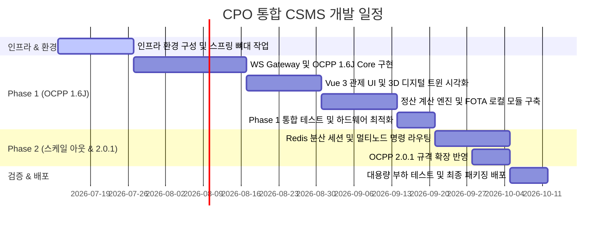

# [Timeline] CPO 통합 운영 솔루션 예상 개발 일정 (Development Timeline)

본 문서는 CPO 통합 운영 솔루션(CSMS Platform) 구축을 위한 단계별 개발 로드맵 및 주차별 상세 일정을 기술합니다. 본 프로젝트는 Phase 1(경량 단독 운영 모드)을 우선 안정화한 후, Phase 2(분산 스케일 아웃 및 OCPP 2.0.1 확장) 단계로 고도화하는 것을 목표로 합니다.

---

## 1. 프로젝트 마일스톤 (Project Milestones)

| 마일스톤 | 목표 작업 | 완료 기준 | 예상 일자 |
| :--- | :--- | :--- | :--- |
| **M1: Phase 1 완료** | 단일 호스트 기동 모드 구현 | OCPP 1.6J 연동 및 3D 관제, 정산 원장 저장 완료 | 9주차 말 |
| **M2: Phase 2 완료** | 분산 스케일 아웃 및 OCPP 2.0.1 | Redis 세션 공유, 멀티 노드 라우팅 및 2.0.1 연동 완료 | 11주차 말 |
| **M3: 최종 인수** | 안정성 검증 및 배포 완료 | 부하 테스트(2,000 TPS) 통과 및 폐쇄망 패키지 인도 | 12주차 말 |

---

## 2. 주차별 상세 계획 (Weekly Detailed Plan)

### 2.1. [1단계] 개발 환경 및 인프라 구축 (Week 1 - 2)
- **주요 목표:** 단일 VM 내 기본 인프라(DB, Kafka) 설치 및 백엔드 프레임워크 뼈대 설정.
- **상세 작업:**
  - 개발망 내 PostgreSQL(OLTP) 및 ClickHouse(OLAP 시계열) 인스턴스 구축 및 초기 스키마 마이그레이션 스크립트 작성.
  - 내장형 단일 Kafka Broker(KRaft Mode) 설정 및 메시지 보존 기간(Retention: 24h) 정책 적용.
  - Spring Boot 3.x/4.x 기반 프로젝트 초기화 및 Java 25 Virtual Threads 기능 활성화 (`spring.threads.virtual.enabled=true`).
  - GitHub/GitLab CI 파이프라인 및 개발망 내 기본 Docker 빌드 파이프라인 수립.

### 2.2. [2단계] Phase 1 백엔드 개발 - OCPP 1.6J 구현 (Week 3 - 5)
- **주요 목표:** WebSocket Gateway 구축 및 OCPP 1.6J 핵심 메시지 통신 구현.
- **상세 작업:**
  - Netty 또는 Spring WebSocket 기반의 WS Gateway 설계 및 ConcurrentHashMap 구조의 `LocalSessionStore` 구현.
  - **Uplink 메시지 파이프라인:** CP -> GW -> Kafka(`raw-events`) -> BizCore 컨슘 구조 구현.
  - **Downlink 메시지 파이프라인:** Core -> Kafka(`control-commands`) -> GW 컨슘 -> CP 원격 명령 전송 구조 구현.
  - OCPP 1.6J 핵심 프로파일(Core) 메시지 지원: `BootNotification`, `Heartbeat`, `StatusNotification`, `Authorize`, `StartTransaction`, `StopTransaction`, `MeterValues` 구현.
  - 15초 단위의 대용량 미터링 데이터를 ClickHouse 시계열 테이블에 벌크 인서트(Bulk Insert)하는 로직 개발.

### 2.3. [3단계] Phase 1 프론트엔드 개발 - 관제 UI 및 3D 시각화 (Week 6 - 7)
- **주요 목표:** Vue 3 기반 웹 포털 구축 및 Three.js 활용 3D 관제 화면 개발.
- **상세 작업:**
  - Vue 3 (Composition API) + Pinia 상태 관리를 적용한 기본 어드민 레이아웃 및 차트 개발.
  - Three.js WebGL 기반의 충전소 부지/건물 평면도 2.5D/3D 렌더링 화면 구현.
  - 실시간 충전기 상태값(Online/Offline/Faulted/Charging) 동적 Glow 렌더링 및 텍스트 팝업 오버레이 구현.
  - 웹소켓 연동 실시간 OCPP Raw 메시지 로그 뷰어(JSON 포맷팅, 필터링, 정지 기능 포함) 기능 개발.
  - Leaflet.js 및 GeoJSON 오프라인 타일 서빙을 활용한 폐쇄망 전용 지도 관제 화면 설계.

### 2.4. [4단계] 정산 엔진, FOTA 및 Phase 1 통합 검증 (Week 8 - 9)
- **주요 목표:** TOU 요금제 정산 엔진 개발, 로컬 FOTA 구현 및 Phase 1 마일스톤(M1) 달성.
- **상세 작업:**
  - 계절별/시간대별 TOU(Time-of-Use) 요금 적용 테이블 구성 및 트랜잭션 종료 시 최종 이용금액을 연산하는 정산 엔진 개발.
  - 최종 정산 완료 시 결제/매출 원장 무결성을 보장하기 위해 PostgreSQL에 CDR(Charge Detail Record) 저장 로직 구현.
  - 내장망 전용 FOTA 서버(로컬 스토리지 다운로드 링크) 및 펌웨어 배포 진행률 트래킹 시스템 구축.
  - 하드웨어 경량화 튜닝 (Kafka Heap 512MB 강제 제한 및 ClickHouse 쿼리 메모리 4GB 상한 설정).
  - 시뮬레이터를 활용한 동시 2,000대 연결 검증 및 통합 시나리오 테스트.

### 2.5. [5단계] Phase 2 스케일 아웃 및 OCPP 2.0.1 고도화 (Week 10 - 11)
- **주요 목표:** Redis 기반 분산 세션 관리 및 OCPP 2.0.1 프로토콜 확장 구현 (M2).
- **상세 작업:**
  - L4/L7 로드밸런서 연동을 위한 WebSocket Gateway 로드밸런싱 아키텍처 적용.
  - Redis Active Connection Map을 활용하여 분산 서버 간 충전기 커넥션 관리 및 Redis Pub/Sub을 통한 제어 명령 노드 라우팅 구현.
  - 분산 메시지 큐 구성을 위한 Apache Kafka Multi-Broker Cluster 배포 구성.
  - PostgreSQL Primary-Standby 복제화 구성 및 ClickHouse 분산 레플리카 설정.
  - OCPP 2.0.1 규격 추가에 따른 메시지 스키마 매핑 및 메시지 변환 레이어 연동 (`TransactionEvent` 및 Smart Charging 등).

### 2.6. [6단계] 대용량 부하 테스트 및 최종 배포 (Week 12)
- **주요 목표:** 2,000 TPS 대용량 메시지 부하 테스트 및 완전 폐쇄망 배포본 패키징 (M3).
- **상세 작업:**
  - 가상 충전기 트래픽 제너레이터를 활용한 2,000 TPS 급 메시지 유입 처리 성능 테스트 및 응답 Latency(평균 100ms 이하) 계측.
  - VM 환경 및 Kubernetes 배포 전용 Helm Chart 제작 및 Docker Base 이미지 최적화.
  - 폐쇄망(Air-Gapped) 설치용 압축 패키지 배포 구성 검증(로컬 자원 구동 및 오프라인 지도 확인).
  - 인수 검증 보고서 작성 및 운영 가이드라인 교육 제공.

---

## 3. 리소스 투입 및 역할 정의 (Resources & Roles)

- **Back-end Engineer (2명):**
  - WebSocket Gateway, Kafka 메시지 파이프라인 개발.
  - 비즈니스 코어(가상 스레드 튜닝), PostgreSQL & ClickHouse 하이브리드 연동, 정산 계산 엔진 및 Redis 세션 클러스터 개발.
- **Front-end Engineer (1명):**
  - Vue 3 어드민 포털 개발, 실시간 관제 UI 구현.
  - Three.js WebGL 3D/2.5D 충전소 모델 렌더링 및 오프라인 지도 서빙 연동.
- **DevOps / DBA (1명):**
  - PostgreSQL 및 ClickHouse 파티셔닝, 백업 정책 셋업.
  - Kafka Cluster 구성, CI/CD 배포 패키지 구성 및 2,000 TPS 부하 테스트 인프라 제어.

---

## 4. 리스크 관리 계획 (Risk Management)

1. **ClickHouse 미터 데이터 Bulk Write 병목 리스크:**
   - **대책:** 미터값 유입 시 즉시 DB 쓰기를 하지 않고, 가상 스레드 기반 인메모리 버퍼에 1초 단위 또는 1,000건 단위로 모아 Bulk Insert 하도록 처리하여 디스크 I/O 병목 완화.
2. **폐쇄망 환경 내 외부 지도 API 차단 리스크:**
   - **대책:** OSM(OpenStreetMap)의 원경 데이터 GeoJSON 형식을 사전에 다운로드하여 Spring Boot 내장 static 디렉토리에 포함 서빙하며 Leaflet.js 라이브러리로 오프라인 구동 보장.
3. **분산 서버 간 웹소켓 세션 갱신 딜레이 리스크:**
   - **대책:** 충전기 연결/해제 이벤트 발생 시 Redis 세션 맵 동기화 딜레이를 감안하여, 제어 명령 전달 시 라우팅 대상 노드가 부재할 경우 Kafka 재전송 토픽(`control-commands-retry`)을 통한 재시도 로직 적용.
