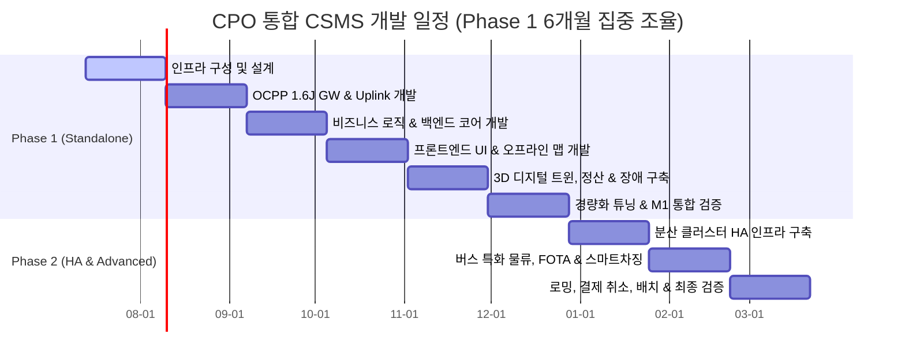

# [Timeline] CPO 통합 운영 솔루션 예상 개발 일정 (Development Timeline)

본 문서는 CPO 통합 운영 솔루션(CSMS Platform) 구축을 위한 단계별 개발 로드맵 및 상세 개발 일정을 기술합니다. 본 프로젝트는 **Phase 1 (단일 서버 기동 모드 - 필수 기능)**의 안정성을 극대화하기 위해 **초기 6개월(24주)** 동안의 설계, 구현, 튜닝 및 통합 검증을 최우선으로 진행하며, 이후 **Phase 2 (분산 확장 클러스터 및 고도화 기능)**에 대해 3개월의 고도화 기간을 부여하는 형태로 구성되어 있습니다.

---

## 1. 프로젝트 마일스톤 (Project Milestones)

| 마일스톤 | 목표 작업 | 완료 기준 | 예상 일자 (개발 착수 대비) |
| :--- | :--- | :--- | :--- |
| **M1: Phase 1 완료** | 단일 호스트 기동 모드 구현 | 통합 기능 정의서 상의 Phase 1 필수 기능(OCPP 1.6J 연동, 3D 디지털 트윈 관제, 정산 원장 저장 및 단독 튜닝)의 100% 완료 및 안정화 검증 | **24주차 말 (6개월차)** |
| **M2: Phase 2 완료** | 분산 스케일 아웃 및 OCPP 2.0.1 | Redis 세션 공유, 멀티 노드 라우팅, OCPP 2.0.1 확장, 스마트 차징 프로파일 제어 및 전기 버스 차고지 배치도 완성 | **32주차 말 (8개월차)** |
| **M3: 최종 인도** | 안정성 검증 및 배포 완료 | 로밍 연동, 배치 및 청구 리포터 완성, 대용량 부하 테스트(2,000 TPS) 통과 및 폐쇄망(Air-Gapped) 패키지 인도 | **36주차 말 (9개월차)** |

---

## 2. 주차별 상세 계획 (Weekly Detailed Plan)

### 2.1. [Phase 1 - 1개월차] 개발 환경 & 인프라 및 상세 설계 (Week 1 - 4)
* **주요 목표:** 단일 VM 내 기본 인프라(DB, Kafka) 설치 및 150개 AS-IS 화면 기능 정의 기반 백엔드/프론트엔드 상세 아키텍처 설계.
* **상세 작업:**
  * 개발망 내 PostgreSQL(OLTP) 및 ClickHouse(OLAP 시계열) 인스턴스 단독 노드 설치 및 초기 스키마 셋업.
  * 단일 Kafka Broker(KRaft Mode) 설정 및 토픽 구조 설계 (`raw-events`, `control-commands`).
  * Spring Boot 3.x/4.x 기반 프로젝트 초기화 및 Java 25 Virtual Threads 기능 활성화 (`spring.threads.virtual.enabled=true`).
  * OCPP 1.6J 연동 프로클 명세 분석 및 AS-IS 기능 매트릭스 상세 유스케이스 정의서 작성.

### 2.2. [Phase 1 - 2개월차] OCPP 1.6J WebSocket Gateway & Uplink 구현 (Week 5 - 8)
* **주요 목표:** WebSocket Gateway 구축 및 실시간 미터링 시계열 데이터 파이프라인 개발.
* **상세 작업:**
  * Spring WebSocket 기반의 WS Gateway 설계 및 ConcurrentHashMap 구조의 `LocalSessionStore` 구현.
  * **Uplink 메시지 파이프라인:** CP -> GW -> Kafka(`raw-events`) -> BizCore 컨슘 구조 구현.
  * OCPP 1.6J 핵심 프로파일(Core) 메시지 지원: `BootNotification`, `Heartbeat`, `StatusNotification`, `Authorize`, `StartTransaction`, `StopTransaction`, `MeterValues` 구현.
  * 15초 단위의 대용량 미터링 데이터를 ClickHouse 시계열 테이블에 벌크 인서트(Bulk Insert)하는 버퍼 엔진 구현.

### 2.3. [Phase 1 - 3개월차] 비즈니스 로직 & 백엔드 코어 개발 (Week 9 - 12)
* **주요 목표:** 충전소 자산 등록 및 기본 사용자/인증 마스터 백엔드 API 구현.
* **상세 작업:**
  * 법인관리, 사업장목록, 충전소목록, 한전계약단가 관리 API 개발.
  * 충전기관리(등록/상세), 충전기목록 및 충전기모델관리, 충전기 개소 관리 백엔드 로직 완성.
  * RFID 정보 마스터 등록 및 RFID 재발급/정지 등 요청 승인 프로세스 개발.
  * 휴일 관리 적용을 통한 요일별 요금 매핑 기본 로직 구축.

### 2.4. [Phase 1 - 4개월차] 프론트엔드 Vue 3 UI 포털 및 오프라인 지도 개발 (Week 13 - 16)
* **주요 목표:** Vue 3 포털 레이아웃 구축, 충전기 상태 관제 화면 및 오프라인 지도 뷰 개발.
* **상세 작업:**
  * Vue 3 (Composition API) + Pinia 상태 관리를 적용한 기본 어드민 포털 레이아웃 및 컴포넌트 개발.
  * 실시간 충전기 커넥터 상태 모니터링 화면 및 상태 동적 필터링 그리드 구축.
  * Leaflet.js 및 GeoJSON 오프라인 타일 서빙을 활용한 폐쇄망 전용 지도 관제 화면 설계.
  * 웹소켓 연동 실시간 OCPP Raw 메시지 로그 뷰어(JSON 포맷팅 및 실시간 정지 기능) 프론트 연동.

### 2.5. [Phase 1 - 5개월차] 3D 디지털 트윈, 정산 엔진 및 장애 관리 구축 (Week 17 - 20)
* **주요 목표:** Three.js 기반 3D 관제 렌더링 구현 및 TOU 요금 계산 정산 엔진 개발.
* **상세 작업:**
  * Three.js WebGL 기반의 충전소 부지/건물 평면도 2.5D/3D Mesh 렌더링 및 실시간 상태 동적 Glow Effect 구현.
  * 계절별/시간대별 TOU 요금 계산 로직 적용 및 트랜잭션 종료 시 최종 이용금액을 연산하는 정산 엔진 개발.
  * 트랜잭션 완료 즉시 실행되는 바로정산 API 및 PostgreSQL CDR(Charge Detail Record) 저장 로직 구현.
  * 제조사별 장애코드관리 및 StatusNotification 고장 수동 접수 처리 관리 시스템 구축.

### 2.6. [Phase 1 - 6개월차] 경량화 튜닝 및 1차 마일스톤(M1) 통합 검증 (Week 21 - 24)
* **주요 목표:** Standalone 단일 서버 환경 경량화 튜닝 및 M1 마일스톤 통합 부하 테스트 검증 완료.
* **상세 작업:**
  * 단일 VM 리소스 최적화를 위한 Kafka Heap Size 강제 제한(512MB) 및 ClickHouse 쿼리당 최대 메모리 사용 임계치 제한(4GB) 적용.
  * 가상 충전기 시뮬레이터를 활용한 동시 2,000대 연결 검증 및 통합 시나리오 테스트.
  * 완전 폐쇄망(Air-Gapped) 내 독립 실행 배포본 패키징 및 로컬 오프라인 실행 통합 검증 완료.

---

### 2.7. [Phase 2 - 7개월차] 분산 클러스터 HA 인프라 구축 (Week 25 - 28)
* **주요 목표:** 이중화 로드밸런서 연동, 분산 세션 관리 및 Kafka/DB 이중화 클러스터 인프라 셋업.
* **상세 작업:**
  * L4/L7 로드밸런서 연동 및 Redis Active Connection Map을 통한 분산 Gateway 서버 간 커넥션 세션 관리 구현.
  * Redis Pub/Sub을 활용하여 분산 서버 간 제어 명령 노드 라우팅 및 전송 큐 동기화 구현.
  * Apache Kafka Multi-Broker Cluster 배포 구성 및 PostgreSQL 복제 구성(Primary-Standby), ClickHouse 분산 레플리카 설정.

### 2.8. [Phase 2 - 8개월차] 버스 특화 물류, FOTA 및 스마트 차징 고도화 (Week 29 - 32)
* **주요 목표:** 전기 버스 차고지 전용 관제 화면 개발, FOTA 배포 스케줄러 및 스마트 차징 프로파일 연동.
* **상세 작업:**
  * 버스 차고지 평면도 드래그 앤 드롭 편집기(Canvas 기반) 및 배차 대비 완충 가능성을 판단하는 최적 SOC 현황판 구현.
  * 전기 버스 모델 관리, 차량 번호/idTag 정보 매핑 및 배터리 SOH(State of Health) 모니터링 팝업 구축.
  * FOTA 스케줄러(원격 펌웨어 업데이트), 동적 전력 분배(`SetChargingProfile`) 및 OCPP 2.0.1/1.6J 보안 TLS 인증서 셋업.
  * 데이터 아카이빙 배치 관리 설정 및 Critical 장애 문자/메일 전송 템플릿 구현.

### 2.9. [Phase 2 - 9개월차] 로밍, 정산지급 대행 및 최종 인수 배포 (Week 33 - 36)
* **주요 목표:** 대외 로밍 중계 통신, 정산지급 대행 관리 및 2,000 TPS 대용량 부하 테스트를 거친 최종 인도.
* **상세 작업:**
  * 환경부/한전 로밍 API 정보 연동 및 PG사 Merchant API 연동, 바로정산 규칙 제어.
  * 위탁 점주 정산 대금 자동 송금 요청 및 계좌 이체 송금결과 대조(Reconciliation) 시스템 구축.
  * 위탁 거래처별 사용 내역 거래명세서 및 용역 청구서 PDF 실시간 생성/발송 모듈 구현.
  * 가상 충전기 트래픽 제너레이터를 활용한 동시 2,000 TPS 급 메시지 유입 처리 부하 테스트 완료.
  * 최종 Helm Chart/Docker 이미지 패키징 배포 보고서 작성 및 M2/M3 마일스톤 최종 인수 인도.

---

## 3. 리소스 투입 및 역할 정의 (Resources & Roles)

* **Back-end Engineer (2명):**
  * WebSocket Gateway, Kafka 메시지 파이프라인 개발.
  * 가상 스레드 튜닝, PostgreSQL & ClickHouse 하이브리드 연동, 정산 계산 엔진 및 Redis 세션 클러스터 개발.
* **Front-end Engineer (1명):**
  * Vue 3 어드민 포털 개발, 실시간 관제 UI 구현.
  * Three.js WebGL 3D/2.5D 충전소 모델 렌더링 및 오프라인 지도 서빙 연동, Canvas 차고지 배치 편집기 개발.
* **DevOps / DBA (1명):**
  * PostgreSQL 및 ClickHouse 파티셔닝, 복제 정책 셋업.
  * Kafka Cluster 구성, CI/CD 배포 패키지 구성 및 2,000 TPS 부하 테스트 인프라 제어.
