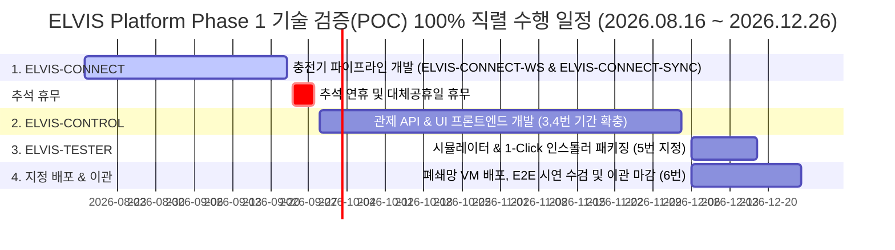
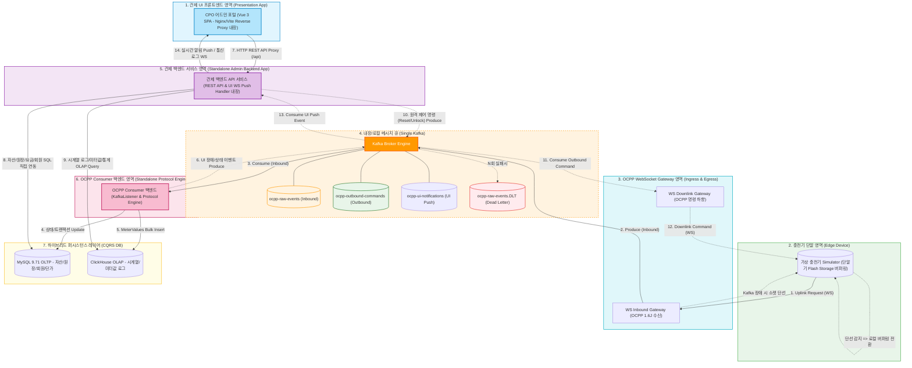

# ELVIS (Electric Vehicle Charging Infrastructure System) Phase 1 기술 검증 정의서 (Proof of Concept)

<style>
  .mermaid {
    max-width: 920px;
    width: 920px;
    margin: 0 auto;
  }
</style>

본 문서는 **ELVIS (Electric Vehicle Charging Infrastructure System) Platform** CSMS Lite의 Phase 1 (Standalone 단독 운영 모드) 핵심 설계 요건을 검증하기 위한 기술 검증(POC) 정의서입니다.
가상 스레드(Java 25), 단일 Kafka 브로커를 백엔드로 하는 Spring Boot & Spring Kafka 직접 구현 비동기 파이프라인, 그리고 MySQL 9.71(OLTP[^OLTP]) 및 ClickHouse(OLAP[^OLAP]) 이원화 적재(CQRS[^CQRS])의 실동작 방식을 코드로 구현하고 검증하는 것을 목적으로 합니다.

---

### 📌 PoC 5대 제출 산출물 연동 체계 (Document Index Table)

본 PoC 사업의 아키텍처, WBS 일정, 세부 과제 및 E2E 프로세스는 아래 5종의 정비된 표준 산출물 문서로 연동 관리되며, 마스터 체계도는 [00.poc_document_index.md](file:///d:/project/lselink/ocpp-lite/git/h2y-ocpp/doc/04.poc/00.poc_document_index.md) 문서입니다:

| 순번 | 산출물 구분 | 문서 파일 링크 | 핵심 수검 내용 및 연동 범위 |
| :---: | :--- | :--- | :--- |
| **00** | **PoC 산출물 체계도** | [00.poc_document_index.md](file:///d:/project/lselink/ocpp-lite/git/h2y-ocpp/doc/04.poc/00.poc_document_index.md) | **[체계도]** PoC 산출물 마스터 목차, 규칙성 체계도 및 네이밍/약어 표준 |
| **01** | **PoC 요구사항 정의서** | [01.poc_requirements.md](file:///d:/project/lselink/ocpp-lite/git/h2y-ocpp/doc/04.poc/01.poc_requirements.md) | 전수 35개 PoC 요구사항(REQ-001 ~ REQ-035) 및 WBS 추적성 매트릭스 |
| **02** | **PoC 아키텍처 명세서** | [02.poc_architecture.md](file:///d:/project/lselink/ocpp-lite/git/h2y-ocpp/doc/04.poc/02.poc_architecture.md) | **[본 문서]** 3대 제품군, 6대 독립 모듈, CQRS 하이브리드 DB 및 Kafka 버퍼링 아키텍처 설계서 |
| **03** | **PoC WBS 일정 명세서** | [03.poc_feature_matrix.md](file:///d:/project/lselink/ocpp-lite/git/h2y-ocpp/doc/04.poc/03.poc_feature_matrix.md) | 100% 제품군 직렬화, 주말/공휴일 휴무 적용, 12/04 확충 및 YYYY-MM-DD 타깃 일정 명세서 |
| **04** | **PoC 세부 작업 명세서** | [04.poc_task_list.md](file:///d:/project/lselink/ocpp-lite/git/h2y-ocpp/doc/04.poc/04.poc_task_list.md) | 제품군/모듈이 좌측에 명시된 전수 68개 WBS 세부 작업 통합 레지스트리 명세서 |
| **05** | **PoC 법인 충전 프로세스 명세서**| [05.poc_process_flow.md](file:///d:/project/lselink/ocpp-lite/git/h2y-ocpp/doc/04.poc/05.poc_process_flow.md) | PoC 수검/시연 전용 법인 회원(UserType.C) RFID 카드 태깅 충전 E2E 프로세스 & TOU 정산 명세서 |

---

## 1. POC 수행 로드맵 및 주차별 마일스톤 (POC Roadmap & Milestones)

본 기술 검증(POC)은 Phase 1 Standalone 모드 구축 일정과 완벽하게 일치하는 총 19주 일정(**2026-08-16 ~ 2026-12-26**)으로 진행되며, **제품군간 단 1일도 겹치지 않는 100% 제품군 직렬(Product-Sequential) 추진 체계**로 세분화하여 수행됩니다.



### 1.1. 주차별 세부 마일스톤 및 수행 작업 (Weekly Detailed Milestones & Date Ranges) 2026-08-16 ~ 2026-12-26

#### 1단계: ELVIS-CONNECT 제품군 개발 (2026-08-17 ~ 2026-09-18)

- **1~2주차 (2026-08-17 ~ 2026-08-28):**
  - **[elvis-connect-ws]** 게이트웨이 요구사항 분석, 아키텍처 설계, WS Handshake/Basic Auth 인증 규격 및 Concurrent Session Map 설계/개발 (`WBS-CONNECT-WS-101-A` ~ `103-C`).
  - **[elvis-connect-sync]** Virtual Threads 기반 Consumer 및 OCPP 메시지 DTO 변환/파서 요구사항 분석 및 설계 (`WBS-CONNECT-SYNC-101-A` ~ `103-D`).
- **3~4주차 (2026-08-31 ~ 2026-09-11):**
  - **[elvis-connect-ws]** Kafka `ocpp-raw-events` 인바운드 Producer 및 `ocpp-outbound-commands` 중계 개발 (`WBS-CONNECT-WS-104-C` ~ `107-C`).
  - **[elvis-connect-sync]** Virtual Threads 기반 Consumer 스캐폴딩 구축, OCPP 메시지 DTO 변환/파서, 실시간 자산/상태 UPDATE 및 거래 세션 관리 개발 (`WBS-CONNECT-SYNC-101-C` ~ `104-C`).
- **5주차 (2026-09-14 ~ 2026-09-18):**
  - **[elvis-connect-sync]** Authorize 회원 인증, TOU 요금 연산 엔진 및 과금 CDR 원장 DB 저장, 장애 감지 Kafka 알림 및 DLT/재처리 구현 (`WBS-CONNECT-SYNC-106-C` ~ `110-C`).
  - **★ Milestone 1 (2026-09-18)**: 추석 연휴 전 MySQL 적재 및 TOU 정산 파이프라인 완수.

#### 2단계: ELVIS-DATA 제품군 개발 (2026-09-21 ~ 2026-10-02)

- **6~7주차 (2026-09-21 ~ 2026-10-02):**
  - **[elvis-data-sync]** ClickHouse JDBC Batch 벌크 적재 Engine 구현 (`WBS-DATA-SYNC-101-C`).
  - **[elvis-data-api]** ClickHouse OLAP 시계열 통계 API 및 원본 OCPP JSON 통신로그 REST API 개발 (`WBS-DATA-API-101-A` ~ `102-C`).
  - **[elvis-data-ui]** ClickHouse 연동 로그 뷰어 및 Sandbox/WireTap 디버깅 제어반 UI 개발 (`WBS-DATA-UI-101-C`).
  - **★ Milestone 2 (2026-10-02)**: ClickHouse 벌크 적재, API 및 분석 UI 구현 완료.

#### [추석 연휴 및 대체공휴일 휴무] (2026-09-24 ~ 2026-09-28, 5일간 휴무)

#### 3단계: ELVIS-CONTROL 제품군 개발 (2026-10-06 ~ 2026-12-02)

- **8~9주차 (2026-10-06 ~ 2026-10-23):**
  - **[elvis-control-api]** 관제 어드민 REST API 요구사항 분석, 레이어 아키텍처 설계, 자산 마스터 페이징 API 및 실시간 상태 조회 API 구현 (`WBS-CONTROL-API-101-A` ~ `102-C`).
  - **[elvis-control-ui]** GNB/LNB UI 레이아웃 스캐폴딩, 실시간 대시보드 상태 요약 카드, 실시간 전력/단가 차트, GIS 충전소 지도 맵, 충전기 그리드 및 모달 팝업 설계 (`WBS-CONTROL-UI-101-A` ~ `108-D`).
- **10~12주차 (2026-10-26 ~ 2026-11-04):**
  - **[elvis-control-api]** 충전 거래 이력 API, Kafka 하향 제어 Producer, Sandbox/WireTap 제어 API, UI Push Websocket 및 JWT 인증 API 구현 (`WBS-CONTROL-API-103-C` ~ `107-C`).
- **13~16주차 (2026-11-05 ~ 2026-12-02):**
  - **[elvis-control-ui]** 관제 대시보드 UI 구현, 충전소 지도 맵 개발, 충전기 그리드/모달, 원격제어 팝업, 요금 정책(TOU) 설정 UI 및 Nginx 서빙 구현 (`WBS-CONTROL-UI-101-C` ~ `109-C`).
  - **★ Milestone 3 (2026-12-02)**: 12/07 지정 배포 직전까지 관제 API & UI 구현 완료.

#### 3단계: ELVIS-TESTER 시뮬레이터 및 인스톨러 개발 (2026-12-06 ~ 2026-12-18, 지정 일정)

- **17~18주차 (2026-12-06 ~ 2026-12-18):**
  - **[elvis-tester]** 2,000대 가상 충전기 동시 접속 부하 시뮬레이터 구현, Linux `Makeself` (.run) 및 Windows `Inno Setup` (setup.exe) 원클릭 인스톨러 패키징, E2E 통합 검증 및 폐쇄망 Target VM 설치 검증 (`WBS-TESTER-SIM-101-C` ~ `DEP-101-C`).
  - **★ 5번 지정 마일스톤 (2026-12-18)**: 폐쇄망 1-Click 무인 인스톨러 제작 및 E2E 시나리오 검증 완료.

#### 4단계: 지정 배포 및 최종 이관 마감 (2026-12-06 ~ 2026-12-26, 지정 일정)

- **17~19주차 (2026-12-06 ~ 2026-12-26):**
  - **[Phase 4 이관]** 1-Click 단일 인스톨러 배포, 2,000대 연동 E2E 시나리오 시연 수검, 최종 시스템 상세설계서(ADD), REST API 명세서(IDD), 사용자 가이드 및 결과보고서 제출 마감 (`WBS-TESTER-DEP-102-D` ~ `104-D`).
  - **★ 6번 지정 마일스톤 (2026-12-26)**: final 배포 완수 및 프로젝트 이관 완료.

---

## 2. POC 검증 핵심 기능 명세 (POC Functional Requirements)

Phase 1 POC에서 구현 및 검증하는 필수 기능 범위 및 상세 명세입니다. 핵심 검증 대상인 **메시지 큐(Kafka) 버퍼링**과 **폐쇄망 오프라인 인스톨러**의 명세를 최우선으로 배치하고 강조합니다.

### 2.1. 메시지 큐(Apache Kafka) 기반 고신뢰성 메시지 버퍼링 기능

- **트래픽 급증 시의 완충 및 비동기 디커플링 (Spike Buffering):**
  - 수천 대의 충전기로부터 대량의 OCPP 통신(MeterValues 등)이 게이트웨이로 유입되더라도 백엔드 시스템(MySQL 9.71, ClickHouse 등)의 부하를 최소화하기 위해, 인입된 모든 메시지를 단일 Kafka 브로커의 토픽(`ocpp-raw-events`)에 우선 큐잉(Queueing)하여 디커플링 검증.
- **메시지 순서 보장 (Message Ordering):**
  - 충전기 ID(또는 세션 ID)를 파티션 키(Partition Key)로 매핑하여 Kafka 토픽으로 전송함으로써, 동일 충전기에서 발생한 OCPP 라이프사이클 이벤트(`BootNotification` -> `StartTransaction` -> `MeterValues` -> `StopTransaction`)의 발생 순서가 컨슈머 단에서도 엄격하게 유지되도록 검증.
- **고장 감지 및 백프레셔 제어 (Backpressure Control):**
  - ClickHouse 또는 MySQL 9.71 장애로 인한 처리 지연(Lag) 발생 시, 웹소켓 세션을 차단하지 않고 Kafka 내에 메시지를 안전하게 적재(최대 24시간 보존)하여 백엔드 복구 후 유실 없는 순차적 재처리를 보증.

### 2.2. 폐쇄망 원클릭 단일 인스톨러 패키징 기능 (Single-File Offline Installer)

외부 인터넷 연결이 완전히 차단된 폐쇄망(Air-Gapped) 인프라 환경에서도 OS 수준의 패키지 설치부터 자바 런타임, 미들웨어(Kafka, MySQL 9.71, ClickHouse), 그리고 애플리케이션 서비스 기동까지 원클릭으로 무인 설치가 가능하도록 오프라인 패키징을 제공하고 이를 검증합니다.

- **리눅스(Linux) 환경 패키징 (Makeself 기반):**
  - Makeself 자가 추출형 아카이브(Self-extracting Archive) 도구를 활용하여 필요한 모든 종속성 패키지를 단일 `.run` 파일에 내장.
  - **오프라인 의존성 내장:** OpenJDK 25 자바 런타임 환경(JRE), MySQL 9.71 및 ClickHouse 설치 패키지(RPM/DEB), Apache Kafka 바이너리 아카이브(tar.gz), 빌드된 스프링 부트 애플리케이션 JAR, 그리고 초기 데이터베이스 마이그레이션 스크립트 포함.
  - **설치 스크립트(`install.sh`) 기능:** OS 환경 점검(CPU/메모리 사양, 방화벽 포트 8080/9092/3306/8123 자동 개방), 내장된 바이너리를 지정 경로에 자동 압축 해제, `systemd` 서비스 등록 및 실행 스크립트 자동 구성을 통한 원클릭 무인 기동.
- **윈도우(Windows) 환경 패키징 (Inno Setup 기반):**
  - Inno Setup 컴파일러를 활용하여 그래픽 UI 기반의 단일 `setup.exe` 패키지 생성.
  - **오프라인 윈도우 인프라 구성:** Windows용 OpenJDK 25 JRE, MySQL 9.71 Windows Installer(MSI), Apache Kafka 및 ClickHouse Windows 이식 버전을 내장하여 자동 설치 및 구성을 지원.
  - Windows 서비스(Service) 등록 스크립트 및 환경 변수 자동 설정을 지원하여, 설치 완료 후 재부팅 또는 기동 시 관리자 개입 없이 CSMS 포털 및 모든 미들웨어가 윈도우 서비스로서 자동 실행되도록 구현.
- **폐쇄망 설치 무결성 검증:**
  - 가상 머신(VM)에서 네트워크 어댑터를 완전히 차단(Host-only 또는 Internal Network)한 상태에서 설치 파일 복사 후 1-Click 설치를 실행하여, 외부 Repository(Maven Central, OS Repo 등) 통신 없이 정상 기동 및 대시보드 진입 여부를 검증.

### 2.3. 웹소켓 게이트웨이 및 세션 제어 기능

- **충전기 커넥션 핸들셰이크 & 인증:**
  - 충전기 웹소켓 접속 시 HTTP Basic Authentication 식별자 검증 및 세션 개설.
  - 동일 기기의 중복 접속 시 기존 세션 강제 끊김 처리(Session Eviction) 및 신규 세션 유지.
- **커넥션 하트비트 감지 및 타임아웃 감지:**
  - 설정된 Heartbeat Interval(예: 60초)의 1.5배 이상 데이터 수신이 없을 시, 고장으로 판단하고 게이트웨이 레벨에서 물리 웹소켓 강제 Close 처리.
  - 메모리 내 `LocalSessionStore`에서 즉시 세션 객체 제거 및 MySQL 9.71 상 충전기 상태를 `Offline`으로 변경.
- **메시지 큐(Kafka) 장애 연동 웹소켓 차단 (Broker Failover Disconnect):**
  - Kafka 브로커 장애 또는 퍼블리싱 타임아웃 감지 시, 게이트웨이가 수신 웹소켓 세션을 즉시 강제 종료(Socket Termination)시켜 충전기가 OCPP 표준 규격의 단말기 비휘발성 플래시 메모리(Local Buffer) 저장 모드로 무유실 전환되도록 제어.

### 2.4. OCPP 1.6J 표준 메시지 수신 처리 기능

- **기기 부팅 및 인증 (`BootNotification`, `Authorize`):**
  - 부팅 메시지 수신 시 MySQL 9.71의 `charge_point` 테이블을 조회하여 해당 기기가 Registered 상태이면 accepted 응답을 전송하고 Online 상태로 변경.
  - RFID[^RFID] 태그 접촉에 따른 `Authorize` 요청 시, 데이터베이스 내 회원 상태 및 정기권 유효 여부를 체크하여 accepted/invalid 여부 반환.
- **충전 개시 및 종료 (`StartTransaction`, `StopTransaction`):**
  - 충전 시작 시 충전 트랜잭션 식별 ID를 고유하게 발급하고, MySQL 9.71 내 `charging_transaction` 테이블에 상태(status: Charging) 기록.
  - 충전 종료 시 누적 Wh 충전량과 요금 단가를 곱하여 최종 금액을 연산하고, **최종 정산 원장(CDR)**을 영속화하여 트랜잭션 완료(status: Finished).
- **실시간 계측값 수집 (`MeterValues`):**
  - 15초 주기로 전송되는 충전기의 전류(A), 전압(V), 누적 전력량(Wh), 배터리 충전율(SOC) 정보를 추출하여 메모리 버퍼(Queue)로 인입.

### 2.5. 비동기 적재 및 관제 알림 기능

- **ClickHouse 시계열 로그 적재:**
  - 버퍼에 대기 중인 MeterValues 패킷 및 OCPP 원본 로그 문자열을 ClickHouse JDBC 드라이버의 Batch 실행을 통해 1초/1,000건 단위로 고속 병렬 적재.
- **실시간 알림 및 장애 감지 (`StatusNotification`):**
  - 충전기가 `Faulted` 상태 메시지를 보낼 경우, 즉시 MySQL 9.71에 장애 이력을 생성하고, `alertPushChannel`을 통해 어드민 UI 웹 화면으로 Web소켓 브로드캐스팅 알림 발송.

### 2.6. Phase 1 필수 관리자 화면 연계 검증

본 POC의 백엔드 처리기는 [통합 기능 분류 정의서 (02.feature_specification)](file:///d:/project/lselink/ocpp-lite/git/h2y-ocpp/doc/02.feature_specification.md)에서 정의한 Phase 1 필수 어드민 화면의 데이터 원천을 완벽하게 제공하도록 검증 설계를 포함합니다.

1. **대시보드 및 관제 현황 모니터링:**
   - `LocalSessionStore`에 보존된 활성 웹소켓 세션 수를 실시간 집계하여 대시보드의 '충전기 기동률' 데이터를 제공합니다.
   - 충전소별 상태 집계 현황 및 실시간 충전기 기동률 상태를 요약 대시보드 그리드 형태로 시각화하여 연동합니다.
2. **충전기 상태 조회, 통신로그 조회 및 동적 채널 제어:**
   - 충전기로부터 수신된 `StatusNotification` 메시지를 처리하여 커넥터별 상태(Available, Charging, Faulted)를 실시간 반영합니다.
   - ClickHouse에 벌크 적재된 원본 JSON 패킷을 조회하는 API를 통해 관리자가 디버깅용 통신 로그를 탐색할 수 있도록 합니다.
   - 관리자 콘솔 UI에서 특정 충전기 선택 시 즉시 '동적 격리(Sandbox)' 명령을 하달해 트래픽을 차단/우회하고, 정밀 모니터링을 위해 '동적 디버깅(WireTap)'을 활성화하여 실시간 패킷 흐름 스트림 뷰와 연계합니다.
3. **충전이력 상세조회 & 결제 정보 현황:**
   - `StopTransaction` 수신 시 연산 완료된 최종 과금 정보(CDR)가 MySQL 9.71의 `charging_transaction` 테이블에 완벽하게 Commit되는지 조회하여, 일반/법인차량 충전 이력 및 매출 통계 화면의 데이터 무결성을 검증합니다.
4. **원격 제어 및 인증 설정:**
   - 어드민 API로부터 전달받은 원격 명령(`Reset`, `UnlockConnector` 등)을 `controlCommandChannel`을 경유해 해당 충전기의 실시간 WebSocket 세션으로 즉시 라우팅하여 제어 반응 속도를 측정합니다.
   - 충전기 등록 마스터 설정에 정의된 Basic Auth 보안 인증 키값을 기준으로 웹소켓 커넥트 시점의 Handshake 검증을 통과하는지 검증합니다.

### 2.7. 동적 채널 및 라우팅 제어 기능 (Dynamic Channel & Routing Management)

- **특정 충전기 트래픽 격리 (Traffic Sandbox):**
  - 특정 충전기 단말의 펌웨어 오작동 등으로 인해 비정상적인 미터값(`MeterValues`) 및 상태 알림(`StatusNotification`) 패킷이 폭증할 때, 시스템 전체 공유 파이프라인의 메시지 처리 지연이 발생하는 것을 방지합니다.
  - 런타임에 Dynamic Router를 통해 해당 충전기 ID(예: `CP_1001`) 전용의 격리 채널(Sandbox Channel)을 실시간 등록/바인딩하여, 타 정상 충전기들의 메시지 파이프라인과 트래픽 흐름을 완벽히 격리(Isolation)합니다.
- **실시간 디버깅 감시 (Dynamic WireTap):**
  - 특정 충전기에 기기 통신 장애가 발생하여 관제사가 정밀 디버깅을 원할 경우, 시스템 재기동 없이 해당 충전기 ID에 대해서만 동적으로 `WireTap` 패턴을 활성화합니다.
  - 실시간 수신되는 OCPP 메시지의 복사본을 디버깅용 웹소켓 채널(`debugConsoleChannel`)로 분기 유도하여 관리자 화면의 실시간 로그 뷰어에 통신 디버깅 스트림을 노출합니다.

---

## 3. 아키텍처 및 검증 범위 (Architecture & Verification Scope)

- **폐쇄망 오프라인 인스톨러 설치 무결성 검증 (Offline Installation Integrity Verification):** 완전 격리망 환경(VM)에서 추가적인 외부 패키지 레포지토리 연결 없이 단일 인스톨러(`install.run` / `setup.exe`)만으로 미들웨어 구성 및 서비스가 원클릭 설치 및 정상 기동되는지 검증.
- **WebSocket & Kafka 메시지 큐 연동 및 양방향 버퍼링 검증 (Bi-directional Kafka Resilience):**
  - **인바운드 수신 큐 (`ocpp-raw-events`):** 실시간 충전기 연결용 웹소켓 핸들러와 `KafkaTemplate`을 연동하여 메시지를 유실 없이 Kafka 브로커로 인입시키고, 다운스트림 장애 상황에서 디스크 영속화 버퍼링 수행.
  - **아웃바운드 송신 큐 (`ocpp-outbound-commands`):** 관제 시스템 및 어드민 API에서 발송되는 충전기 원격 제어 명령(`Reset`, `UnlockConnector` 등)을 `KafkaTemplate`을 거쳐 Kafka 아웃바운드 토픽으로 발행 후, 해당 충전기 소켓 세션을 보유한 게이트웨이가 `@KafkaListener`로 구독하여 충전기로 하향 전송.
- **관제 백엔드 & OCPP Consumer 물리적 서비스 영역 완전 분리 (Physical Service Separation):** 관제 백엔드(Admin API & UI WS Push)와 OCPP Consumer(Protocol Engine & DB Writer)를 별도의 서비스 영역(Zone 5 vs Zone 6) 및 독립 런타임 프로젝트로 완벽히 분리 구성하여 상호 간 간섭을 완전히 차단.
- **프론트엔드 내장 리버스 프록시 연동 아키텍처 (Frontend Reverse Proxy Architecture):** 웹 서버(Nginx / Vite Dev Server) 내부의 리버스 프록시(`/api` 경로 포워딩)를 통해 별도의 API Gateway 미들웨어 없이 관제 백엔드 REST API와 동일 출처(Same-Origin)로 직접 연동하여 CORS 이슈를 방지하고 구성을 단순화.
- **관제 백엔드 API & 하이브리드 DB(MySQL 9.71 & ClickHouse) 직접 연동 검증 (Admin Backend & Hybrid DB Integration):** 관제 UI(Vue 3 SPA) 요청을 처리하는 관제 백엔드 REST API 모듈을 구성하고, MySQL 9.71 OLTP DB(자산/마스터/원장) 및 ClickHouse OLAP DB(시계열 미터값/통신 로그/통계) 조회를 모두 통합 처리하여 관제 UI로 전달하며, 원격 제어 명령 하달 시 Kafka 아웃바운드 토픽으로 전송.
- **Spring Kafka 비동기 파이프라인 검증:** `WebSocket Handler ➡️ KafkaTemplate ➡️ Kafka Topic ➡️ @KafkaListener ➡️ 비즈니스 서비스 호출` 양방향 흐름이 정상 동작하는가?
- **가상 스레드(Virtual Threads) 및 DB 적재 검증:** 가상 스레드 환경에서 MySQL 9.71(JPA) 정산 원장 적재 및 ClickHouse(벌크 인서트) 미터값 시계열 저장이 논블로킹으로 동시 수행되는가?
- **어드민 관제 UI 연동 및 실시간 상태/알림 검증 (Admin UI & Live Push Verification):** Vue 3 SPA 어드민 대시보드와 관제 백엔드 간의 REST API(자산/정산/이력/시계열 로그 조회) 및 WebSocket 실시간 상태 반영/장애 알림 브로드캐스팅 연동 검증.



### 3.1. 6대 핵심 소프트웨어 모듈 및 3대 제품군 체계 (Product Suite & Subsystem Architecture)

인프라(Kafka, DB) 및 엣지 단말(Simulator)을 제외한 실제 소프트웨어 개발 및 배포 대상은 **3대 핵심 제품군 (`ELVIS-CONTROL`, `ELVIS-DATA`, `ELVIS-CONNECT`)** 산하 **6개 독립 모듈**로 구성되며, 직관적인 식별 및 운영을 위한 모듈 약어(Abbreviation) 체계는 다음과 같습니다:

#### 📌 제품군 및 모듈 풀스펠링 명체계 (Product Suite & Full Module Names)
* **`ELVIS-CONTROL`**: 관제 포털 및 백엔드 관리 어드민 제품군
  * **`ELVIS-CONTROL-UI`** (`elvis-control-ui`): 관제 UI 프론트엔드
  * **`ELVIS-CONTROL-API`** (`elvis-control-api`): 관제 백엔드 REST API 서비스 (MySQL 전용)
* **`ELVIS-DATA`**: 빅데이터 및 분석 제품군
  * **`ELVIS-DATA-SYNC`** (`elvis-data-sync`): ClickHouse 벌크 적재 Consumer 백엔드
  * **`ELVIS-DATA-API`** (`elvis-data-api`): ClickHouse 시계열 통계 및 통신로그 REST API 서비스
  * **`ELVIS-DATA-UI`** (`elvis-data-ui`): ClickHouse 연동 로그 뷰어 및 Sandbox/WireTap UI
* **`ELVIS-CONNECT`**: 충전기 단말 접속 및 이벤트 버퍼링 제품군
  * **`ELVIS-CONNECT-WS`** (`elvis-connect-ws`): OCPP 웹소켓 게이트웨이
  * **`ELVIS-CONNECT-SYNC`** (`elvis-connect-sync`): 패킷 파싱 및 MySQL OLTP 적재 Consumer 백엔드

#### 6대 소프트웨어 모듈 명세표

| 상위 제품군 | 모듈명 (Module Name) | 대문자 풀명칭 (Code) | 주요 기술 스택 | 매핑 영역 | 핵심 역할 및 기능 범위 |
| :--- | :--- | :---: | :--- | :---: | :--- |
| **ELVIS-CONTROL** | **`elvis-control-ui`** <br>(관제 UI 프론트엔드) | **`ELVIS-CONTROL-UI`** | Vue 3 / SPA <br>(Nginx / Vite Reverse Proxy) | `Zone 1` | • 관제사 어드민 웹 UI 포털 및 실시간 대시보드 시각화 <br>• Nginx/Vite 내장 프록시로 `/api` 요청을 관제 백엔드 및 빅데이터 API로 포워딩 |
| **ELVIS-CONTROL** | **`elvis-control-api`** <br>(관제 백엔드 API 서비스) | **`ELVIS-CONTROL-API`** | Java 25 / Spring Boot <br>(Spring MVC, WebSocket Handler) | `Zone 5` | • 어드민 REST API (MySQL 9.71 조회 및 트랜잭션 처리) <br>• UI 웹소켓 푸시 핸들러 내장 (`ocpp-ui-notifications` 소비 ➔ UI Push) <br>• 관제사 원격 제어 명령 Kafka 발행 (`ocpp-outbound-commands`) |
| **ELVIS-DATA** | **`elvis-data-sync`** <br>(ClickHouse Sync 백엔드) | **`ELVIS-DATA-SYNC`** | Java 25 / Spring Boot <br>(Virtual Threads, KafkaListener) | `Zone 6` | • Kafka 인바운드 메시지 소비 (`ocpp-raw-events`) <br>• OCPP 패킷 파싱 및 ClickHouse 1초 계측값/통신로그 벌크 적재 |
| **ELVIS-DATA** | **`elvis-data-api`** <br>(ClickHouse API 서비스) | **`ELVIS-DATA-API`** | Spring Boot 3.4 <br>(HikariCP, ClickHouse JDBC) | `Zone 5` | • ClickHouse 시계열 통계 API 및 원본 OCPP JSON 통신로그 REST API 제공 <br>• 대용량 OLAP 집계 쿼리 최적화 수행 |
| **ELVIS-DATA** | **`elvis-data-ui`** <br>(ClickHouse UI 컴포넌트) | **`ELVIS-DATA-UI`** | Vue 3 / Vite <br>(ECharts) | `Zone 1` | • 실시간 통신로그 뷰어 및 Sandbox/WireTap 디버깅 제어반 UI 제공 <br>• ECharts 연동 ClickHouse 시계열 데이터 시각화 차트 제공 |
| **ELVIS-CONNECT** | **`elvis-connect-ws`** <br>(OCPP WS 게이트웨이) | **`ELVIS-CONNECT-WS`** | Java 25 / Spring Boot <br>(Spring WebSocket) | `Zone 3` | • 충전기 단말 WebSocket 커넥션 수용 (Handshake/Auth) <br>• 수신 패킷 Kafka 인바운드 발행 및 하향 제어 커맨드 수신/전송 |
| **ELVIS-CONNECT** | **`elvis-connect-sync`** <br>(OCPP Consumer 백엔드) | **`ELVIS-CONNECT-SYNC`** | Java 25 / Spring Boot <br>(Virtual Threads, KafkaListener) | `Zone 6` | • Kafka 인바운드 메시지 소비 (`ocpp-raw-events`) <br>• OCPP 패킷 파싱, MySQL 9.71 상태 Update, TOU 요금 정산 및 CDR 영속화 |

---

## 4. 단일 서버 일체형 환경 구성 및 사양 명세 (Single Server All-in-One Host Environment)

본 POC 및 Phase 1 인스톨러 배포본은 단일 PC 또는 단일 VM 호스트(**Windows 11 64-bit** 또는 Enterprise Linux) 환경에 **6대 앱 모듈**과 **3대 인프라 미들웨어(Kafka, MySQL, ClickHouse)**를 모두 함께 탑재(All-in-One Deployment)하여 운영할 수 있도록 검증 사양을 제시합니다.

### 4.1. 단일 서버 하드웨어 사양 명세 (Single Server Hardware Specifications)

| 구분                   | 표준 권장 사양 (Standard Spec)         | 여유 고성능 사양 (High-End Spec)                          | 비고                                            |
| :--------------------- | :------------------------------------- | :-------------------------------------------------------- | :---------------------------------------------- |
| **OS**                 | **Windows 11 Pro / Enterprise 64-bit** | **Windows 11 Pro / Enterprise 64-bit** (또는 RHEL/Ubuntu) | Windows 11 데스크톱/서버 환경 기준              |
| **CPU**                | **16 vCPUs** (3.0GHz 이상)             | **32 vCPUs** (3.2GHz 이상 High Clock)                     | 가상 스레드 대용량 병렬 연산 및 Kafka 처리      |
| **Memory (RAM[^RAM])** | **32 GB RAM**                          | **64 GB RAM**                                             | ClickHouse 대용량 OLAP 메모리 쿼리 & OS Cache   |
| **Disk Storage**       | **1 TB NVMe SSD[^SSD]**                | **2 TB Enterprise NVMe SSD** (RAID 1/10)                  | Windows 시스템, MySQL, ClickHouse 및 Kafka 적재 |
| **Network**            | 1 Gbps / 10 Gbps NIC                   | **10 Gbps ~ 25 Gbps Dual NIC**                            | 대규모 동시 웹소켓 세션 및 1초 미터값 수신      |

### 4.2. Windows 11 환경 내부 7개 프로세스별 자원 할당 명세 (Windows 11 Itemized Resource Budgeting)

Windows 11 OS 자체 오버헤드(DWM, Defender, System Service, Pagefile 등 약 6GB ~ 12GB RAM 및 100GB ~ 150GB Disk)를 사전에 차감 고려하여, 7개 개별 프로세스에 정밀 배분한 자원 할당 예산표입니다:

#### 4.2.1. Windows 11 표준 권장 사양 자원 할당 명세 (Standard Spec: 16 vCPU / 32GB RAM / 1TB SSD)

| 구분           | 개별 프로세스 명칭 (Process Name)          | CPU 코어 배분 | RAM 메모리 할당 | 디스크 용량 할당        | 자원 제어 및 Windows 설정 가이드                                                                |
| :------------- | :----------------------------------------- | :------------ | :-------------- | :---------------------- | :---------------------------------------------------------------------------------------------- |
| **앱 1**       | **`elvis-control-ui`** (Nginx Windows)     | **1 vCPU**    | **0.5 GB**      | **10 GB**               | • Windows Nginx 포트 정적 서빙 및 `/api` 프록시                                                 |
| **앱 2**       | **`elvis-control-api`** (관제 백엔드 API)  | **3 vCPUs**   | **1.5 GB**      | **20 GB**               | • JVM `-Xms1g -Xmx1.5g`, REST API & UI WS Push                                                  |
| **앱 3**       | **`elvis-connect-ws`** (OCPP WS 게이트웨이)| **4 vCPUs**   | **1.5 GB**      | **20 GB**               | • JVM `-Xms1g -Xmx1.5g` 세팅, 게이트웨이 앱 로그                                                |
| **앱 4**       | **`elvis-connect-sync`** (Consumer Engine) | **6 vCPUs**   | **2.5 GB**      | **30 GB**               | • JVM `-Xms1.5g -Xmx2.5g`, Virtual Threads 파싱/적재                                            |
| **미들웨어 1** | **`Apache Kafka`** (KRaft Single Broker)   | **4 vCPUs**   | **3.0 GB**      | **100 GB**              | • Kafka JVM `-Xms2g -Xmx3g`, Log Retention 7일                                                  |
| **미들웨어 2** | **`MySQL 9.71`** (Windows Service)         | **4 vCPUs**   | **5.5 GB**      | **220 GB**              | • `innodb_buffer_pool_size = 4G`, 자산/원장/Binlog                                              |
| **미들웨어 3** | **`ClickHouse`** (Windows Native/WSL2)     | **6 vCPUs**   | **8.5 GB**      | **500 GB**              | • `max_server_memory_usage = 8G`, 시계열 1초 미터값 적재                                        |
| **시스템 OS**  | **`Windows 11 OS & System Cache`**         | -             | **6.0 GB**      | **100 GB**              | • **Windows 11 System OS Baseline (~4.5GB)** <br>• DWM, Defender, Pagefile & Windows File Cache |
| **합계**       | **Windows 11 호스트 표준 사양 통합**       | **16 vCPUs**  | **32.0 GB RAM** | **1,000 GB NVMe (1TB)** | **OS 오버헤드 차감 후 메모리/디스크 경합 제로 보장**                                            |

#### 4.2.2. Windows 11 여유 고성능 사양 자원 할당 명세 (High-Performance Spec: 32 vCPU / 64GB RAM / 2TB SSD)

| 구분           | 개별 프로세스 명칭 (Process Name)          | CPU 코어 배분 | RAM 메모리 할당 | 디스크 용량 할당 | 자원 제어 및 Windows 설정 가이드                                                             |
| :------------- | :----------------------------------------- | :------------ | :-------------- | :--------------- | :------------------------------------------------------------------------------------------- |
| **앱 1**       | **`elvis-control-ui`** (Nginx Windows)     | **2 vCPUs**   | **1.0 GB**      | **10 GB**        | • Windows Nginx 고성능 튜닝                                                                  |
| **앱 2**       | **`elvis-control-api`** (관제 백엔드 API)  | **4 vCPUs**   | **3.0 GB**      | **20 GB**        | • JVM `-Xms2g -Xmx3g`, 초고속 REST & UI WS Push                                              |
| **앱 3**       | **`elvis-connect-ws`** (OCPP WS 게이트웨이)| **6 vCPUs**   | **3.0 GB**      | **20 GB**        | • JVM `-Xms2g -Xmx3g` 세팅, 넉넉한 세션 메모리                                               |
| **앱 4**       | **`elvis-connect-sync`** (Consumer Engine) | **10 vCPUs**  | **5.0 GB**      | **30 GB**        | • JVM `-Xms2g -Xmx5g`, 대용량 가상 스레드 파싱                                               |
| **미들웨어 1** | **`Apache Kafka`** (KRaft Single Broker)   | **6 vCPUs**   | **6.0 GB**      | **200 GB**       | • Kafka JVM `KAFKA_HEAP_OPTS="-Xms4g -Xmx6g"`                                                |
| **미들웨어 2** | **`MySQL 9.71`** (Windows Service)         | **6 vCPUs**   | **12.0 GB**     | **400 GB**       | • `innodb_buffer_pool_size = 10G`, 대용량 SQL 인덱싱                                         |
| **미들웨어 3** | **`ClickHouse`** (Windows Native/WSL2)     | **10 vCPUs**  | **19.0 GB**     | **1,170 GB**     | • `max_server_memory_usage = 18G`, 대용량 시계열 OLAP                                        |
| **시스템 OS**  | **`Windows 11 OS & System Cache`**         | -             | **12.0 GB**     | **150 GB**       | • **Windows 11 System Baseline (~5GB)** <br>• DWM, System Restore, Pagefile & Virtualization |

---

### 4.3. 단일 서버 디스크 물리/논리 분리 구성 전략 (Disk Storage Separation Strategy)

단일 호스트 서버 상에서 7개 프로세스가 동시 실행될 때, **ClickHouse의 대용량 시계열 벌크 인서트 IOPS**와 **MySQL OLTP 트랜잭션 동기화**, **Windows OS 시스템 디스크 IOPS** 간의 병목 현상(Disk I/O Contention)을 방지하기 위해 **2-Disk 물리 분리 구성**을 강력히 권장합니다.

#### 4.3.1. [강력 권장] 2-Disk 물리 분리 구성안 (Dual-Disk Topology)

| 드라이브 구분                              | 디스크 용량 (1TB 표준 기준) | 디스크 용량 (2TB 고성능 기준) | 탑재 대상 프로세스 및 저장 폴더                                                                                                                    | 디스크 I/O 성격 및 분리 효과                                                                              |
| :----------------------------------------- | :-------------------------- | :---------------------------- | :------------------------------------------------------------------------------------------------------------------------------------------------- | :-------------------------------------------------------------------------------------------------------- |
| **Disk 1 (`C:\`)** <br>(System & OLTP)     | **400 GB NVMe SSD**         | **650 GB NVMe SSD**           | • **Windows 11 OS** (`C:\Windows`, Pagefile) <br>• **6대 앱 모듈** (`C:\ocpp\apps`, 앱 로그) <br>• **MySQL 9.71 OLTP DB** (`C:\ProgramData\MySQL`) | • **랜덤 I/O 위주 업무 처리** <br>• OS 부팅, 웹 앱 서비스, MySQL 회원/원장 SQL 트랜잭션 수용              |
| **Disk 2 (`D:\`)** <br>(BigData OLAP & MQ) | **600 GB NVMe SSD**         | **1,350 GB NVMe SSD**         | • **Apache Kafka 메시지 큐** (`D:\kafka-logs`) <br>• **ClickHouse OLAP 데이터** (`D:\clickhouse\data`)                                             | • **대용량 순차/벌크 I/O 전용** <br>• ClickHouse 시계열 미터값 벌크 적재 IOPS와 Kafka 큐잉 병목 완전 격리 |

#### 4.3.2. 단일 디스크(Single 1TB/2TB SSD) 구동 시 파티션 분리 가이드

단일 물리 NVMe SSD 1개만 탑재된 서버의 경우에도 디스크 꽉 찼을 때 OS 다운 방지를 위해 다음과 같이 논리 파티션을 분리합니다:

- **`C:\` 파티션 (150 GB ~ 250 GB):** Windows OS, 앱 실행 파일, Nginx 정적 파일
- **`D:\` 파티션 (850 GB ~ 1,750 GB):** Kafka 로그, MySQL 데이터, ClickHouse 컬럼 데이터 파일

---

### 4.4. 미들웨어별 구동 및 설정 가이드

#### 4.1.1. MySQL 9.71 (OLTP DB)

- **필수 설정 (`/etc/mysql/my.cnf` 또는 `C:\ProgramData\MySQL\MySQL Server 9.0\my.ini`)**:
  ```ini
  [mysqld]
  port=3306
  bind-address=0.0.0.0
  max_connections=500
  default-time-zone='+00:00'
  character-set-server=utf8mb4
  collation-server=utf8mb4_unicode_ci
  ```
- **기동 명령어**:
  - **Linux**: `sudo systemctl start mysql`
  - **Windows**: `net start MySQL90` (설정된 서비스명 기준)
- **데이터베이스 및 사용자 생성**:
  ```sql
  CREATE DATABASE ocpp_db;
  CREATE USER 'ocpp_user'@'%' IDENTIFIED BY 'ocpp_password';
  GRANT ALL PRIVILEGES ON ocpp_db.* TO 'ocpp_user'@'%';
  FLUSH PRIVILEGES;
  ```

#### 4.1.2. Apache Kafka (KRaft Mode)

- **필수 설정 (`config/kraft/server.properties`)**:
  ```properties
  node.id=1
  process.roles=broker,controller
  listeners=PLAINTEXT://0.0.0.0:9092,CONTROLLER://0.0.0.0:9093
  advertised.listeners=PLAINTEXT://localhost:9092
  controller.listener.names=CONTROLLER
  controller.quorum.voters=1@localhost:9093
  log.dirs=/tmp/kraft-combined-logs
  log.retention.hours=24
  ```
- **기동 명령어 (Linux/macOS)**:

  ```bash
  # 1. 고유 클러스터 ID 생성
  KAFKA_CLUSTER_ID=$(bin/kafka-storage.sh random-uuid)

  # 2. 로그 디렉토리 포맷 설정
  bin/kafka-storage.sh format -t $KAFKA_CLUSTER_ID -c config/kraft/server.properties

  # 3. Kafka 브로커 백그라운드 구동
  bin/kafka-server-start.sh -daemon config/kraft/server.properties
  ```

#### 4.1.3. ClickHouse (OLAP DB)

- **필수 설정 (`/etc/clickhouse-server/config.xml` 및 `users.xml`)**:
  - 외부 연동을 위해 호스트 바인딩 해제 (`config.xml` 내 `<listen_host>::</listen_host>` 활성화)
  - HTTP 포트(`8123`) 및 TCP 포트(`9000`) 확인
- **기동 명령어**:
  - **Linux**: `sudo systemctl start clickhouse-server`
- **데이터베이스 및 사용자 생성 (`clickhouse-client` 접속 후)**:
  ```sql
  CREATE DATABASE ocpp_log_db;
  CREATE USER ocpp_user IDENTIFIED WITH sha256_password BY 'ocpp_password';
  GRANT ALL ON ocpp_log_db.* TO ocpp_user;
  ```

---

## 5. 핵심 백엔드 POC 구현 코드 (Sample Implementation)

Phase 1 요건을 충족하기 위한 Java 25 & Spring Boot 3.x/4.x 기반 핵심 설정 및 클래스 구현 표준 예시입니다.

### 5.1. application.yml 설정

```yaml
spring:
  threads:
    virtual:
      enabled: true # 1. Java 25 가상 스레드 전역 활성화

  datasource: # 2. MySQL 9.71 OLTP 설정
    url: jdbc:mysql://localhost:3306/ocpp_db?useSSL=false&serverTimezone=UTC
    username: ocpp_user
    password: ocpp_password
    driver-class-name: com.mysql.cj.jdbc.Driver
    hikari:
      maximum-pool-size: 50 # 가상 스레드 증가에 대비한 충분한 커넥션 풀 확보

  kafka: # 3. Kafka 브로커 연동 설정
    bootstrap-servers: localhost:9092
    consumer:
      group-id: ocpp-core-group
      auto-offset-reset: earliest
      key-deserializer: org.apache.kafka.common.serialization.StringDeserializer
      value-deserializer: org.apache.kafka.common.serialization.StringDeserializer
    producer:
      key-serializer: org.apache.kafka.common.serialization.StringSerializer
      value-serializer: org.apache.kafka.common.serialization.StringSerializer

clickhouse: # 4. ClickHouse OLAP 설정
  url: jdbc:ch://localhost:8123/ocpp_log_db
  username: ocpp_user
  password: ocpp_password
```

### 5.2. WebSocket Gateway & Spring Kafka 설정

수신된 OCPP 메시지를 웹소켓 핸들러에서 직접 `KafkaTemplate`을 통해 Kafka 브로커(`ocpp-raw-events` 토픽)로 큐잉 전송하는 설정 및 구현 코드 예시입니다.

```java
package com.h2y.ocpp.poc.config;

import org.apache.kafka.clients.admin.NewTopic;
import org.springframework.context.annotation.Bean;
import org.springframework.context.annotation.Configuration;
import org.springframework.kafka.config.TopicBuilder;

@Configuration
public class KafkaConfig {

    public static final String RAW_TOPIC = "ocpp-raw-events";
    public static final String CMD_TOPIC = "ocpp-outbound-commands";

    // Inbound OCPP Raw Event 토픽 생성
    @Bean
    public NewTopic ocppRawTopic() {
        return TopicBuilder.name(RAW_TOPIC)
                .partitions(1)
                .replicas(1)
                .build();
    }

    // Outbound Command 토픽 생성
    @Bean
    public NewTopic ocppOutboundTopic() {
        return TopicBuilder.name(CMD_TOPIC)
                .partitions(1)
                .replicas(1)
                .build();
    }
}
```

```java
package com.h2y.ocpp.poc.gateway;

import com.h2y.ocpp.poc.config.KafkaConfig;
import org.slf4j.Logger;
import org.slf4j.LoggerFactory;
import org.springframework.kafka.core.KafkaTemplate;
import org.springframework.stereotype.Component;
import org.springframework.web.socket.CloseStatus;
import org.springframework.web.socket.TextMessage;
import org.springframework.web.socket.WebSocketSession;
import org.springframework.web.socket.handler.TextWebSocketHandler;

import java.util.Map;
import java.util.concurrent.ConcurrentHashMap;

@Component
public class OcppWebSocketHandler extends TextWebSocketHandler {

    private static final Logger log = LoggerFactory.getLogger(OcppWebSocketHandler.class);

    // JVM 메모리 내 세션 관리소
    private final Map<String, WebSocketSession> localSessionStore = new ConcurrentHashMap<>();
    private final KafkaTemplate<String, String> kafkaTemplate;

    public OcppWebSocketHandler(KafkaTemplate<String, String> kafkaTemplate) {
        this.kafkaTemplate = kafkaTemplate;
    }

    @Override
    public void afterConnectionEstablished(WebSocketSession session) throws Exception {
        String cpId = getChargePointId(session);
        localSessionStore.put(cpId, session);
        log.info("[WS Session Open] ChargePoint: {} (Session ID: {})", cpId, session.getId());
    }

    @Override
    protected void handleTextMessage(WebSocketSession session, TextMessage message) throws Exception {
        String cpId = getChargePointId(session);
        String payload = message.getPayload();

        log.debug("[WS Received] CP: {} -> Payload: {}", cpId, payload);

        // Kafka ocpp-raw-events 토픽으로 즉시 비동기 발행 (충전기 ID를 파티션 키로 사용해 순서 보장)
        kafkaTemplate.send(KafkaConfig.RAW_TOPIC, cpId, payload)
                .whenComplete((result, ex) -> {
                    if (ex != null) {
                        log.error("[Kafka Send Failed] CP: {}, Error: {}", cpId, ex.getMessage());
                        try {
                            // 카프카 장애 감지 시 물리 소켓을 즉시 단선시켜 단말의 로컬 버퍼링 유도
                            session.close(CloseStatus.SERVER_ERROR);
                        } catch (Exception e) {
                            log.error("Error closing session for CP: {}", cpId, e);
                        }
                    } else {
                        log.debug("[Kafka Send Success] CP: {}, Offset: {}", cpId, result.getRecordMetadata().offset());
                    }
                });
    }

    @Override
    public void afterConnectionClosed(WebSocketSession session, CloseStatus status) throws Exception {
        String cpId = getChargePointId(session);
        localSessionStore.remove(cpId);
        log.info("[WS Session Closed] ChargePoint: {}, Status: {}", cpId, status);
    }

    private String getChargePointId(WebSocketSession session) {
        // 경로 세그먼트에서 충전기 ID 추출 예시 (e.g. /ocpp/{cpId})
        String path = session.getUri().getPath();
        return path.substring(path.lastIndexOf('/') + 1);
    }
}
```

### 5.3. OCPP Kafka Consumer & 비즈니스 라우팅 구현

`@KafkaListener`를 이용하여 카프카 토픽의 메시지를 소비하고 JSON 패킷을 파싱하여 해당 비즈니스 처리 엔진으로 동적 라우팅합니다.

```java
package com.h2y.ocpp.poc.consumer;

import com.fasterxml.jackson.databind.JsonNode;
import com.fasterxml.jackson.databind.ObjectMapper;
import com.h2y.ocpp.poc.config.KafkaConfig;
import com.h2y.ocpp.poc.model.OcppDto;
import com.h2y.ocpp.poc.service.OcppCoreService;
import com.h2y.ocpp.poc.service.ClickHouseService;
import com.h2y.ocpp.poc.service.OcppSandboxService;
import org.apache.kafka.clients.consumer.ConsumerRecord;
import org.slf4j.Logger;
import org.slf4j.LoggerFactory;
import org.springframework.kafka.annotation.KafkaListener;
import org.springframework.messaging.handler.annotation.Header;
import org.springframework.kafka.support.KafkaHeaders;
import org.springframework.stereotype.Component;

import java.time.Instant;

@Component
public class OcppConsumer {

    private static final Logger log = LoggerFactory.getLogger(OcppConsumer.class);
    private final ObjectMapper objectMapper = new ObjectMapper();

    private final OcppCoreService ocppCoreService;
    private final ClickHouseService clickHouseService;
    private final OcppSandboxService sandboxService;

    public OcppConsumer(OcppCoreService ocppCoreService,
                        ClickHouseService clickHouseService,
                        OcppSandboxService sandboxService) {
        this.ocppCoreService = ocppCoreService;
        this.clickHouseService = clickHouseService;
        this.sandboxService = sandboxService;
    }

    @KafkaListener(topics = KafkaConfig.RAW_TOPIC, groupId = "ocpp-core-group")
    public void consume(ConsumerRecord<String, String> record,
                        @Header(KafkaHeaders.RECEIVED_KEY) String cpId) {

        String payload = record.value();
        log.info("[Kafka Consume] CP: {} - Thread: {}", cpId, Thread.currentThread().getName());

        // 1. 동적 트래픽 격리 (Sandbox) 상태 검사
        if (sandboxService.isIsolated(cpId)) {
            log.warn("[Traffic Sandbox] 격리 대상 기기 트래픽 감지 - 처리 폐기. CP: {}", cpId);
            sandboxService.logSandboxTraffic(cpId, payload);
            return;
        }

        try {
            // OCPP 1.6J 표준 패킷 포맷 파싱: [MessageType, UniqueId, Action, Payload]
            JsonNode root = objectMapper.readTree(payload);
            int messageType = root.get(0).asInt();
            String messageId = root.get(1).asText();
            String action = root.get(2).asText();
            JsonNode body = root.get(3);

            OcppDto dto = new OcppDto(messageId, action, body.toString(), Instant.now());

            // 2. Action 명에 따른 비동기 라우팅 분기 처리
            switch (action) {
                case "BootNotification":
                    ocppCoreService.handleBoot(cpId, dto);
                    break;
                case "Authorize":
                    ocppCoreService.handleAuthorize(cpId, dto);
                    break;
                case "StartTransaction":
                    ocppCoreService.handleStartTx(cpId, dto);
                    break;
                case "StopTransaction":
                    ocppCoreService.handleStopTx(cpId, dto);
                    break;
                case "MeterValues":
                    clickHouseService.handleMeterValues(cpId, dto);
                    break;
                default:
                    log.warn("알 수 없는 OCPP Action 수신: {}", action);
            }
        } catch (Exception e) {
            log.error("OCPP 메시지 처리 중 오류 발생. CP: {}, Payload: {}", cpId, payload, e);
        }
    }
}
```

### 5.4. 관제 백엔드 서비스 및 MySQL 9.71 / ClickHouse 적재 엔진

관제 UI(Vue 3 SPA) 요청을 처리하는 관제 백엔드는 MySQL 9.71 OLTP DB와 직접 커넥션 풀을 형성하여 REST API 조회를 처리하고, 원격 제어 하달 시 Kafka 아웃바운드 토픽으로 전송합니다.

```java
package com.h2y.ocpp.poc.admin;

import com.h2y.ocpp.poc.config.KafkaConfig;
import org.slf4j.Logger;
import org.slf4j.LoggerFactory;
import org.springframework.kafka.core.KafkaTemplate;
import org.springframework.stereotype.Service;
import org.springframework.transaction.annotation.Transactional;

@Service
public class AdminBackendService {

    private static final Logger log = LoggerFactory.getLogger(AdminBackendService.class);
    private final KafkaTemplate<String, String> kafkaTemplate;

    public AdminBackendService(KafkaTemplate<String, String> kafkaTemplate) {
        this.kafkaTemplate = kafkaTemplate;
    }

    // 1. 관제 UI(REST API) 요청 시 MySQL 9.71 자산/원장 정보 조회
    @Transactional(readOnly = true)
    public String getChargePointDetails(String cpId) {
        log.info("[관제 백엔드] MySQL 9.71 OLTP direct query - CP: {}, Thread: {}", cpId, Thread.currentThread());
        return "{\"cpId\":\"" + cpId + "\", \"status\":\"Online\", \"vendor\":\"H2Y-Vendor\"}";
    }

    // 2. 관제 UI(REST API) 요청 시 ClickHouse OLAP 시계열 미터값 및 원본 통신 로그 조회
    @Transactional(readOnly = true)
    public String getClickHouseMeterLogs(String cpId) {
        log.info("[관제 백엔드] ClickHouse OLAP 시계열/로그 direct query - CP: {}, Thread: {}", cpId, Thread.currentThread());
        return "{\"cpId\":\"" + cpId + "\", \"totalKwh\":128.5, \"logRecords\":[{\"eventTime\":\"2026-07-28T17:00:00Z\", \"val\":\"32.5kW\"}]}";
    }

    // 3. 관제 UI 원격 제어 하달 시 Kafka 아웃바운드 토픽(ocpp-outbound-commands)으로 발행
    public void sendRemoteCommand(String cpId, String command, String payload) {
        log.info("[관제 백엔드] 충전기 원격 제어 하달 - CP: {}, Cmd: {}", cpId, command);
        String kafkaMsg = String.format("{\"cpId\":\"%s\", \"action\":\"%s\", \"payload\":%s}", cpId, command, payload);

        kafkaTemplate.send(KafkaConfig.CMD_TOPIC, cpId, kafkaMsg)
                .whenComplete((result, ex) -> {
                    if (ex != null) {
                        log.error("[Kafka Remote Cmd Fail] CP: {}, Error: {}", cpId, ex.getMessage());
                    } else {
                        log.info("[Kafka Remote Cmd Sent] CP: {}, Offset: {}", cpId, result.getRecordMetadata().offset());
                    }
                });
    }
}
```

```java
package com.h2y.ocpp.poc.service;

import com.h2y.ocpp.poc.model.OcppDto;
import org.slf4j.Logger;
import org.slf4j.LoggerFactory;
import org.springframework.stereotype.Service;
import org.springframework.transaction.annotation.Transactional;

@Service
public class OcppCoreService {

    private static final Logger log = LoggerFactory.getLogger(OcppCoreService.class);

    @Transactional
    public void handleBoot(String cpId, OcppDto dto) {
        log.info("[MySQL 9.71 적재] BootNotification 처리 - CP: {}, Thread: {}", cpId, Thread.currentThread());
        // JPA/Hibernate를 활용한 MySQL CP 마스터 온라인 갱신 로직 실행
    }

    @Transactional
    public void handleAuthorize(String cpId, OcppDto dto) {
        log.info("[MySQL 9.71 적재] Authorize 처리 - CP: {}, Thread: {}", cpId, Thread.currentThread());
        // 회원 카드 검증 로직 실행
    }

    @Transactional
    public void handleStartTx(String cpId, OcppDto dto) {
        log.info("[MySQL 9.71 적재] StartTransaction 생성 - CP: {}, Thread: {}", cpId, Thread.currentThread());
        // charging_transaction 테이블에 Insert 처리
    }

    @Transactional
    public void handleStopTx(String cpId, OcppDto dto) {
        log.info("[MySQL 9.71 적재] StopTransaction 완료 및 CDR 발급 - CP: {}, Thread: {}", cpId, Thread.currentThread());
        // 정산 연산 및 charging_transaction 테이블 상태 update 처리
    }
}
```

```java
package com.h2y.ocpp.poc.service;

import com.h2y.ocpp.poc.model.OcppDto;
import org.slf4j.Logger;
import org.slf4j.LoggerFactory;
import org.springframework.beans.factory.annotation.Autowired;
import org.springframework.stereotype.Service;

import javax.sql.DataSource;
import java.sql.Connection;
import java.sql.PreparedStatement;
import java.util.ArrayList;
import java.util.List;
import java.util.concurrent.BlockingQueue;
import java.util.concurrent.LinkedBlockingQueue;
import java.util.concurrent.ScheduledExecutorService;
import java.util.concurrent.ScheduledThreadPoolExecutor;
import java.util.concurrent.TimeUnit;

@Service
public class ClickHouseService {

    private static final Logger log = LoggerFactory.getLogger(ClickHouseService.class);
    private final BlockingQueue<OcppDto> buffer = new LinkedBlockingQueue<>(10000);

    @Autowired
    private DataSource clickHouseDataSource; // ClickHouse 전용 JDBC 데이터소스 주입

    public ClickHouseService() {
        // 백그라운드에서 1초 또는 1000건 단위로 ClickHouse 벌크 적재 수행하는 가상 스레드 스케줄러 기동
        ScheduledExecutorService scheduler = new ScheduledThreadPoolExecutor(1,
                r -> Thread.ofVirtual().name("ch-bulk-writer").unstarted(r));

        scheduler.scheduleWithFixedDelay(this::flushBuffer, 1, 1, TimeUnit.SECONDS);
    }

    public void handleMeterValues(String cpId, OcppDto dto) {
        buffer.offer(dto); // 버퍼에 임시 적재 (논블로킹)
    }

    private void flushBuffer() {
        if (buffer.isEmpty()) return;

        List<OcppDto> batch = new ArrayList<>();
        buffer.drainTo(batch, 1000); // 최대 1,000건 인출

        log.info("[ClickHouse Bulk Insert] {} 건 적재 개시 - Thread: {}", batch.size(), Thread.currentThread());

        String sql = "INSERT INTO default.meter_value_history (cp_id, transaction_id, event_time, payload) VALUES (?, ?, ?, ?)";
        try (Connection conn = clickHouseDataSource.getConnection();
             PreparedStatement ps = conn.prepareStatement(sql)) {

            conn.setAutoCommit(false);
            for (OcppDto dto : batch) {
                ps.setString(1, "CP_1001");
                ps.setString(2, dto.getMessageId());
                ps.setObject(3, java.sql.Timestamp.from(dto.getReceivedAt()));
                ps.setString(4, dto.getPayload());
                ps.addBatch();
            }
            ps.executeBatch();
            conn.commit();
            log.info("[ClickHouse Bulk Insert] 적재 완료");
        } catch (Exception e) {
            log.error("ClickHouse Bulk Insert 중 오류 발생", e);
        }
    }
}
```

### 5.5. 동적 트래픽 격리(Sandbox) 및 실시간 디버깅(WireTap) 구현 예시

Spring Integration의 복잡한 EIP[^EIP] 컴포넌트 없이, 비즈니스 컨슈머 로직에서 동적으로 참조할 수 있는 thread-safe 관리 서비스 기반의 격리(Sandbox) 및 디버깅 분기(WireTap) 기법을 구현한 예시입니다.

```java
package com.h2y.ocpp.poc.service;

import org.slf4j.Logger;
import org.slf4j.LoggerFactory;
import org.springframework.stereotype.Service;

import java.util.Map;
import java.util.Set;
import java.util.concurrent.ConcurrentHashMap;

@Service
public class OcppSandboxService {

    private static final Logger log = LoggerFactory.getLogger(OcppSandboxService.class);

    // 격리(Sandbox) 설정된 충전기 ID 셋
    private final Set<String> isolatedChargePoints = ConcurrentHashMap.newKeySet();

    // 격리 기기 전용 간이 로깅 저장소 (디버깅용)
    private final Map<String, String> sandboxTrafficLogs = new ConcurrentHashMap<>();

    // 격리 여부 판별
    public boolean isIsolated(String cpId) {
        return isolatedChargePoints.contains(cpId);
    }

    // 특정 충전기 격리 등록
    public void isolateChargePoint(String cpId) {
        isolatedChargePoints.add(cpId);
        log.warn("[Sandbox Activated] 충전기 {} 가 실시간 격리 모드로 등록되었습니다. 이후 패킷은 버려집니다.", cpId);
    }

    // 격리 해제 및 복구
    public void releaseChargePoint(String cpId) {
        isolatedChargePoints.remove(cpId);
        sandboxTrafficLogs.remove(cpId);
        log.info("[Sandbox Deactivated] 충전기 {} 가 격리 모드에서 해제되었습니다.", cpId);
    }

    // 격리된 트래픽 기록
    public void logSandboxTraffic(String cpId, String payload) {
        sandboxTrafficLogs.put(cpId, payload);
    }
}
```

```java
package com.h2y.ocpp.poc.service;

import org.slf4j.Logger;
import org.slf4j.LoggerFactory;
import org.springframework.stereotype.Service;

import java.util.Set;
import java.util.concurrent.ConcurrentHashMap;

@Service
public class OcppWireTapService {

    private static final Logger log = LoggerFactory.getLogger(OcppWireTapService.class);

    // 실시간 디버깅 감시 대상 기기 ID 셋
    private final Set<String> monitoredChargePoints = ConcurrentHashMap.newKeySet();

    public boolean isMonitored(String cpId) {
        return monitoredChargePoints.contains(cpId);
    }

    public void startMonitoring(String cpId) {
        monitoredChargePoints.add(cpId);
        log.info("[WireTap Enabled] 충전기 {} 에 대한 실시간 모니터링이 활성화되었습니다.", cpId);
    }

    public void stopMonitoring(String cpId) {
        monitoredChargePoints.remove(cpId);
        log.info("[WireTap Disabled] 충전기 {} 에 대한 실시간 모니터링이 비활성화되었습니다.", cpId);
    }

    // 관제 화면이나 디버그 웹소켓 콘솔로 로그 복제 브로드캐스트
    public void wireTap(String cpId, String payload) {
        if (isMonitored(cpId)) {
            log.info("[WireTap Stream] CP: {} -> OCPP Packet: {}", cpId, payload);
            // 실시간 웹소켓 푸시 전송 (SimpMessagingTemplate 등을 사용한 UI 푸시 구현부)
        }
    }
}
```

---

## 6. 검증 시나리오 및 방법 (Verification Scenario)

작성된 코드를 빌드하고 시뮬레이터를 이용하여 전체 흐름을 테스트하며, 특히 **폐쇄망 오프라인 인스톨러**와 **메시지 큐(Kafka) 버퍼링**의 안정성을 우선 검증합니다.

### 6.1. Step 1: 폐쇄망 단일 인스톨러 배포 및 1-Click 설치 검증

1. 외부 네트워크(인터넷)가 완전히 단절된 테스트용 가상 머신(Clean OS - Linux 또는 Windows)을 구성합니다.
2. 패키징 스크립트를 통해 생성된 단일 설치 파일(`install.run` 또는 `setup.exe`)을 대상 VM으로 복사합니다.
3. 설치 파일을 실행하여 외부 패키지 저장소 연결 시도 없이 내장된 바이너리 패키지만으로 1-Click 설치가 정상 완료되는지 확인합니다.
4. 설치 마법사 또는 스크립트 종료 후, 설치된 네이티브 서비스(MySQL 9.71, Kafka, ClickHouse) 및 Spring Boot 애플리케이션이 OS 서비스(systemd/Windows Service)로 등록되어 자동으로 정상 구동 상태에 진입하는지 확인합니다.

### 6.2. Step 2: 인프라 기동 및 데이터베이스 초기화 (수동/개발자 환경 검증용)

1. 로컬 환경에서 MySQL 9.71, Kafka, ClickHouse 네이티브 바이너리 서비스를 각각 기동합니다.
2. MySQL 9.71 및 ClickHouse 콘솔에 접속하여 [01.prd.md의 핵심 데이터베이스 스키마 스크립트](file:///d:/project/h2y/h2y-ocpp/doc/01.standard_solution/01.prd.md#L745-L801)를 실행하여 테스트용 테이블을 초기화합니다.

### 6.3. Step 3: Spring Boot POC 어플리케이션 빌드 및 기동

1. Java 25 SDK 환경에서 프로젝트 루트 경로로 진입하여 Maven 또는 Gradle 빌드를 완료합니다.
2. `OcppPocApplication`을 실행하여 웹소켓 게이트웨이 포트(예: 8080)와 Kafka 브로커 커넥션이 오차 없이 맺어지는지 확인합니다.

### 6.4. Step 4: 가상 시뮬레이터를 통한 메시지 큐(Kafka) 버퍼링 및 연동 확인

아래의 Mocking용 Node.js 클라이언트 스크립트를 사용하여 가상 메시지 패킷을 웹소켓 게이트웨이로 발송하며, 대량 트래픽 인입 시 Kafka 메시지 큐가 병목 없이 완충 작용을 수행하는지 검증합니다.

1. **대용량/고속 송신을 통한 Kafka 버퍼링 검증:** 시뮬레이터 전송 주기를 극도로 단축(예: 0.1초)하여 대용량 `MeterValues` 패킷을 일시에 큐잉하고, 컨슈머에서 백프레셔를 유지하며 안정적으로 순차 처리하는지 확인합니다.
2. **다운스트림 장애 완충 검증:** ClickHouse 적재 모듈을 일시 정지(장애 모킹)시킨 상태에서 시뮬레이터 송신을 계속 진행하고, Kafka 토픽에 메시지가 안전하게 누적(Lag 발생)된 후, ClickHouse 모듈 재기동 시 유실 없이 일괄 벌크 적재(Flush)되는지 확인합니다.

```javascript
// simulator.js
const WebSocket = require("ws");
const ws = new WebSocket("ws://localhost:8080/ocpp/CP_1001");

ws.on("open", function open() {
  console.log("WS 연결 완료");

  // 1. BootNotification 전송
  const bootMsg = [
    2,
    "msg-0001",
    "BootNotification",
    {
      chargePointVendor: "H2Y-Vendor",
      chargePointModel: "H2Y-Fast-200",
    },
  ];
  ws.send(JSON.stringify(bootMsg));

  // 2. 15초 단위 실시간 계측값(MeterValues) 루프 전송
  let count = 1;
  setInterval(() => {
    const meterMsg = [
      2,
      `msg-meter-${count++}`,
      "MeterValues",
      {
        transactionId: "TX_9999",
        meterValue: [
          {
            timestamp: new Date().toISOString(),
            sampledValue: [
              {
                value: (30 + count * 0.1).toString(),
                context: "Sample.Periodic",
              },
            ],
          },
        ],
      },
    ];
    ws.send(JSON.stringify(meterMsg));
    console.log("MeterValues 패킷 송신 완료");
  }, 1000); // POC 검증을 위해 1초 주기로 고속 송신 테스트
});
```

### 6.5. Step 5: 데이터 적재 및 기능 최종 검증 (Checklist)

| 검증 단계               | 검증 항목                                                                                  | 확인 방법 및 명령어                                                                                                                      | 성공 여부 |
| :---------------------- | :----------------------------------------------------------------------------------------- | :--------------------------------------------------------------------------------------------------------------------------------------- | :-------: |
| **단일 인스톨러**       | Makeself 또는 Inno Setup 기반 패키지의 완전 오프라인(폐쇄망) 무인 설치 및 자동 기동 여부   | 완전 오프라인 가상 머신(VM) 환경에서 `install.run` (리눅스) 또는 `setup.exe` (윈도우) 기동 후 인프라 및 서비스 정상 동작 여부 확인       |    [ ]    |
| **Kafka 인입 & 버퍼링** | `ocpp-raw-events` 토픽에 Raw JSON 패킷 적재 및 다운스트림 지연 시 완충(Lag 누적) 동작 여부 | 1) `kafka-console-consumer.sh` 실행 시 실시간 패킷 출력 확인 <br>2) DB 중단 시 Kafka Lag 누적 후 DB 복구 시 유실 없이 자동 재처리 확인   |    [ ]    |
| **소켓 접속**           | 가상 시뮬레이터와 Gateway 간의 WS 접속 성립 여부                                           | 런타임 로그 내 `Session Open / Connected` 기록 확인                                                                                      |    [ ]    |
| **Kafka 라우팅**        | Consumer Listener를 거쳐 Action(Boot/Meter)별 비즈니스 서비스 라우팅 여부                  | 어플리케이션 로그에 `[MySQL 9.71 적재]`, `[ClickHouse Bulk Insert]` 분기 지점 정상 도달 메시지 확인                                      |    [ ]    |
| **MySQL 9.71 확인**     | `charge_point` 테이블의 상태가 Registered -> Online 변경 여부                              | `SELECT cp_id, status FROM charge_point WHERE cp_id = 'CP_1001';` 수행 시 `Online` 확인                                                  |    [ ]    |
| **ClickHouse 확인**     | 1초 버퍼 기동 후 `meter_value_history` 벌크 적재 완료 여부                                 | `SELECT count(), max(event_time) FROM meter_value_history;` 수행 시 레코드 수가 1초마다 대량 증가 확인                                   |    [ ]    |
| **동적 트래픽 격리**    | 특정 기기(CP) 트래픽에 대한 격리(Sandbox) 런타임 적용 여부                                 | `OcppSandboxService.isolateChargePoint("CP_1001")` 호출 후, 어플리케이션 로그에 `[Traffic Sandbox] 격리 대상 기기 트래픽 감지` 출력 확인 |    [ ]    |

---

## 7. Kafka 장애 대응 및 자가 치유 시나리오 (Kafka Failover & Recovery)

본 Standalone 아키텍처에서 메시지 큐인 Kafka에 장애(Broker Down, Disk Full, Network Partition 등)가 발생했을 때의 시스템 대응 가이드라인 및 복구 매커니즘입니다.

### 7.1. Kafka 브로커 다운 및 접속 불능 (Broker Down)

- **현상:** WebSocket Gateway가 수신한 OCPP 패킷을 `KafkaTemplate`으로 퍼블리싱하려 할 때, `TimeoutException` 또는 `BrokerNotAvailableException`이 발생하며 전송이 실패합니다.
- **대응 매커니즘 (OCPP 표준 retry 활용):**
  1. **물리적 세션 강제 단선 (Disconnect):** Kafka 접속 실패가 감지되면 게이트웨이는 해당 충전기와의 웹소켓 연결을 즉시 강제 단선(Disconnect)시킵니다.
  2. **충전기 자체 로컬 버퍼링 유도:** OCPP 표준 규격에 따라 웹소켓이 끊어진 충전기는 커넥션이 재수립될 때까지 핵심 트랜잭션 데이터(`Start/StopTransaction`, `MeterValues`)를 단말기 내 비휘발성 플래시 메모리(Local Buffer)에 강제 저장합니다.
  3. **Gateway 로컬 메모리 백업 큐 가동 (선택 적용):** 게이트웨이 내부에 `LinkedBlockingQueue` 기반의 임시 메모리 버퍼를 활성화하여 최장 5분간의 유입 패킷을 임시 저장하고 브로커가 복구되면 재전송을 시도합니다.
- **복구 절차:**
  - OS 서비스(systemd 또는 Windows Service)의 자동 재기동(Restart) 정책에 의해 브로커 프로세스는 자동으로 재기동을 시도합니다.
  - 브로커 가동이 정상화되면 웹소켓 게이트웨이는 충전기의 접속 재시도를 Basic Auth 핸드셰이크를 거쳐 수용하고, 충전기는 로컬 버퍼에 쌓여있던 OCPP 메시지를 순차적으로 재전송(Uplink Burst)합니다.

### 7.2. 카프카 토픽 디스크 풀 (Disk Full & Retention Limit)

- **현상:** 미터밸류 수집량이 폭증하여 단일 노드인 Kafka의 디스크 점유율이 100%에 도달하면 브로커가 쓰기 금지(Read-only) 모드로 전환되어 메시지 유입이 차단됩니다.
- **대응 매커니즘:**
  1. **보존 기간 및 용량 강제 제한:** `config/kraft/server.properties` 설정에 보존 정책을 타이트하게 적용합니다.
     - `log.retention.hours=12` (기본 24시간에서 12시간으로 단축)
     - `log.retention.bytes=5368709120` (토픽당 디스크 점유 용량을 최대 5GB로 제한)
     - `log.segment.bytes=1073741824` (로그 세그먼트 단위를 1GB로 설정하여 빠른 세그먼트 삭제 유도)
  2. **ClickHouse 고속 인출:** ClickHouse 라이터(`ClickHouseService`)가 1초 단위 벌크 적재를 수행하여 카프카 큐에 쌓인 미터값을 신속하게 인출 및 비워냄으로써 큐의 점유율을 항상 최소 수준으로 유지합니다.
- **복구 절차:**
  - 디스크 임계치 도달 경보 발생 시 디스크 정리 스크립트를 수행하거나, Kafka Dynamic Config 명령어를 통해 특정 토픽의 보존 정책(Retention Time)을 실시간으로 줄여 강제 삭제를 수행합니다:
    `kafka-configs.sh --bootstrap-server localhost:9092 --entity-type topics --entity-name ocpp-raw-events --alter --add-config retention.ms=3600000` (보존 시간 1시간으로 임시 강제 단축)

### 7.3. 컨슈머 에러 및 중복 처리 방지 (At-Least-Once & Idempotency)

- **현상:** 데이터베이스(MySQL 9.71)의 일시적 커넥션 풀 고갈 등으로 인해 메시지 컨슘 후 DB 반영은 실패했으나 카프카 오프셋은 업데이트되지 않아, 카프카 재기동 시 동일 메시지가 다시 유입되는 **중복 컨슘** 현상이 발생할 수 있습니다.
- **대응 매커니즘:**
  1. **수동 오프셋 커밋 (Manual Ack):** Spring Kafka 컨슈머 설정을 `AckMode.MANUAL_IMMEDIATE`로 변경하여, MySQL 9.71 및 ClickHouse에 데이터가 완벽히 영속화(Commit)된 직후에만 카프카 오프셋 커밋을 전송합니다.
  2. **비즈니스 로직 멱등성(Idempotency) 확보:**
     - `StartTransaction` 처리 시 트랜잭션 식별 ID를 복합 고유 키(Composite Unique Key)로 지정하여 중복 인서트 발생 시 `DuplicateKeyException`을 예외 처리하고 무시합니다.
     - `StopTransaction` 수신 시 정산 데이터가 이미 발급된 원장 상태(status: Finished)라면 데이터베이스 쓰기 단계를 건너뛰고 정상 완료 응답을 반환합니다.

---

[^API]: **API (Application Programming Interface):** 응용 프로그램 프로그래밍 인터페이스

[^CPO]: **CPO (Charge Point Operator):** 전기차 충전소 운영 사업자

[^CPU]: **CPU (Central Processing Unit):** 중앙 처리 장치

[^CQRS]: **CQRS (Command Query Responsibility Segregation):** 명령 및 조회 책임 분리 패턴

[^CSMS]: **CSMS (Charging Station Management System):** 충전기 통합 관리 시스템

[^DB]: **DB (Database):** 데이터베이스

[^DTO[^DTO]]: **DTO (Data Transfer Object):** 데이터 전송 객체

[^EIP]: **EIP (Enterprise Integration Patterns):** 기업 통합 패턴 (소프트웨어 아키텍처 디자인 패턴)

[^GW]: **GW (Gateway):** 게이트웨이 (서버/기기 간의 통신 접점)

[^JVM]: **JVM (Java Virtual Machine):** 자바 가상 머신

[^OCPP]: **OCPP (Open Charge Point Protocol):** 개방형 충전 통신 규격

[^OLAP]: **OLAP (Online Analytical Processing):** 실시간 데이터 분석 처리

[^OLTP]: **OLTP (Online Transaction Processing):** 실시간 트랜잭션 처리

[^RFID]: **RFID (Radio Frequency Identification):** 무선 주파수 식별 (충전 회원 카드 등)

[^TOU]: **TOU (Time of Use):** 계절별/시간대별 차등 요금제

[^UI]: **UI (User Interface):** 사용자 인터페이스

---

[^DTO]: **DTO (Data Transfer Object):** 데이터 전송 객체

---

[^RAM]: **RAM (Random Access Memory):** 주기억장치 (메모리)

[^SSD]: **SSD (Solid State Drive):** 반도체 기반 대용량 저장 장치

---

[^CRUD[^CRUD]]: **CRUD (Create, Read, Update, Delete):** 생성, 조회, 수정, 삭제의 기본 데이터 가동 기능
[^E2E[^E2E]]: **E2E (End-to-End):** 종단 간 (처음부터 끝까지 전체 경로)
[^OOM[^OOM]]: **OOM (Out Of Memory):** 메모리 부족 현상
[^TPS[^TPS]]: **TPS (Transactions Per Second):** 초당 트랜잭션 처리 수

---

[^CRUD]: **CRUD (Create, Read, Update, Delete):** 생성, 조회, 수정, 삭제의 기본 데이터 가동 기능

[^E2E]: **E2E (End-to-End):** 종단 간 (처음부터 끝까지 전체 경로)

[^OOM]: **OOM (Out Of Memory):** 메모리 부족 현상

[^TPS]: **TPS (Transactions Per Second):** 초당 트랜잭션 처리 수
