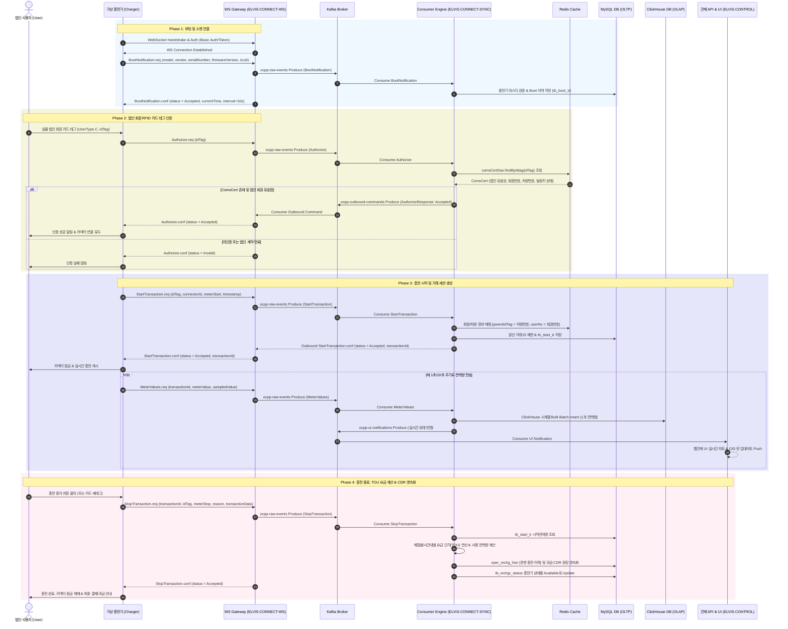

# ELVIS (Electric Vehicle Charging Infrastructure System) Platform PoC 법인 회원 충전 라이프사이클 프로세스 명세서 (PoC Reference Process Flow)

본 문서는 **ELVIS (Electric Vehicle Charging Infrastructure System) Platform PoC(Proof of Concept)** 사업 수검 및 검증을 위한 **단일 기준 프로세스인 법인 회원 RFID 카드 태깅 충전 라이프사이클 (`UserType.C`)**의 상세 연동 프로세스 명세서입니다.

---

## 1. 📌 PoC 프로세스 검증 개요

- **대상 시나리오**: **법인 회원 실물 RFID 카드 태깅 충전 (UserType.C)**
- **검증 목적**: 
  1. 2,000대 가상 충전기의 부팅(`BootNotification`)부터 법인 RFID 회원 인증(`Authorize`), 충전 시작(`StartTransaction`), 충전 종료(`StopTransaction`)까지 E2E 라이프사이클 정상 동작 검증
  2. Java 25 Virtual Threads 기반 Kafka 인바운드/아웃바운드 메시지 버퍼링 및 MySQL 9.71 OLTP / ClickHouse OLAP 이중 적재 안정성 검증
  3. 계절별/시간대별 단가(TOU) 계산을 통한 과금 CDR 원장 영속화 및 관제 UI(`elvis-control-ui`) 실시간 모니터링 연동 검증

---

## 2. 🔄 법인 회원 충전 E2E 시퀀스 다이어그램 (`UserType.C`)

---

## 3. 📝 PoC 단계별 상세 처리 규격

### 3.1. Phase 1: 부팅 및 소켓 연결 (`BootNotification`)
- **충전기 전송 패킷**: `BootNotification.req (chargePointModel, chargePointVendor, chargePointSerialNumber, firmwareVersion, iccid)`
- **게이트웨이(`ELVIS-CONNECT-WS`) 처리**:
  - Netty/Spring WebSocket `HandshakeInterceptor`에서 ChargeBoxId 및 Token 검증
  - 수신 패킷을 Kafka `ocpp-raw-events` 토픽으로 비동기 발행
- **Consumer(`ELVIS-CONNECT-SYNC`) 처리**:
  - 충전기 마스터 DB 조회를 통한 등록 충전기 여부 확정
  - `tb_boot_tr` 테이블에 부팅 이력 저장 후 게이트웨이를 통해 `BootNotification.conf (status = Accepted)` 응답

---

### 3.2. Phase 2: 법인 회원 RFID 카드 인증 (`Authorize`)
- **충전기 전송 패킷**: `Authorize.req (idTag)`
- **Consumer(`ELVIS-CONNECT-SYNC`) 처리**:
  - `CsmsCertDao.findByIdtag(idTag)`를 호출하여 Redis 캐시 및 MySQL 회원 마스터 조회
  - **법인 회원 유효성 검증 항목**:
    1. 법인 회원 등록 여부 (`UserType = 'C'`)
    2. 법인 계약 상태 (정상/정지)
    3. 법인 연동 빌링키 만료 여부
  - 검증 성공 시 `Authorize.conf (status = Accepted)`, 실패 시 `Invalid` 전송

---

### 3.3. Phase 3: 충전 시작 및 실시간 전력량 적재 (`StartTransaction` & `MeterValues`)
- **충전기 전송 패킷**: `StartTransaction.req (connectorId, idTag, meterStart, timestamp)`
- **Consumer(`ELVIS-CONNECT-SYNC`) 처리**:
  - `parentIdTag`에 차량번호(`userNm`), `userNo`에 회원번호 설정
  - MySQL 시퀀스/분산 매니저 기반 신규 `transactionId` 채번
  - `tb_start_tr` 테이블에 충전 시작 정보 저장
- **1초 미터값 적재 (`MeterValues`)**:
  - 충전 중 전송되는 `MeterValues.req` 패킷은 `ConcurrentLinkedQueue` 버퍼에 저장
  - 1초 단위로 ClickHouse OLAP DB에 **JDBC Batch Bulk Insert** 수행 (고성능 시계열 적재)
  - 관제 백엔드(`ELVIS-CONTROL-API`)로 Kafka 알림 이벤트를 발행하여 **Vue 3 관제 UI 화면에 실시간 차트 반영**

---

### 3.4. Phase 4: 충전 종료, TOU 정산 & 이관 (`StopTransaction`)
- **충전기 전송 패킷**: `StopTransaction.req (transactionId, idTag, meterStop, timestamp, reason, transactionData)`
- **Consumer(`ELVIS-CONNECT-SYNC`) 처리**:
  - `tb_start_tr` 테이블의 `meterStart`와 `StopTransaction.req`의 `meterStop` 차이로 총 사용 전력량($kWh$) 산출
  - 계절별(봄/여름/가을/겨울) 및 시간대별(경부하/중간부하/최대부하) **TOU 요금 단가표 연산 엔진** 호출
  - 계산된 최종 과금 금액 및 CDR 원장을 MySQL `oper_rechg_hist` 테이블에 영속화
  - 충전기 상태를 `Occupied` ➔ `Available`로 최신화하고 `StopTransaction.conf (status = Accepted)` 하향 전송

---

## 4. 📊 PoC 시연 수검용 실데이터 연동 및 TOU 정산 연산 예시 표

아래 예시는 PoC E2E 수검 테스트 시 실제로 적용되는 샘플 데이터 및 TOU 요금 계산 로직 연산 표입니다.

### 4.1. 시연용 단말 및 카드 샘플 데이터
- **충전기 ID (`chargeBoxId`)**: `CP-ELVIS-2026-0001` (커넥터 ID: 1)
- **법인 RFID 카드 (`idTag`)**: `CARD-CORP-2026-001` (사용자 유형: `UserType.C`)
- **매핑 회원 정보**: 법인명 `(주)엘에스링크`, 차량번호 `123가 5678`, 회원번호 `MEM-2026-9901`

### 4.2. 시연 충전 세션 및 TOU 과금 정산 예시 (여름철 14:00~14:30 중간/최대부하)

| 세션 구분 | 타임스탬프 (Timestamp) | 누적 미터값 (MeterValue) | 차이 전력량 (kWh) | 적용 계절/부하 구분 | 적용 단가 (원/kWh) | 정산 금액 (원) |
| :--- | :---: | :---: | :---: | :---: | :---: | :---: |
| **충전 시작 (`StartTransaction`)** | `2026-08-17 14:00:00` | 10,000 Wh | 0.0 kWh | - | - | 0 원 |
| **충전 진행 중 (`MeterValues`)** | `2026-08-17 14:15:00` | 20,000 Wh | 10.0 kWh | 여름철 최대부하 (14시~15시) | 320 원 / kWh | 3,200 원 |
| **충전 종료 (`StopTransaction`)** | `2026-08-17 14:30:00` | 30,000 Wh | 10.0 kWh | 여름철 최대부하 (14시~15시) | 320 원 / kWh | 3,200 원 |
| **최종 CDR 원장 합계** | **30분간 충전** | **종료: 30,000 Wh** | **총 20.0 kWh** | **여름철 최대부하 구간** | **평균 320 원** | **최종 과금: 6,400 원** |

---

## 5. 📂 관련 문서 체계

| 구분 | 문서명 | 설명 |
| :--- | :--- | :--- |
| **전체용** | [start_transaction_process_flows.md](file:///d:/project/lselink/ocpp-lite/git/h2y-ocpp/start_transaction_process_flows.md) | 법인/일반/비회원/로밍 4대 시나리오가 통합된 전체 시스템 프로세스 명세서 |
| **PoC용** | [04.poc_process_flow.md](file:///d:/project/lselink/ocpp-lite/git/h2y-ocpp/doc/04.poc/04.poc_process_flow.md) | **[본 문서]** 2026 PoC 수검 및 시연 전용 법인 회원(UserType.C) 단일 기준 프로세스 명세서 |
| **아키텍처**| [01.poc_architecture.md](file:///d:/project/lselink/ocpp-lite/git/h2y-ocpp/doc/04.poc/01.poc_architecture.md) | PoC 2대 제품군 및 4대 독립 모듈 아키텍처 및 하이브리드 DB 구조 설계서 |
| **WBS** | [02.poc_feature_matrix.md](file:///d:/project/lselink/ocpp-lite/git/h2y-ocpp/doc/04.poc/02.poc_feature_matrix.md) | 100% 직렬 개발 순번 및 YYYY-MM-DD Target Date 기반 WBS 일정 명세서 |
| **Task 명세**| [03.poc_task_list.md](file:///d:/project/lselink/ocpp-lite/git/h2y-ocpp/doc/04.poc/03.poc_task_list.md) | 전수 68개 WBS 세부 과제 통합 명세서 |
