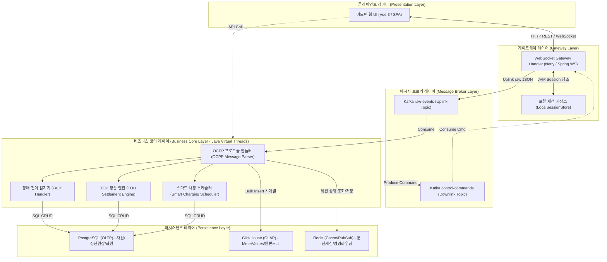
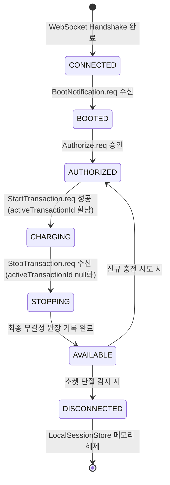
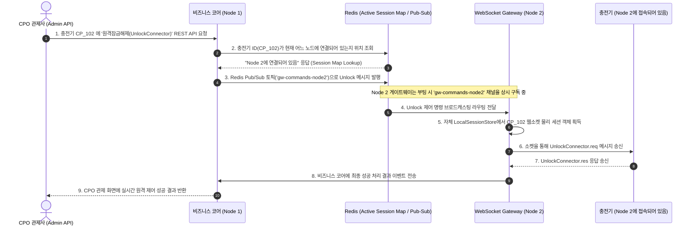

# [Architecture] CPO 통합 운영 솔루션 소프트웨어 아키텍처 정의서

본 문서는 CPO 통합 운영 솔루션(CSMS Platform)의 내적 소프트웨어 모듈 구성, 데이터 레이어 연동, 가상 스레드 분배 및 다중 노드 세션 라우팅을 정의하는 소프트웨어 아키텍처 정의서입니다. 

---

## 1. 아키텍처 핵심 설계 원칙 (Architectural Principles)

본 시스템은 수천 대의 충전기로부터 유입되는 대용량 실시간 트래픽을 처리하고, 폐쇄망(Air-Gapped) 내 하드웨어 자원을 극대화하기 위해 다음과 같은 3대 핵심 아키텍처 원칙을 준수합니다.

### 1.1. 비차단 비동기 파이프라인 (Loose Coupling & Async Pipeline)
* **구조:** WebSocket Gateway 레이어와 비즈니스 처리 코어(Business Core) 레이어를 물리적으로 격리하고, 그 사이에 **Apache Kafka**를 완충 지대로 배치합니다.
* **효과:** 충전기 연결 유지 및 패킷 수신 기능이 무거운 DB 쓰기, 정산 연산, 외부 결제 연동(PG) 지연 등의 백엔드 부하에 직접적으로 노출되지 않고 독립적으로 보장됩니다.

### 1.2. 하이브리드 세션 관리 (Stateful Agent & Stateless Service)
* **구조:** 웹소켓 세션별로 가벼운 상태값만을 갖는 **`OcppSessionAgent` (Stateful)** 인스턴스를 JVM 메모리에 띄워 관리하고, 무거운 트랜잭션 처리 및 조회 연산은 **Stateless Service** 싱글톤 객체들이 분할 처리합니다.
* **효과:** 세션별 기기의 동작 상태(Booted -> Charging -> Available)를 데이터베이스 액세스 없이 메모리 수준에서 직관적으로 검증할 수 있고, 세션 정보가 극도로 가벼워 메모리(Heap) 오버헤드가 최소화됩니다.

### 1.3. 데이터 CQRS (Command Query Responsibility Segregation)
* **구조:** ACID 트랜잭션과 데이터의 정합성이 최우선인 정보는 **PostgreSQL (OLTP)**에 격리 저장하고, 용량이 매우 크고 변경이 없는 계측 데이터(MeterValues) 및 원본 JSON 패킷 로그는 **ClickHouse (OLAP)** 시계열 테이블에 적재합니다.
* **효과:** OLTP 데이터베이스의 잠금(Lock) 경합 및 디스크 I/O 병목을 완화하고, 수억 건의 미터값 추이 시각화 쿼리를 100ms 이내에 처리합니다.

---

## 2. 소프트웨어 다층 레이어드 구조 (Software Layered Architecture)

솔루션 내부의 모듈 구조는 하부 인프라 및 통신 프로토콜의 변화에 유연하게 대응할 수 있도록 역할별로 명확히 레이어링되어 있습니다.



### 2.1. 레이어별 상세 역할 정의

1. **클라이언트 레이어 (Presentation Layer - Vue 3):**
   * 사용자 브라우저에 단일 페이지 어플리케이션(SPA)으로 구동되며, 통신 상태 그리드, 오프라인 지도 렌더링, 실시간 통신 로그 패킷 뷰어를 제공합니다.
2. **게이트웨이 레이어 (WebSocket Gateway Layer):**
   * 충전기와의 raw TCP/SSL 소켓 접속을 처리하고, OCPP JSON 패킷 규격을 검증(Schema Validation)합니다.
   * `LocalSessionStore` (ConcurrentHashMap)를 내장하여 충전기 ID와 물리 소켓 세션 인스턴스를 매핑 및 보존합니다.
3. **메시지 브로커 레이어 (Message Broker Layer - Apache Kafka):**
   * 업링크/다운링크 채널을 토픽 단위로 물리적으로 이격하고 비동기 메시지 백로그를 관리합니다.
4. **비즈니스 코어 레이어 (Business Core Layer - Spring Boot with Virtual Threads):**
   * 플랫폼 핵심 엔진으로서 모든 연산이 가상 스레드 위에서 처리되어 스레드 고갈 병목을 극적으로 예방합니다.
   * OCPP 프로토콜 상태 코드 검증, 한전 요율 기반 TOU 요금 정산, StatusNotification 장애 등급 변환 가공을 수행합니다.
5. **퍼시스턴스 레이어 (Persistence Layer - DB / Cache):**
   * 영속성 저장 영역으로 역할에 특화된 DB 엔진들이 분산 탑재되어 퍼포먼스를 조율합니다.

---

## 3. 웹소켓 세션 관리 및 세션 객체 상세 설계

### 3.1. `OcppSessionAgent` 데이터 명세
충전기당 1개씩 생성되며, JVM 메모리 공간의 점유율을 줄이기 위해 부가 기능을 배제하고 핵심 속성만을 갖는 초경량 상태 변수 구조체로 구성됩니다.

```java
public class OcppSessionAgent {
    private final String chargePointId;       // 충전기 고유 아이덴티티 (예: CP_1001)
    private final WebSocketSession session;    // JVM 실제 물리 웹소켓 소켓 객체 참조
    private String ocppVersion = "1.6J";       // 현재 연결 프로토콜 버전 (1.6J / 2.0.1)
    private SessionState state = SessionState.CONNECTED; // 세션 수명 주기 상태
    private String activeTransactionId = null; // 현재 충전이 개시된 활성 트랜잭션 ID (미충전 시 null)
    private Instant lastHeartbeatTime;        // 최종 하트비트 수신 시각 (커넥션 타임아웃 판단용)
    
    // Getters & Setters
}
```

### 3.2. 세션 수명 주기 상태 전이도 (State Transition Model)
세션 객체는 OCPP 프로토콜 규격 및 물리 소켓 감지에 따라 다음과 같이 엄격하게 변환됩니다.



---

## 4. [Phase 2] 다중 노드 분산 환경에서의 원격 명령 라우팅 흐름

Phase 2(Scale-out) 환경에서는 부하 분산기에 의해 충전기가 각기 다른 게이트웨이 노드(Node 1, Node 2)에 접속하게 됩니다. 관리자 어드민 API가 특정 노드에 들어왔을 때, 다른 노드에 속한 충전기의 소켓 세션 인스턴스를 찾아서 명령을 안전하게 배달하기 위해 **Redis Pub/Sub** 및 **세션 상태 동기화 맵**을 라우터로 활용합니다.



* **핵심 라우팅 규칙:**
  * **위치 정보 저장:** 충전기가 특정 노드에 접속하거나 해제될 때, 해당 게이트웨이 노드는 Redis `Hash` 구조인 `active_session_map`에 `[충전기ID] : [노드ID]` 형태로 상태를 기록합니다.
  * **메시지 전송 이중화:** 특정 노드가 갑작스럽게 다운되는 현상에 대비해, Redis Pub/Sub 채널 전송 실패 시 3회 이내로 Kafka `control-commands-retry` 토픽으로 우회 발행하여 메시지 유실을 방지합니다.
