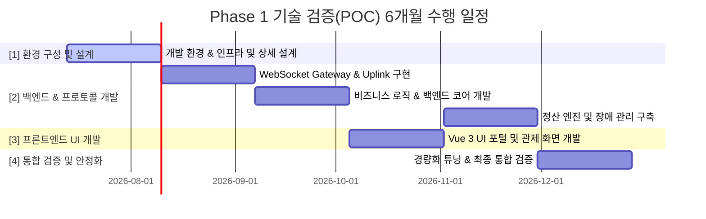
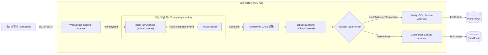

# [POC] CPO 통합 CSMS Phase 1 기술 검증 정의서 (Proof of Concept)

본 문서는 CPO 통합 운영 솔루션(CSMS Platform)의 Phase 1 (Standalone 단독 운영 모드) 핵심 설계 요건을 검증하기 위한 기술 검증(POC) 정의서입니다. 
가상 스레드(Java 25), 단일 Kafka 브로커를 백엔드로 하는 Spring Integration EIP 파이프라인, 그리고 PostgreSQL(OLTP) 및 ClickHouse(OLAP) 이원화 적재(CQRS)의 실동작 방식을 코드로 구현하고 검증하는 것을 목적으로 합니다.

---

## 1. POC 6개월 수행 로드맵 (6-Month POC Roadmap)

본 기술 검증(POC)은 Phase 1 Standalone 모드 구축 일정과 싱크를 맞추어 총 6개월(24주)의 일정으로 세분화하여 진행합니다.



### 1.1. 주차별 세부 마일스톤 및 수행 작업

#### 1개월차: 개발 환경 & 인프라 및 상세 설계 (Week 1 - 4)
* **1주차 (Week 1):**
  * **[백엔드]** JDK 25 가상 스레드 기반 Spring Boot 프로젝트 생성 및 빌드/실행 환경 전역 설정 (`spring.threads.virtual.enabled=true`).
* **2주차 (Week 2):**
  * **[인프라/DB]** Single Kafka Broker (KRaft Mode), PostgreSQL, ClickHouse 로컬 Docker Compose 인프라 구축 및 컨테이너 기동 최적화.
* **3주차 (Week 3):**
  * **[인프라/DB]** OLTP 및 OLAP 핵심 테이블 DDL 작성 및 PostgreSQL/ClickHouse 초기 데이터베이스 스키마 검증.
* **4주차 (Week 4):**
  * **[공통/설계]** 150개 AS-IS 화면 기능 분석을 기반으로 Phase 1 Standalone POC 아키텍처 상세 설계서 작성 및 메시지 인터페이스 규격 확정.

#### 2개월차: OCPP 1.6J WebSocket Gateway & Uplink 구현 (Week 5 - 8)
* **5주차 (Week 5):**
  * **[백엔드]** Spring WebSocket 기반 Gateway 핸들러 구현 및 `LocalSessionStore` 메모리 맵(ConcurrentHashMap) 설계.
* **6주차 (Week 6):**
  * **[백엔드]** Spring Integration `KafkaChannel` 정의, 웹소켓 유입 Raw JSON의 `ocpp-raw-events` 토픽 인입 검증 및 동적 채널 관리(Dynamic Channel Management) 라우터 설계.
* **7주차 (Week 7):**
  * **[백엔드]** OCPP 1.6J 핵심 프로파일 메시지 4종 (`BootNotification`, `Heartbeat`, `StatusNotification`, `Authorize`) 연동 개발.
* **8주차 (Week 8):**
  * **[백엔드]** OCPP 1.6J 트랜잭션 메시지 2종 (`StartTransaction`, `StopTransaction`) 연동 개발.
  * **[인프라/DB]** 15초 주기 미터값 (`MeterValues`) ClickHouse 벌크 적재 버퍼 엔진 구현.

#### 3개월차: 비즈니스 로직 & 백엔드 코어 개발 (Week 9 - 12)
* **9주차 (Week 9):**
  * **[백엔드]** 법인관리, 사업장목록, 충전소목록, 한전계약단가 관리 API 개발.
* **10주차 (Week 10):**
  * **[백엔드]** 충전기관리(등록/상세), 충전기목록 및 충전기모델관리, 충전기 개소 관리 백엔드 로직 완성.
* **11주차 (Week 11):**
  * **[백엔드]** RFID 정보 마스터 등록 및 RFID 요청 승인 프로세스 개발.
* **12주차 (Week 12):**
  * **[백엔드]** 요일별/휴일별 요금 정책 적용 기본 데이터 모델 설계 및 한전 계약 요금 테이블 연동 비즈니스 로직 개발.

#### 4개월차: 프론트엔드 Vue 3 UI 포털 및 관제 화면 개발 (Week 13 - 16)
* **13주차 (Week 13):**
  * **[프론트엔드]** Vue 3 (Composition API) + Pinia 상태 관리를 적용한 기본 어드민 포털 레이아웃 및 대시보드 컴포넌트 개발.
* **14주차 (Week 14):**
  * **[프론트엔드]** 실시간 충전기 커넥터 상태 모니터링 화면 및 상태 동적 필터링 그리드 구축.
* **15주차 (Week 15):**
  * **[프론트엔드]** 충전소 및 충전기 상세 자산 목록 화면, 그리고 요금 정책 관리 컴포넌트 개발.
* **16주차 (Week 16):**
  * **[프론트엔드]** 웹소켓 연동 실시간 OCPP Raw 메시지 로그 뷰어 화면, 특정 기기 동적 격리(Sandbox) 및 디버깅(WireTap) 제어용 관리자 콘솔 UI 개발.
  * **[백엔드]** UI-백엔드 WebSocket 통합 연동 및 실시간 이벤트 채널 매핑.

#### 5개월차: 정산 엔진 및 장애 관리 구축 (Week 17 - 20)
* **17주차 (Week 17):**
  * **[백엔드]** 계절별/시간대별 TOU 요금 계산 로직 적용 및 트랜잭션 종료 시 최종 이용금액을 연산하는 정산 엔진 개발.
* **18주차 (Week 18):**
  * **[백엔드]** PostgreSQL CDR(Charge Detail Record) 저장 로직 및 바로정산 API 구현.
* **19주차 (Week 19):**
  * **[백엔드]** 제조사별 장애코드관리 및 StatusNotification 고장 수동 접수 처리 관리 시스템 구축.
* **20주차 (Week 20):**
  * **[백엔드]** 실시간 장애 알림(StatusNotification) 웹소켓 브로드캐스팅 알림 연동.
  * **[프론트엔드]** 실시간 장애 알림(StatusNotification) 팝업 및 장애 목록 화면 연계.

#### 6개월차: 경량화 튜닝 및 최종 통합 검증 완료 (Week 21 - 24)
* **21주차 (Week 21):**
  * **[인프라/DB]** 단일 VM 리소스 최적화를 위한 Kafka Heap Size 강제 제한(512MB) 및 ClickHouse 쿼리당 최대 메모리 사용 임계치 제한(4GB) 적용.
* **22주차 (Week 22):**
  * **[테스트/검증]** 가상 충전기 시뮬레이터(Node.js)를 활용한 동시 2,000대 연결 및 데이터 송수신 안정성 테스트.
* **23주차 (Week 23):**
  * **[테스트/검증]** Phase 1 통합 시나리오 테스트 및 병목 구간 식별/가상 스레드 성능 튜닝.
* **24주차 (Week 24):**
  * **[인프라/배포]** 완전 폐쇄망(Air-Gapped) 내 독립 실행 배포본 패키징 및 최종 통합 검증 완료 (M1 달성).

---

## 2. POC 검증 핵심 기능 명세 (POC Functional Requirements)

Phase 1 POC에서 구현 및 검증하는 필수 기능 범위 및 상세 명세입니다.

### 2.1. 웹소켓 게이트웨이 및 세션 제어 기능
* **충전기 커넥션 핸들셰이크 & 인증:**
  * 충전기 웹소켓 접속 시 HTTP Basic Authentication 식별자 검증 및 세션 개설.
  * 동일 기기의 중복 접속 시 기존 세션 강제 끊김 처리(Session Eviction) 및 신규 세션 유지.
* **커넥션 하트비트 감지 및 타임아웃 감지:**
  * 설정된 Heartbeat Interval(예: 60초)의 1.5배 이상 데이터 수신이 없을 시, 고장으로 판단하고 게이트웨이 레벨에서 물리 웹소켓 강제 Close 처리.
  * 메모리 내 `LocalSessionStore`에서 즉시 세션 객체 제거 및 PostgreSQL 상 충전기 상태를 `Offline`으로 변경.

### 2.2. OCPP 1.6J 표준 메시지 수신 처리 기능
* **기기 부팅 및 인증 (`BootNotification`, `Authorize`):**
  * 부팅 메시지 수신 시 PostgreSQL의 `charge_point` 테이블을 조회하여 해당 기기가 Registered 상태이면 accepted 응답을 전송하고 Online 상태로 변경.
  * RFID 태그 접촉에 따른 `Authorize` 요청 시, 데이터베이스 내 회원 상태 및 정기권 유효 여부를 체크하여 accepted/invalid 여부 반환.
* **충전 개시 및 종료 (`StartTransaction`, `StopTransaction`):**
  * 충전 시작 시 충전 트랜잭션 식별 ID를 고유하게 발급하고, PostgreSQL 내 `charging_transaction` 테이블에 상태(status: Charging) 기록.
  * 충전 종료 시 누적 Wh 충전량과 요금 단가를 곱하여 최종 금액을 연산하고, **최종 정산 원장(CDR)**을 영속화하여 트랜잭션 완료(status: Finished).
* **실시간 계측값 수집 (`MeterValues`):**
  * 15초 주기로 전송되는 충전기의 전류(A), 전압(V), 누적 전력량(Wh), 배터리 충전율(SOC) 정보를 추출하여 메모리 버퍼(Queue)로 인입.

### 2.3. 비동기 적재 및 관제 알림 기능
* **ClickHouse 시계열 로그 적재:**
  * 버퍼에 대기 중인 MeterValues 패킷 및 OCPP 원본 로그 문자열을 ClickHouse JDBC 드라이버의 Batch 실행을 통해 1초/1,000건 단위로 고속 병렬 적재.
* **실시간 알림 및 장애 감지 (`StatusNotification`):**
  * 충전기가 `Faulted` 상태 메시지를 보낼 경우, 즉시 PostgreSQL에 장애 이력을 생성하고, `alertPushChannel`을 통해 어드민 UI 웹 화면으로 Web소켓 브로드캐스팅 알림 발송.

### 2.4. Phase 1 필수 관리자 화면 연계 검증
본 POC의 백엔드 처리기는 [통합 기능 분류 정의서 (02.feature_specification)](file:///d:/project/lselink/ocpp-lite/git/h2y-ocpp/doc/02.feature_specification.md)에서 정의한 Phase 1 필수 어드민 화면의 데이터 원천을 완벽하게 제공하도록 검증 설계를 포함합니다.

1. **대시보드 및 관제 현황 모니터링:**
   * `LocalSessionStore`에 보존된 활성 웹소켓 세션 수를 실시간 집계하여 대시보드의 '충전기 기동률' 데이터를 제공합니다.
   * 충전소별 상태 집계 현황 및 실시간 충전기 기동률 상태를 요약 대시보드 그리드 형태로 시각화하여 연동합니다.
2. **충전기 상태 조회, 통신로그 조회 및 동적 채널 제어:**
   * 충전기로부터 수신된 `StatusNotification` 메시지를 처리하여 커넥터별 상태(Available, Charging, Faulted)를 실시간 반영합니다.
   * ClickHouse에 벌크 적재된 원본 JSON 패킷을 조회하는 API를 통해 관리자가 디버깅용 통신 로그를 탐색할 수 있도록 합니다.
   * 관리자 콘솔 UI에서 특정 충전기 선택 시 즉시 '동적 격리(Sandbox)' 명령을 하달해 트래픽을 차단/우회하고, 정밀 모니터링을 위해 '동적 디버깅(WireTap)'을 활성화하여 실시간 패킷 흐름 스트림 뷰와 연계합니다.
3. **충전이력 상세조회 & 결제 정보 현황:**
   * `StopTransaction` 수신 시 연산 완료된 최종 과금 정보(CDR)가 PostgreSQL의 `charging_transaction` 테이블에 완벽하게 Commit되는지 조회하여, 일반/법인차량 충전 이력 및 매출 통계 화면의 데이터 무결성을 검증합니다.
4. **원격 제어 및 인증 설정:**
   * 어드민 API로부터 전달받은 원격 명령(`Reset`, `UnlockConnector` 등)을 `controlCommandChannel`을 경유해 해당 충전기의 실시간 WebSocket 세션으로 즉시 라우팅하여 제어 반응 속도를 측정합니다.
   * 충전기 등록 마스터 설정에 정의된 Basic Auth 보안 인증 키값을 기준으로 웹소켓 커넥트 시점의 Handshake 검증을 통과하는지 검증합니다.

### 2.5. 동적 채널 및 라우팅 제어 기능 (Dynamic Channel & Routing Management)
* **특정 충전기 트래픽 격리 (Traffic Sandbox):**
  * 특정 충전기 단말의 펌웨어 오작동 등으로 인해 비정상적인 미터값(`MeterValues`) 및 상태 알림(`StatusNotification`) 패킷이 폭증할 때, 시스템 전체 공유 파이프라인의 메시지 처리 지연이 발생하는 것을 방지합니다.
  * 런타임에 Dynamic Router를 통해 해당 충전기 ID(예: `CP_1001`) 전용의 격리 채널(Sandbox Channel)을 실시간 등록/바인딩하여, 타 정상 충전기들의 메시지 파이프라인과 트래픽 흐름을 완벽히 격리(Isolation)합니다.
* **실시간 디버깅 감시 (Dynamic WireTap):**
  * 특정 충전기에 기기 통신 장애가 발생하여 관제사가 정밀 디버깅을 원할 경우, 시스템 재기동 없이 해당 충전기 ID에 대해서만 동적으로 `WireTap` 패턴을 활성화합니다.
  * 실시간 수신되는 OCPP 메시지의 복사본을 디버깅용 웹소켓 채널(`debugConsoleChannel`)로 분기 유도하여 관리자 화면의 실시간 로그 뷰어에 통신 디버깅 스트림을 노출합니다.

---

## 3. 아키텍처 및 검증 범위 (Architecture & Verification Scope)

* **WebSocket & Kafka 연동 검증:** 실시간 충전기 연결용 웹소켓 인터페이스와 Spring Integration의 `KafkaChannel`을 연동하여 메시지를 유실 없이 Kafka 브로커로 인입시키고 비동기로 컨슘하는가?
* **Spring Integration EIP 파이프라인 검증:** `Inbound Adapter ➡️ KafkaChannel ➡️ Transformer ➡️ Payload Router ➡️ Service Activator` 흐름이 POJO 수준에서 정상 동작하는가?
* **가상 스레드(Virtual Threads) 및 DB 적재 검증:** 가상 스레드 환경에서 PostgreSQL(JPA) 정산 원장 적재 및 ClickHouse(벌크 인서트) 미터값 시계열 저장이 논블로킹으로 동시 수행되는가?



---

## 4. 개발 및 테스트 환경 구성 (Poc Environment)

POC 구동을 위한 로컬 가상화 환경 인프라 정의서입니다. 단일 VM 혹은 개발자 PC 내에서 Docker Compose를 통해 Kafka(KRaft), PostgreSQL, ClickHouse를 원클릭 기동합니다.

### 4.1. docker-compose-poc.yml
```yaml
version: '3.8'
services:
  # 1. Single Kafka Broker (KRaft Mode)
  kafka:
    image: confluentinc/cp-kafka:7.4.0
    container_name: poc-kafka
    ports:
      - "9092:9092"
    environment:
      KAFKA_NODE_ID: 1
      KAFKA_LISTENER_SECURITY_PROTOCOL_MAP: 'CONTROLLER:PLAINTEXT,PLAINTEXT:PLAINTEXT,PLAINTEXT_HOST:PLAINTEXT'
      KAFKA_ADVERTISED_LISTENERS: 'PLAINTEXT://kafka:29092,PLAINTEXT_HOST://localhost:9092'
      KAFKA_OFFICES_TOPIC_REPLICATION_FACTOR: 1
      KAFKA_GROUP_INITIAL_REBALANCE_DELAY_MS: 0
      KAFKA_TRANSACTION_STATE_LOG_MIN_ISR: 1
      KAFKA_TRANSACTION_STATE_LOG_REPLICATION_FACTOR: 1
      KAFKA_PROCESS_ROLES: 'broker,controller'
      KAFKA_CONTROLLER_QUORUM_VOTERS: '1@kafka:29093'
      KAFKA_LISTENERS: 'PLAINTEXT://0.0.0.0:29092,CONTROLLER://0.0.0.0:29093,PLAINTEXT_HOST://0.0.0.0:9092'
      KAFKA_INTER_BROKER_LISTENER_NAME: 'PLAINTEXT'
      KAFKA_CONTROLLER_LISTENER_NAMES: 'CONTROLLER'
      KAFKA_LOG_DIRS: '/tmp/kraft-combined-logs'
      CLUSTER_ID: 'MkU3OEVBNTcwNTJENDM2Qk'

  # 2. PostgreSQL (OLTP DB)
  postgres:
    image: postgres:15-alpine
    container_name: poc-postgres
    ports:
      - "5432:5432"
    environment:
      POSTGRES_DB: ocpp_db
      POSTGRES_USER: ocpp_user
      POSTGRES_PASSWORD: ocpp_password
    volumes:
      - pgdata:/var/lib/postgresql/data

  # 3. ClickHouse (OLAP DB)
  clickhouse:
    image: clickhouse/clickhouse-server:latest
    container_name: poc-clickhouse
    ports:
      - "8123:8123"
      - "9000:9000"
    environment:
      CLICKHOUSE_DB: ocpp_log_db
      CLICKHOUSE_USER: ocpp_user
      CLICKHOUSE_PASSWORD: ocpp_password
    ulimits:
      nofile:
        soft: 262144
        hard: 262144
    volumes:
      - chdata:/var/lib/clickhouse

volumes:
  pgdata:
  chdata:
```

---

## 5. 핵심 백엔드 POC 구현 코드 (Sample Implementation)

Phase 1 요건을 충족하기 위한 Java 25 & Spring Boot 3.x/4.x 기반 핵심 설정 및 클래스 구현 표준 예시입니다.

### 5.1. application.yml 설정
```yaml
spring:
  threads:
    virtual:
      enabled: true # 1. Java 25 가상 스레드 전역 활성화

  datasource: # 2. PostgreSQL OLTP 설정
    url: jdbc:postgresql://localhost:5432/ocpp_db
    username: ocpp_user
    password: ocpp_password
    driver-class-name: org.postgresql.Driver
    hikari:
      maximum-pool-size: 50 # 가상 스레드 증가에 대비한 충분한 커넥션 풀 확보

  kafka: # 3. Kafka 브로커 연동 설정
    bootstrap-servers: localhost:9092
    consumer:
      group-id: ocpp-core-group
      auto-offset-reset: earliest
      key-deserializer: org.apache.kafka.common.serialization.StringDeserializer
      value-deserializer: org.apache.kafka.common.serialization.StringDeserializer
    producer:
      key-serializer: org.apache.kafka.common.serialization.StringSerializer
      value-serializer: org.apache.kafka.common.serialization.StringSerializer

clickhouse: # 4. ClickHouse OLAP 설정
  url: jdbc:ch://localhost:8123/ocpp_log_db
  username: ocpp_user
  password: ocpp_password
```

### 5.2. WebSocket Gateway & Spring Integration 설정
수신된 메시지를 동기 채널이 아닌 KafkaChannel을 통해 Kafka 브로커에 큐잉하고 컨슘하도록 어댑터와 채널을 연동합니다.

```java
package com.h2y.ocpp.poc.config;

import org.apache.kafka.clients.admin.NewTopic;
import org.springframework.context.annotation.Bean;
import org.springframework.context.annotation.Configuration;
import org.springframework.integration.channel.DirectChannel;
import org.springframework.integration.config.EnableIntegration;
import org.springframework.integration.dsl.IntegrationFlow;
import org.springframework.integration.dsl.MessageChannels;
import org.springframework.integration.kafka.dsl.Kafka;
import org.springframework.kafka.core.ConsumerFactory;
import org.springframework.kafka.core.KafkaTemplate;
import org.springframework.messaging.MessageChannel;

@Configuration
@EnableIntegration
public class IntegrationConfig {

    private static final String RAW_TOPIC = "ocpp-raw-events";

    // 1. Kafka 토픽 등록 Bean
    @Bean
    public NewTopic ocppRawTopic() {
        return new NewTopic(RAW_TOPIC, 1, (short) 1);
    }

    // 2. ocppRawChannel을 Kafka 메시지 채널로 정의 (Spring Integration)
    // WS Gateway가 이 채널로 메세지를 전송하면 내부적으로 Kafka Topic으로 자동 퍼블리싱됩니다.
    @Bean
    public MessageChannel ocppRawChannel(KafkaTemplate<String, String> kafkaTemplate) {
        return Kafka.channel(kafkaTemplate, RAW_TOPIC)
                .autoStartup(true)
                .get();
    }

    // 3. 내부 비즈니스 DTO 채널
    @Bean
    public MessageChannel ocppDtoChannel() {
        return MessageChannels.direct().get();
    }

    // 4. Kafka 토픽으로부터 메시지를 수신하여 비즈니스 DTO 파이프라인으로 태우는 Flow
    @Bean
    public IntegrationFlow ocppRawMessageConsumerFlow(
            ConsumerFactory<String, String> consumerFactory,
            MessageChannel ocppDtoChannel,
            OcppMessageTransformer transformer) {
        
        return IntegrationFlow.from(Kafka.messageDrivenChannelAdapter(consumerFactory, RAW_TOPIC))
                .transform(transformer)  // JSON ➡️ Java DTO 객체 변환
                .channel(ocppDtoChannel) // DTO 채널로 바이패스
                .get();
    }
}
```

### 5.3. OCPP JSON-to-DTO Transformer & Router 구현
메시지를 구조화하여 처리 엔진 및 데이터 저장소로 조건 분기 분배합니다.

```java
package com.h2y.ocpp.poc.config;

import com.fasterxml.jackson.databind.JsonNode;
import com.fasterxml.jackson.databind.ObjectMapper;
import org.springframework.integration.annotation.MessageEndpoint;
import org.springframework.integration.annotation.Transformer;
import org.springframework.messaging.Message;
import org.springframework.messaging.support.MessageBuilder;

import java.time.Instant;

@MessageEndpoint
public class OcppMessageTransformer {

    private final ObjectMapper objectMapper = new ObjectMapper();

    @Transformer(inputChannel = "ocppRawChannel", outputChannel = "ocppDtoChannel")
    public Message<OcppDto> transform(Message<String> rawMessage) throws Exception {
        String payload = rawMessage.getPayload();
        JsonNode root = objectMapper.readTree(payload);

        // OCPP 1.6J 표준 패킷 포맷 파싱: [MessageType, UniqueId, Action, Payload]
        int messageType = root.get(0).asInt();
        String messageId = root.get(1).asText();
        String action = root.get(2).asText();
        JsonNode body = root.get(3);

        OcppDto dto = new OcppDto(messageId, action, body.toString(), Instant.now());
        
        return MessageBuilder.withPayload(dto)
                .setHeader("ocppAction", action)
                .build();
    }
}
```

```java
package com.h2y.ocpp.poc.config;

import org.springframework.context.annotation.Bean;
import org.springframework.context.annotation.Configuration;
import org.springframework.integration.annotation.Router;
import org.springframework.integration.dsl.IntegrationFlow;
import org.springframework.messaging.MessageChannel;

@Configuration
public class OcppRouterConfig {

    // ocppDtoChannel로 들어온 DTO를 ocppAction 헤더값을 기준으로 세부 비즈니스 서비스로 분기 라우팅
    @Bean
    public IntegrationFlow ocppRoutingFlow(MessageChannel ocppDtoChannel) {
        return IntegrationFlow.from(ocppDtoChannel)
                .route(OcppDto.class, dto -> dto.getAction(), mapping -> mapping
                        .subFlowMapping("BootNotification", sf -> sf.handle("ocppCoreService", "handleBoot"))
                        .subFlowMapping("Authorize", sf -> sf.handle("ocppCoreService", "handleAuthorize"))
                        .subFlowMapping("StartTransaction", sf -> sf.handle("ocppCoreService", "handleStartTx"))
                        .subFlowMapping("StopTransaction", sf -> sf.handle("ocppCoreService", "handleStopTx"))
                        .subFlowMapping("MeterValues", sf -> sf.handle("clickHouseService", "handleMeterValues"))
                )
                .get();
    }
}
```

### 5.4. 비즈니스 서비스 및 ClickHouse 벌크 저장 엔진
가상 스레드 컨텍스트 하에서 PostgreSQL 트랜잭션 및 ClickHouse 벌크 라이터가 동작합니다.

```java
package com.h2y.ocpp.poc.service;

import com.h2y.ocpp.poc.config.OcppDto;
import org.slf4j.Logger;
import org.slf4j.LoggerFactory;
import org.springframework.stereotype.Service;
import org.springframework.transaction.annotation.Transactional;

@Service("ocppCoreService")
public class OcppCoreService {

    private static final Logger log = LoggerFactory.getLogger(OcppCoreService.class);

    @Transactional
    public void handleBoot(OcppDto dto) {
        log.info("[PostgreSQL 적재] BootNotification 처리 - Thread: {}", Thread.currentThread());
        // JPA/Hibernate를 활용한 Postgres CP 마스터 온라인 갱신 로직 실행
    }

    @Transactional
    public void handleStartTx(OcppDto dto) {
        log.info("[PostgreSQL 적재] StartTransaction 생성 - Thread: {}", Thread.currentThread());
        // charging_transaction 테이블에 Insert 처리
    }
}
```

```java
package com.h2y.ocpp.poc.service;

import com.h2y.ocpp.poc.config.OcppDto;
import org.slf4j.Logger;
import org.slf4j.LoggerFactory;
import org.springframework.beans.factory.annotation.Autowired;
import org.springframework.stereotype.Service;

import javax.sql.DataSource;
import java.sql.Connection;
import java.sql.PreparedStatement;
import java.util.ArrayList;
import java.util.List;
import java.util.concurrent.BlockingQueue;
import java.util.concurrent.LinkedBlockingQueue;
import java.util.concurrent.ScheduledExecutorService;
import java.util.concurrent.ScheduledThreadPoolExecutor;
import java.util.concurrent.TimeUnit;

@Service("clickHouseService")
public class ClickHouseService {

    private static final Logger log = LoggerFactory.getLogger(ClickHouseService.class);
    private final BlockingQueue<OcppDto> buffer = new LinkedBlockingQueue<>(10000);
    
    @Autowired
    private DataSource clickHouseDataSource; // ClickHouse 전용 JDBC 데이터소스 주입

    public ClickHouseService() {
        // 백그라운드에서 1초 또는 1000건 단위로 ClickHouse 벌크 적재 수행하는 가상 스레드 스케줄러 기동
        ScheduledExecutorService scheduler = new ScheduledThreadPoolExecutor(1, 
                r -> Thread.ofVirtual().name("ch-bulk-writer").unstarted(r));
        
        scheduler.scheduleWithFixedDelay(this::flushBuffer, 1, 1, TimeUnit.SECONDS);
    }

    public void handleMeterValues(OcppDto dto) {
        buffer.offer(dto); // 버퍼에 임시 적재 (논블로킹)
    }

    private void flushBuffer() {
        if (buffer.isEmpty()) return;

        List<OcppDto> batch = new ArrayList<>();
        buffer.drainTo(batch, 1000); // 최대 1,000건 인출

        log.info("[ClickHouse Bulk Insert] {} 건 적재 개시 - Thread: {}", batch.size(), Thread.currentThread());

        String sql = "INSERT INTO default.meter_value_history (cp_id, transaction_id, event_time, payload) VALUES (?, ?, ?, ?)";
        try (Connection conn = clickHouseDataSource.getConnection();
             PreparedStatement ps = conn.prepareStatement(sql)) {
            
            conn.setAutoCommit(false);
            for (OcppDto dto : batch) {
                ps.setString(1, "CP_1001");
                ps.setString(2, dto.getMessageId());
                ps.setObject(3, java.sql.Timestamp.from(dto.getReceivedAt()));
                ps.setString(4, dto.getPayload());
                ps.addBatch();
            }
            ps.executeBatch();
            conn.commit();
            log.info("[ClickHouse Bulk Insert] 적재 완료");
        } catch (Exception e) {
            log.error("ClickHouse Bulk Insert 중 오류 발생", e);
        }
    }
}
```

### 5.5. 동적 채널 등록 및 Dynamic Router 구현 예시
Spring Integration의 `IntegrationFlowContext` 및 `@Router` 패턴을 활용하여 런타임에 기기별 채널을 동적으로 바인딩하고 라우팅 경로를 변경하는 구현 예시입니다.

```java
package com.h2y.ocpp.poc.config;

import org.springframework.integration.annotation.Router;
import org.springframework.messaging.MessageChannel;
import org.springframework.stereotype.Component;

import java.util.Collection;
import java.util.Collections;
import java.util.Map;
import java.util.concurrent.ConcurrentHashMap;

@Component("dynamicRouter")
public class OcppDynamicRouter {

    private final Map<String, MessageChannel> customRoutes = new ConcurrentHashMap<>();
    private final MessageChannel defaultChannel;

    public OcppDynamicRouter(MessageChannel ocppDtoChannel) {
        this.defaultChannel = ocppDtoChannel;
    }

    // 1. DTO 유입 시 충전기 ID를 기반으로 동적 분기 채널 매핑
    @Router
    public Collection<MessageChannel> route(OcppDto dto) {
        String cpId = "CP_1001"; // 예시: dto에서 실제 충전기 ID 획득
        MessageChannel targetChannel = customRoutes.get(cpId);
        
        if (targetChannel != null) {
            return Collections.singletonList(targetChannel);
        }
        return Collections.singletonList(defaultChannel); // 매핑이 없으면 기본 DirectChannel 배달
    }

    // 2. 특정 충전기 전용 채널 동적 등록 (Sandbox/격리 또는 실시간 WireTap 목적)
    public void registerCustomRoute(String cpId, MessageChannel channel) {
        customRoutes.put(cpId, channel);
    }

    // 3. 동적 채널 해제 및 기본 채널 원복
    public void removeCustomRoute(String cpId) {
        customRoutes.remove(cpId);
    }
}
```

```java
package com.h2y.ocpp.poc.service;

import com.h2y.ocpp.poc.config.OcppDynamicRouter;
import org.springframework.beans.factory.annotation.Autowired;
import org.springframework.integration.dsl.IntegrationFlow;
import org.springframework.integration.dsl.MessageChannels;
import org.springframework.integration.dsl.context.IntegrationFlowContext;
import org.springframework.messaging.MessageChannel;
import org.springframework.stereotype.Service;

@Service
public class DynamicChannelService {

    @Autowired
    private IntegrationFlowContext flowContext;

    @Autowired
    private OcppDynamicRouter dynamicRouter;

    // 특정 오동작 충전기(CP)에 대해 트래픽 Sandbox(격리 및 Drop/제한) 동적 적용
    public void isolateChargePoint(String cpId) {
        // 1. 격리용 전용 DirectChannel 동적 생성
        String channelName = "sandbox-" + cpId + "-channel";
        MessageChannel sandboxChannel = MessageChannels.direct(channelName).get();

        // 2. 격리 채널에 대한 처리 Flow 동적 등록 (예: 로깅 및 폐기/속도 제한)
        IntegrationFlow sandboxFlow = IntegrationFlow.from(sandboxChannel)
                .handle(message -> {
                    System.out.println("[Traffic Sandbox] 격리 채널 유입 및 폐기: " + message.getPayload());
                })
                .get();

        flowContext.registration(sandboxFlow)
                .id(cpId + ".sandbox.flow")
                .register();

        // 3. Dynamic Router에 해당 CP와 격리 채널 매핑 등록
        dynamicRouter.registerCustomRoute(cpId, sandboxChannel);
    }

    // 격리 해제 및 기본 채널 복구
    public void releaseChargePoint(String cpId) {
        dynamicRouter.removeCustomRoute(cpId);
        flowContext.remove(cpId + ".sandbox.flow");
    }
}
```

---

## 6. 검증 시나리오 및 방법 (Verification Scenario)

작성된 코드를 빌드하고 시뮬레이터를 이용하여 전체 흐름을 테스트합니다.

### 6.1. Step 1: 인프라 기동 및 테이블 생성
1. 로컬 환경에서 도커 데몬을 기동한 후 `docker-compose -f docker-compose-poc.yml up -d` 명령어를 통해 환경을 기동합니다.
2. PostgreSQL 및 ClickHouse 콘솔에 접속하여 [01.prd.md: L648](file:///d:/project/lselink/ocpp-lite/git/h2y-ocpp/doc/01.prd.md#L648-L737) 의 핵심 데이터베이스 스키마 스크립트를 실행하여 테스트용 테이블을 초기화합니다.

### 6.2. Step 2: Spring Boot POC 어질리티 빌드 및 기동
1. Java 25 SDK 환경에서 프로젝트 루트 경로로 진입하여 Maven 또는 Gradle 빌드를 완료합니다.
2. `OcppPocApplication`을 실행하여 웹소켓 게이트웨이 포트(예: 8080)와 Kafka 브로커 커넥션이 오차 없이 맺어지는지 확인합니다.

### 6.3. Step 3: 가상 시뮬레이터 송신 및 연동 확인
아래의 Mocking용 Node.js 클라이언트 스크립트를 사용하여 가상 메시지 패킷을 웹소켓 게이트웨이로 발송합니다.

```javascript
// simulator.js
const WebSocket = require('ws');
const ws = new WebSocket('ws://localhost:8080/ocpp/CP_1001');

ws.on('open', function open() {
  console.log('WS 연결 완료');
  
  // 1. BootNotification 전송
  const bootMsg = [2, "msg-0001", "BootNotification", {
    chargePointVendor: "H2Y-Vendor",
    chargePointModel: "H2Y-Fast-200"
  }];
  ws.send(JSON.stringify(bootMsg));

  // 2. 15초 단위 실시간 계측값(MeterValues) 루프 전송
  let count = 1;
  setInterval(() => {
    const meterMsg = [2, `msg-meter-${count++}`, "MeterValues", {
      transactionId: "TX_9999",
      meterValue: [{
        timestamp: new Date().toISOString(),
        sampledValue: [{ value: (30 + count * 0.1).toString(), context: "Sample.Periodic" }]
      }]
    }];
    ws.send(JSON.stringify(meterMsg));
    console.log('MeterValues 패킷 송신 완료');
  }, 1000); // POC 검증을 위해 1초 주기로 고속 송신 테스트
});
```

### 6.4. Step 4: 데이터 적재 여부 최종 검증 (Checklist)

| 검증 단계 | 검증 항목 | 확인 방법 및 명령어 | 성공 여부 |
| :--- | :--- | :--- | :---: |
| **소켓 접속** | 가상 시뮬레이터와 Gateway 간의 WS 접속 성립 여부 | 런타임 로그 내 `Session Open / Connected` 기록 확인 | [ ] |
| **Kafka 인입** | `ocpp-raw-events` 토픽에 Raw JSON 패킷 적재 여부 | `kafka-console-consumer.sh --bootstrap-server localhost:9092 --topic ocpp-raw-events --from-beginning` 실행 시 패킷 출력 확인 | [ ] |
| **EIP 라우팅** | Transformer를 거쳐 Action(Boot/Meter)별 비즈니스 서비스 라우팅 여부 | 어플리케이션 로그에 `[PostgreSQL 적재]`, `[ClickHouse Bulk Insert]` 분기 지점 정상 도달 메시지 확인 | [ ] |
| **PostgreSQL 확인**| `charge_point` 테이블의 상태가 Registered -> Online 변경 여부 | `SELECT cp_id, status FROM charge_point WHERE cp_id = 'CP_1001';` 수행 시 `Online` 확인 | [ ] |
| **ClickHouse 확인**| 1초 버퍼 기동 후 `meter_value_history` 벌크 적재 완료 여부 | `SELECT count(), max(event_time) FROM meter_value_history;` 수행 시 레코드 수가 1초마다 대량 증가 확인 | [ ] |
| **동적 채널 격리** | 특정 기기(CP) 트래픽에 대한 격리(Sandbox) 런타임 적용 여부 | `DynamicChannelService.isolateChargePoint("CP_1001")` 호출 후, 어플리케이션 로그에 `[Traffic Sandbox] 격리 채널 유입` 출력 확인 | [ ] |
