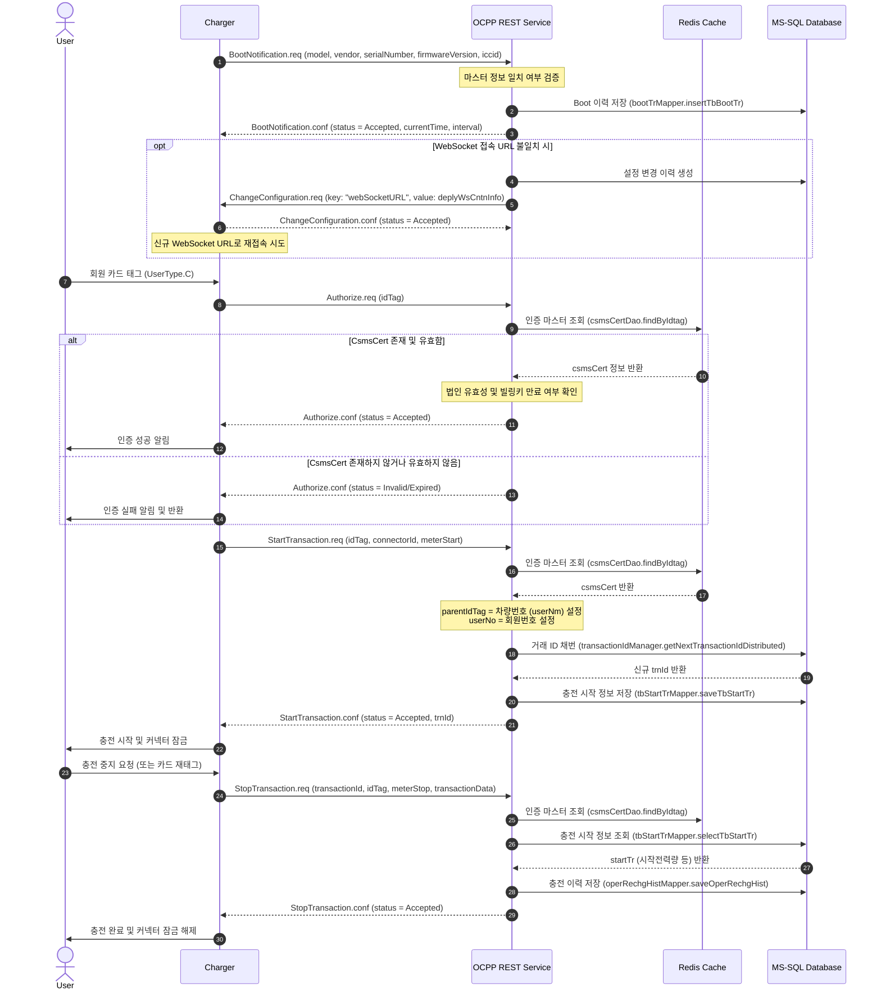
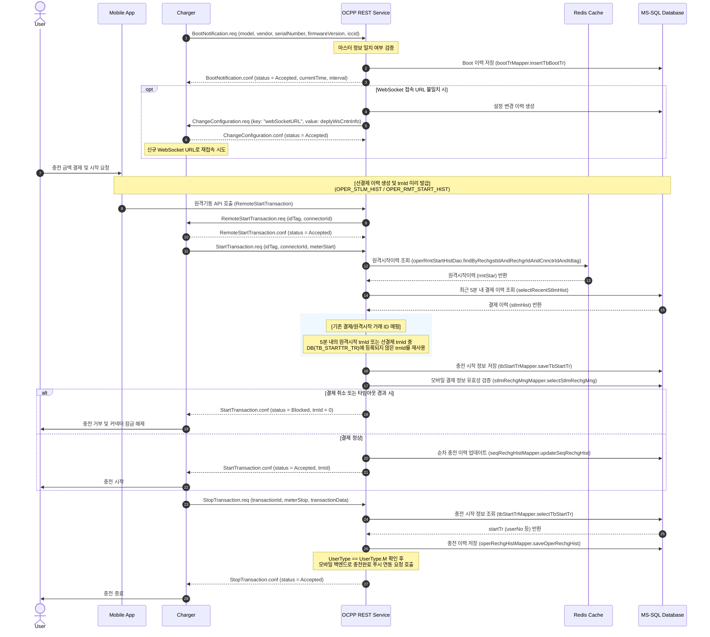
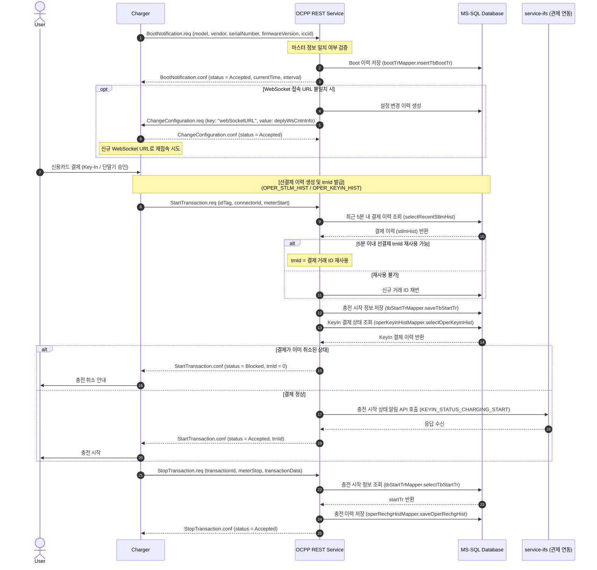
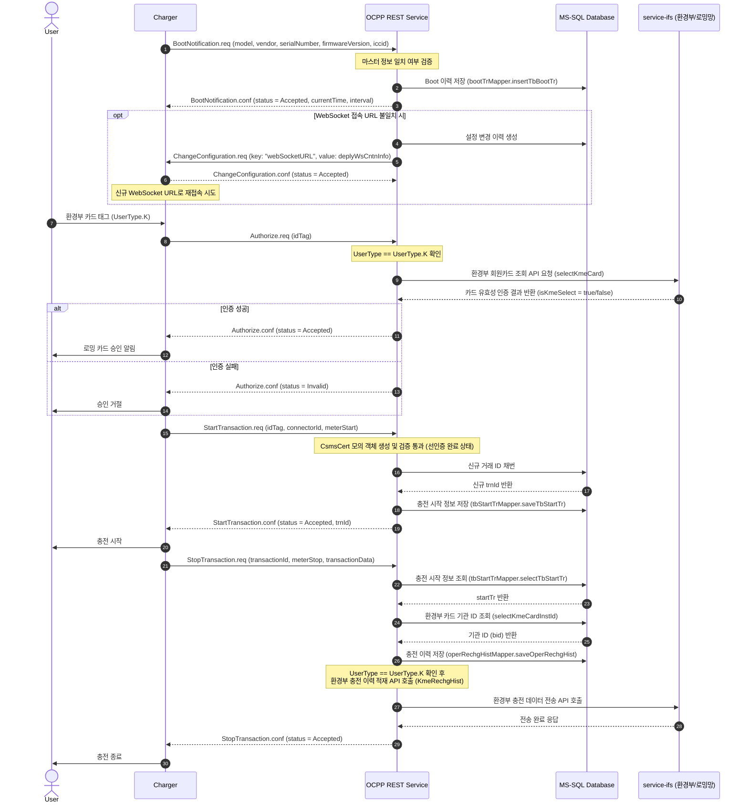

# OCPP[^OCPP] 충전 거래 라이프사이클 시퀀스 다이어그램

이 문서는 사용자의 충전 및 결제 방식(충전 유형)에 따른 네 가지 핵심 시나리오별로 충전기의 시스템 기동(`BootNotification`)부터 시작하여 인증(`Authorize`), 충전 시작(`StartTransaction`), 충전 종료(`StopTransaction`)까지의 전체 연동 흐름을 정의합니다.

---

## 1. 회원 카드 태깅 충전 라이프사이클 (`Card Charging Lifecycle`)

사용자가 충전기에 실물 회원 카드(RFID[^RFID])를 태깅하여 인증하고 충전을 진행하는 표준 시나리오입니다.

---

## 2. 모바일 앱 원격 충전 라이프사이클 (`Remote App Charging Lifecycle`)

모바일 앱에서 선결제 후 원격 충전 명령을 내려 기동하고, 종료 후 모바일 백엔드로 푸시를 전송하는 시나리오입니다.

---

## 3. 비회원 현장 결제 충전 라이프사이클 (`Key-In Charging Lifecycle`)

충전기 터미널 화면에서 비회원이 신용카드를 삽입하거나 번호를 입력(Key-In)하여 결제 후 충전하는 시나리오입니다.

---

## 4. 환경부 및 로밍 회원 카드 충전 라이프사이클 (`Roaming Charging Lifecycle`)

타사 환경부 또는 로밍 카드(`UserType.K`)를 태깅하여 시작하며, 로밍 연동망을 통해 결제 및 이력을 송수신하는 시나리오입니다.

---
[^OCPP]: **OCPP (Open Charge Point Protocol):** 개방형 충전 통신 규격
[^RFID]: **RFID (Radio Frequency Identification):** 무선 주파수 식별 (충전 회원 카드 등)
